# Agent Skills，一篇就够了。

`READ⏰: 50min`

> ☁️ *One Poem Suffices · "Don't Build Agents, Build Skills Instead"*

Agent Skills（下文简称 Skills）无疑是 2025 年末到现在最热门的话题之一。我其实很早就写了篇草稿，但当时缺少实践经验，写出来流于解释。这段时间工程师圈子里更热的话题是 Harness Engineering，我借着这类工程实践积累了一些 Skills 实操的 insights，回头把这篇重写了几遍，希望能提供一些理解 Agent Skills 的不同视角。

从格式标准上看，Skills 很简单：一个文件夹，一个 `SKILL.md`，再加可选的脚本和参考资料。它不像一个新的 Agent Framework，也不像 MCP 那样标准化外部能力的接入，更像一种可以被不同 Agent Harness 读取的轻量 packaging。你完全可以用很少的代码给大部分 Agent Framework 实现 Skills 这个 feature（参考 [agentskills/skills-ref](https://github.com/agentskills/agentskills/tree/main/skills-ref/src/skills_ref) 和 [Agent Skills Specification](https://agentskills.io/specification)）。但围绕它的讨论热度一直在发酵：有一段时间 GitHub Trending 上频繁出现 Skills / agent-guideline 类的 repo，例如 [`andrej-karpathy-skills`](https://github.com/multica-ai/andrej-karpathy-skills) 已经超过 150k stars。

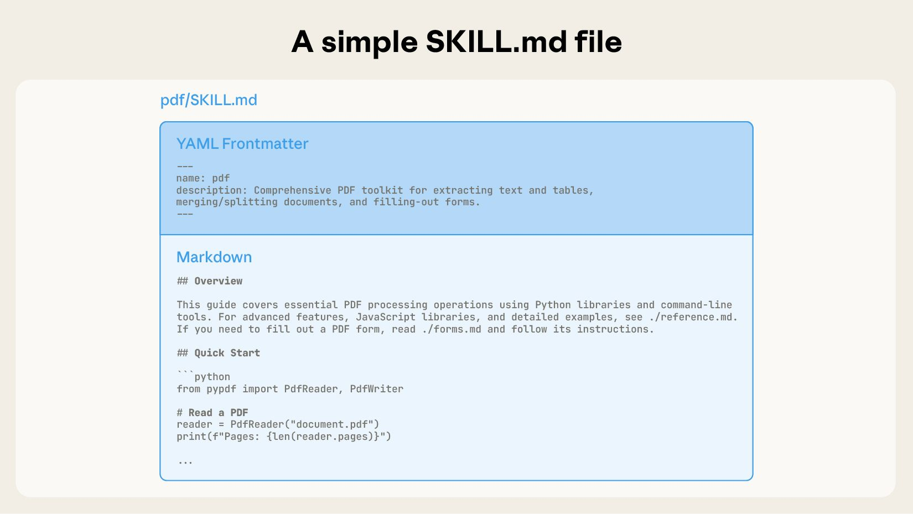

**"Skills 真的这么有用吗？"** 这是我最初读相关文章时反复问自己的问题，毕竟它的设计实在太简单。但现在，我绝大部分任务都有项目级和个人级的 Skills 来降低**控制 / 对齐**成本：让 Agent follow 我设计好的流程，让模型的输出风格和内容对齐我的偏好。从 [The Bitter Lesson](https://www.cs.utexas.edu/~eunsol/courses/data/bitter_lesson.pdf) 的长期视角看，把人类知识硬编码进 AI 系统往往不是最可扩展的路线；但在具体的任务工程里，我们要的不是推进通用智能的边界，而是把任务高效做完，把自己的**思考预算**留给真正需要品味和判断的环节。Skills 的整个定义也很符合 Anthropic 的工程价值观：***Do the simple thing that works***。

Skills 给 Agent 提供的是什么？Anthropic Skills 团队负责人 Barry Zhang 在 [AI Engineer 的 talk](https://youtu.be/CEvIs9y1uog) 中的定义是 "***composable procedural knowledge for agents***"。这里的关键词是**程序性知识（Procedural Knowledge）**。与事实性知识（知道是什么）不同，程序性知识描述的是 怎么做 以及 怎样算做对。它与具体场景绑定，因此也可以理解为从特定领域蒸馏出的实践经验（Domain Expertise）。

!!! note "为什么叫 Procedural Knowledge 而不是 Workflow Knowledge 呢？"

    我最早写这篇博客时，凭直觉用的是 Workflow Knowledge。后来想搞清楚 Anthropic 为什么专门要用 Procedural 这个词，去翻了下背景：它来自认知科学，跟 declarative knowledge（"知道什么"）相对，指"知道怎么做"的那一类知识（参见 [Wikipedia: Procedural knowledge](https://en.wikipedia.org/wiki/Procedural_knowledge)）。

    看完我也接受了这个用法。不是每个 Skill 都是流程：一个只固定配色和字体的品牌设计 Skill，很难称为 Workflow Knowledge。Procedural 的范围更大，简单的"按规范做"和复杂的"按流程做"都能兼容。本文之后统一用 Procedural Knowledge（程序性知识）。

但只到这里，对我而言还有一个困惑没有解开：**Skills 的本质是什么？** 如果只跟着 Anthropic 的官方叙事走，很容易把它解读成"一种 Agent 能力的打包格式"，这篇也会变成多篇 Anthropic 博客的综合解读，那大可不必由我来写（Opus / GPT 可能更适合）。回到第一性原理想这个问题，结合我之前写博客的一些思考，我的理解从两个点出发。

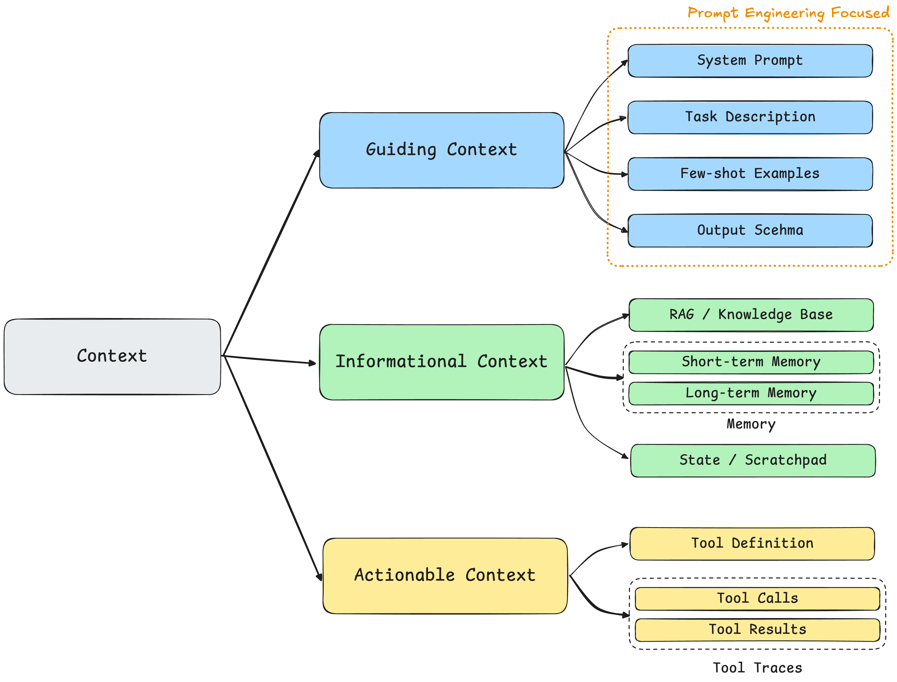

**第一，Skills 本质上就是 Context。** 技术上你完全可以在 Skills 文件夹里放任何类型的上下文。按我在[《Context Engineering，一篇就够了》](https://keli-wen.github.io/One-Poem-Suffices/one-poem-suffices/context-engineering/)里的分类，既可以是指导性上下文，也可以是信息性上下文：事实数据、API 文档、甚至 RAG 索引。所以"提供什么类型的知识"并不是 Skills 最核心的创新，朴素的 Context 文件也可以提供 Procedural Knowledge。

那为什么最佳实践都表明，Procedural Knowledge 特别适合 Skills 这种格式？我的理解是三个原因：（1）它的触发信号是**任务类型**：模型看到"生成 PDF 报告"就知道该加载 PDF 流程，靠 Skills 的 `description` 做文本分类就够了，不需要向量检索。（2）它的内容**天然有结构**：步骤、工具、引用，可以映射到文件夹层级。（3）它的复用是**整包、跨会话**的：同一个流程在不同会话、不同人手里都原样适用，每次被取用的都是同一份完整内容，这样打包的 ROI 才够高。举一个反例，常见的 RAG 场景：一份公司内部的产品 FAQ，触发信号是用户提问的语义（更多需要向量检索，而非任务类型分类），内容是扁平的 Q&A 对，复用的单位是条目而非整包：每次提问只命中其中几条，且次次不同，不存在一个值得整体加载的“流程”。这种 Context 用 RAG 比用 Skill 更合适。

!!! question "读到这里可能有一个很直接的问题：`scripts/` 是可执行的 tools，怎么能直接说 Skills 就是 Context？"

    我的思考是：第一，我在 Context Engineering 篇把上下文分了三类，除了上面这两类，还有一类**行动性上下文**：工具的定义和用法本身也是 Context，MCP（Model Context Protocol）就是它的标准化协议，`scripts/` 可以看成它的本地版。第二，Skill 从头到尾只负责提供 Context，"能跑"是 Harness/Sandbox 给的能力；把同一个 Skill 放进没有执行环境的 Harness，`scripts/` 就退化成一段可以阅读的参考代码。下文的 1.3 节会展开解释。

**第二，Skills 的设计体现了 Push → Pull 的范式转移。** 这个判断源自我在写 [《Just-in-Time Context，一篇就够了》](https://keli-wen.github.io/One-Poem-Suffices/one-poem-suffices/just-in-time-context/) 时的思考。传统模式下，人类构建检索系统，把自认为模型可能需要的上下文灌进去（Push）；当模型能力越过某个智能阈值，这种**硬编码**反而成了限制。所以 Anthropic 很早就开始力推 Just-in-Time Context：只给**引用和目录**，把上下文窗口尽可能留给模型主动的探索（Pull）。Skills 的核心机制，就是 JIT Context 的核心机制：**引用即上下文（References as Context）**和**渐进式披露（Progressive Disclosure）**。metadata 常驻 → body 按需读 → references 深度探索，正是这个范式的具体实现。

这两点合在一起，才能解释 Skills 为什么长成现在这个样子。所以我的结论会是：**Agent Skills 是 Just-in-Time Context 的具体实现之一**。后文也会尽量从这两个视角出发，而不是单纯解读官方博客。

基于此，本篇旨在回答三个问题：

- **What？** Skills 作为一种 JIT Context 的实现，具体的格式和机制是什么？它和 Prompt / MCP / Subagent / Memory 等已有机制有什么区别？
- **Why？** 为什么是现在，为什么是这种形态？通用 Agent 的崛起和 Skills 之间是什么关系？
- **How？** 构建一个好 Skill 的最佳实践是什么？

为了保证正文的阅读流畅性，我把一些延伸讨论放进了附录～ 这篇博客”呕心沥血“，写了好几周，希望大家多多支持～

## 1. What is a Skill?

引言中我先给出了两个观点：Skills 本质是 Context，取用方式是 JIT/Pull。我们先从**是什么**出发，解释其具体的格式和机制长什么样。

### 1.1 格式：一个文件夹

Anthropic 对 Skill 的定义很简单：

> Skills 是一组组织好的文件，为 Agent 打包可组合的程序性知识。换句话说，它们就是文件夹。这份简单是刻意设计的。*"Skills are organized collections of files that package composable procedural knowledge for agents. In other words, **they're folders**. This simplicity is deliberate."*
>

文件夹可以被人阅读、被 Git 管理、被团队分享，也能被 Agent 用 `Read` / `Bash` / 文件系统原语操作。任何人都可以在电脑上建一个文件夹，写一个 `SKILL.md`，然后所见即所得地迭代。这对于更多的 No-Tech 用户非常友好。

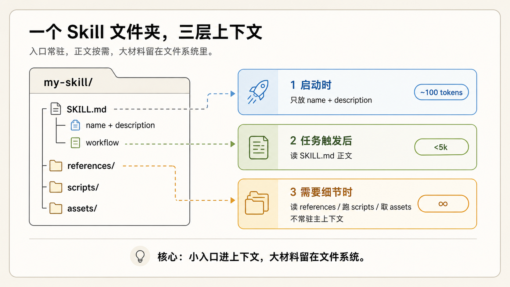

这张 GPT 画的图展示了 Skill 核心的结构与设计：**只有少量 metadata 常驻上下文，作为 trigger 让 Agent 决定要不要进一步加载；其余所有内容都留在文件夹里，由 Agent 按需自行拉取。** 三层结构对应的 token 量级：

- **第一层 metadata**（`name` + `description`）：约 **100 token**，启动时预加载进 System Prompt
- **第二层 `SKILL.md` 正文**：Anthropic 建议控制在 **500 lines / 5,000 token 以内**，被触发后才读
- **第三层 bundled files**（`references/`、`scripts/`、`assets/`）：**无上限**，按路径按需打开

!!! tip

    我与一些朋友交流时发现，很多人不知道 Skills 的 metadata 会常驻 System Prompt，就像不知道 MCP 也会把 Tools 的定义注入上下文。如果忽略概念的包装，把两者都理解成 Context，那它们出现在上下文窗口里就是自然的事。

    也因此，Skills 并不是越多越好。Anthropic 给的参考线是：同时启用的 Skills 到了 20-50 个，就该重新评估和取舍；常见的做法是合并同类 Skill，把具体内容下放到 `references/`，交给渐进式披露。或者走 [Tool Search Tool 的范式](https://platform.claude.com/docs/en/agents-and-tools/tool-use/tool-search-tool)。

### 1.2 Skills 的核心机制

Skills 的核心机制和 JIT Context 一致：**引用即上下文 + 渐进式披露**。这里重述下 JIT 博客中的一些结论：理解这套机制有一个前提：**上下文是边际效益递减的有限资源**。上下文窗口里的 token 越多，模型从中提取准确信息的能力越弱（[context rot](https://research.trychroma.com/context-rot)），而 Agent 架构天然比普通对话消耗更多 token（Anthropic 的数据是 [4 倍以上](https://www.anthropic.com/engineering/multi-agent-research-system)）。所以**管理好上下文窗口，就是在管理 Agent 的推理质量**。

[Agent Skills Best Practices](https://platform.claude.com/docs/en/agents-and-tools/agent-skills/best-practices) 里有一句话：**"The context window is a public good."** 上下文窗口要同时容纳 System Prompt、对话历史、工具结果、其他 Skill metadata 和当前任务材料。Skill 的三层结构就是在管理这份公共资源：第一层 metadata 做触发判断（这个任务需不需要我？），第二层 body 给流程和指令（具体该怎么做？），第三层 `references/` / `scripts/` 提供细节和执行力（遇到具体问题去哪查、用什么工具？）。Agent 逐层深入，每一层只在需要时才加载，不浪费注意力预算。

### 1.3 为什么 Skills 需要 scripts/？

`scripts/` 是 Skill 可选的组件。大多数 Skill 一开始**不需要**它（也没有它），只写 `SKILL.md` 和 `references/` 已经够用。`scripts/` 是 Skill 的**上限**，不是入门门槛。

**什么时候该把写给模型看的指令，换成给模型跑的脚本？** 很简单：**当某个动作和语义理解无关、需要 100% 可复现时。** Anthropic 举过一个例子：Claude 总在幻灯片任务里反复写同一段 styling Python，后来他们让 Claude 把它保存进 Skill，作为给未来自己的工具。**重复、稳定、可验证的动作，就该从语言解释变成可执行的 script。**

`scripts/` 本质上就是 Tools（Anthropic 的原话也是 "scripts as tools"）。而工具对模型来说一直都是 Context：模型并不真的"执行"任何东西，它看到工具的定义（绝大部分 Harness 在创建新 Session 时会把工具定义注入上下文），吐出一行调用，再等结果以 token 回来，执行发生在模型之外的 Harness 里。所以引言说"Skills 本质是 Context"是把 `scripts/` 算在内的：它就是行动性上下文，只是定义放进了文件系统。这带来两个传统 Tools 没有的性质。其一，**定义可读可改**：传统 Tool 的描述（docstring）写得再含糊，模型也只能将就着用；script 是文件，代码本身就是最准确的定义，模型必要时可以直接读源码并做改动，不用时则安静地待在文件系统里。其二，**它不承诺可执行**：script 只提供"这里有个工具、这么用"的上下文，真跑起来缺依赖、环境不对，都要 Agent 自己当场解决（[frontmatter](https://agentskills.io/specification#frontmatter) 的 `compatibility` 字段就是用来提前声明环境要求的）。

*Skill 的 metadata 挂在 agent 配置中，文件夹内容则活在 agent 虚拟机的文件系统里，与 Bash / Python / Node 运行时为邻；MCP server 在远端。Source: [Equipping agents for the real world with Agent Skills](https://www.anthropic.com/engineering/equipping-agents-for-the-real-world-with-agent-skills)*

第二个收益是**省 token**。当 Agent 读一个 reference，是把内容按需拉进上下文窗口；而跑一个 script，效果上和派一个 Subagent 类似（把 Subagent 理解成一个 Agentic Tool 即可），起到了**上下文隔离**的作用。脚本本体、它处理的数据、中间过程，全都隔离在“珍贵的主上下文窗口”外，窗口里只剩一行调用和一行结果（当然有时候可能有很多日志信息）。举个不恰当的例子：让模型用 generation tokens 一行一行吐出 1MB CSV 的排序结果，既慢又贵；一行 `sort` 就够了。如果说渐进式披露对注意力预算的控制是"按需读取"，`scripts/` 就是更进一步的"根本不用读"：把复杂、耗 token 的流程直接 tool 化，省掉不必要的注意力消耗。

**`scripts/` 和 MCP 有什么区别？**

两者都是行动性上下文，但分工不同。MCP 解决**连接**：把外部系统（数据库、SaaS、内部服务）用标准协议接进来，工具由 server 托管，连上了就能用。`scripts/` 解决**流程内的确定性**：它从属于 Skill 所描述的那套流程，把其中重复、脆弱、和语义理解无关的环节固化成代码，换来稳定性和 token 效率；它通常不连接任何外部系统，就在本地跑，跑不起来也没有人兜底，要 Agent 自己修环境。所以常见的组合是 **MCP 拿数据 → `scripts/` 清洗渲染 → 模型基于 Skill 的领域知识判断总结**：连接交给协议，确定性交给脚本，判断留给模型。详见 [Extending Claude with Skills and MCP](https://claude.com/blog/extending-claude-capabilities-with-skills-mcp-servers)。

另外，`scripts/` 也是 Skill 对部署唯一提出要求的部分：纯 Context 的 Skill，任何能读文件的 Agent 都能用；带上脚本，就需要一个干净的 Sandbox。在涉及部署时需要做 Agent Framework 两种流派的取舍，具体内容见 Appendix B。

### 1.4 如何为 Skills 分类？

既然 Skills 本质是 Context，那分类也可以从 Context 的视角来看。一个 Skill 文件夹里其实混合了三种上下文（对应 [Context Engineering 篇的上下文三分类](../context-engineering/)）：

- **指导性上下文**：`SKILL.md` 里的流程规范、质量标准、判断原则，告诉模型"该怎么做"
- **信息性上下文**：`references/` 里的参考资料、模板、数据，告诉模型"需要知道什么"
- **行动性上下文**：`scripts/` 里的可执行代码，告诉模型"可以跑什么"

这个对应关系只是典型印象，不是硬性规定。`references/` 里完全可以放一份风格规范（指导性），`SKILL.md` 里也少不了背景信息（信息性）。这里主要侧重说明的是 Skills 可以包括各类上下文。不同 Skill 侧重不同。一个品牌设计 Skill 可能只有指导性上下文（配色规范、字体要求）；一个 PDF Skill 三类都有（流程 + 参考文档 + Python 脚本）。

Anthropic 还提供了另一个互补的分类视角，从**行为目的**和**知识来源**两个维度来看（来自 [Improving skill-creator](https://claude.com/blog/improving-skill-creator-test-measure-and-refine-agent-skills) 和 [AI Engineer talk](https://youtu.be/CEvIs9y1uog)）：

- **行为目的**：区分 Skills 是在**补模型做不稳的能力**（Capability Uplift，例如 PDF 解析、Office 文档处理），还是在**固化流程和偏好**（Encoded Preference，例如 PR Review checklist、周报格式、commit message 约定）。

- **知识来源**：区分 Skills 是**平台方提供的通用能力**（Anthropic 官方的 `pdf` / `docx` 等 Skill），**第三方产品的最佳实践**（Vercel / Supabase 等把自家 API 用法封装成 Skill），还是**你自己 / 团队 / 组织的工作方式**（Coding Harness 偏好、团队 PR 模板、内部审查流程）。

个人觉得“行为目的”这个分类视角挺好，目前对我效率提升最高的，仍是固化流程和偏好这一类 Skills。

## 2. Skill vs Prompt / MCP / Subagent / Memory

把 Skills 和相关概念放在一起比较，区别其实很清晰：它们要么是不同类型的 Context，要么是不同的取用方式。Anthropic 在 [Skills Explained](https://claude.com/blog/skills-explained) 里给过一张完整的对比表格，下面我从自己的视角补充一些理解。

### 2.1 vs Prompt / CLAUDE.md / AGENTS.md

Prompt、`CLAUDE.md`、`AGENTS.md` 和 Skill 都在告诉 Agent "怎么做"（更偏指导性上下文），区别主要在**什么时候加载**：

| 机制 | 加载时机 | 典型场景 |
|---|---|---|
| Prompt | 当前对话内输入 | 一次性请求、临场修正 |
| `CLAUDE.md` / `AGENTS.md` | 进入项目即全量加载 | 项目结构、测试命令、代码风格、禁止事项 |
| Skill | 任务语义命中才加载 | 发布检查、数据库 migration、按公司格式生成评审文档 |

> 如果你发现自己在不同对话里反复输入同一段 Prompt，那就把它做成一个 Skill。*"If you find yourself typing the same prompt repeatedly across conversations, **create a Skill instead**."*

如果你发现在完成一类任务时需要输入同一段指令 5 次以上，那这段指令就应该被持久化为**知识**。但有进一步的问题需要思考：**到底是写成 Skill，还是更新到 `CLAUDE.md`？**

区别在这段 Context 的**作用域**。`CLAUDE.md` 是项目级的，每次对话都全量常驻 System Prompt，适合放“永远成立”的规则（项目结构、测试命令、代码风格）。而反复出现的指令往往只在**某一类任务**里才需要，这种任务级的知识写成 Skill，让它语义命中才加载，不占无关对话的注意力预算。

如果用 Push / Pull 的范式进行解释：Prompt 和 `CLAUDE.md` 都是 **Push**（人类主动塞进去），Skill 是 **Pull**（Agent 判断需要时才加载）。三者不互斥，按加载时机自然分层。

### 2.2 vs MCP

"MCP 和 Skill 有什么区别？""有了 Skill 是不是就不需要 MCP 了？"这两个问题我见过很多次，但它们本身就问偏了：两者是兼容且互补的，都在扩展 Agent，只是扩展的方向不同。

Anthropic 的 [Extending Claude with Skills and MCP](https://claude.com/blog/extending-claude-capabilities-with-skills-mcp-servers) 博客里有一个厨房类比：**MCP 像一间装备齐全的厨房**，灶台、刀具、食材、冷柜，对应外部系统、数据库、文件、业务 API；**Skill 像一份菜谱**，告诉你先做什么、火候多少、什么时候下料。**模型**则是站在中间的厨师：厨房给它原料和工具，菜谱给它流程，它负责判断和临场发挥。

两者的关系可以表述为：**"MCP provides connectivity; skills provide expertise."** 前者解决"能不能拿到"，后者解决"知不知道怎么用"。例如你想让 AI 帮你投资：MCP 让 Agent 接入你的账户，获取持仓信息、执行交易操作；Skills 负责指导决策流程，例如给你的 Agent 接入一个巴菲特 Skill。

而且两者是**多对多**的关系：一个财务分析 Skill 可以同时编排好几个数据源 MCP（行情一个、财报一个、研报一个），一个 GitHub MCP 也可以被 Code Review、Issue 分类、Release 等多个 Skill 复用。两个生态互相增强，而非互相替代。

从 Context 的角度看：MCP 提供的基本全是**行动性上下文**：工具定义、工具结果，加上把外部数据搬进窗口的通道（严格说 MCP 规范里还有 `prompts` 和 `resources` 两类原语，但生态的重心在 `tools`，这里按主流用法讨论）。Skill 文件夹里装载三类上下文（见 1.4 节），但它的重心是**指导性上下文**："拿到数据之后该怎么处理"，两者之中只有 Skill 在负责这件事。所以可以说：MCP 决定 Agent 能调用什么，Skill 决定它知道怎么用。两者不在同一层，是互补的。

### 2.3 vs Subagent

Subagent 和 Skill 其实不在一个层面上，不太能直接比较。Subagent 是一种**架构机制**：它有独立的 Context Window、独立的工具权限，主 Agent 把一块任务连同 Handoff 上下文交给它，只取回最后结论。它有很多效果，包括改变复杂任务执行的拓扑结构，实现更高级的智能体系统编排；scaling 更多 tokens 做子任务的 verification；以及上下文隔离，把复杂信息流隔离出去，别污染主上下文（[Context Engineering，一篇就够了](../context-engineering/) 中的 **Isolate**）。而 Skill 是一层**可复用的专业知识**，它本身不负责隔离任务流，只负责"这件事该怎么做"。

那它们怎么联系起来？我个人觉得关键在编排 Subagent 时的一个必要环节：**每次派生 Subagent，都要给它足够的 Handoff 上下文**，包括任务背景、工具用法和流程规范。当你的 Agent 反复为**同类任务**派生 Subagent 时，这些上下文在不同 delegation 之间高度重复，同一套东西一遍遍重讲。（例如我之前每次 spawn 新的 Subagent 时，都需要显式要求它基于任务类型按我的规范做进度记录，特别麻烦）

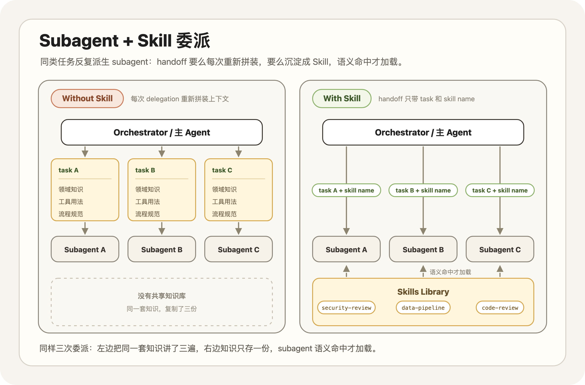

Skill 正好补上这一环。把这套重复的上下文和工具用法沉淀成一个 Skill，Subagent 派生时不必每次重新拼装，语义命中就加载。Anthropic 也在博客中推荐了 Subagent 和 Skills 的组合。例如，在我自己的项目中，如果是数据库实现任务，Orchestrator Agent 会基于我的 `my-work` Skill（为了方便理解，这里改了下名字）设计 verify checklist，要求另一个 Agent 最后用 [supabase-postgres-best-practices Skill](https://github.com/supabase/agent-skills/tree/main/skills/supabase-postgres-best-practices) 做 Review。如果是前端相关任务，则会自动要求用 [react-best-practices Skill](https://github.com/vercel-labs/agent-skills/blob/main/skills/react-best-practices/SKILL.md) 做 Review。整个流程很自然，也可以进一步配合 Hooks。

> 在 Claude Code 和 Agent SDK 中，Subagent 可以访问并使用 Skills：让专精分工的 Subagent 带上可携带的专业知识，是非常强的组合。*"In Claude Code and the Agent SDK, **subagents can access and use Skills**, creating powerful combinations where specialized subagents leverage portable expertise."*

再举一个更通俗的例子，你让 Agent 帮你做一份竞品分析报告。主 Agent 派一个 Subagent 专门负责数据收集和分析，这个 Subagent 加载 `competitive-analysis` Skill（里面定义了分析框架：先看定位、再比功能、再看定价，最后给一页优劣势对比），在隔离窗口里跑完流程，主 Agent 只接收最终的分析结论和关键数据。如果切换为 Deep Research 任务，你只需要去 GitHub 上下载一个 `deep-research` Skill 替换 `competitive-analysis`。

**所以我更倾向认为，"Skill 化的 Subagent"会是更自然的编排范式**：Subagent 提供隔离的执行环境，Skill 提供可复用的专业流程，编排时不再靠 Agent 基于 Session 构建一堆重复 Context，而是让 Subagent 按需加载该用的 Skill。（有点像现代公司里的交接模式～ 当然，向人类组织对齐未必就是 Agent 的最佳实践）

### 2.4 vs Memory

还有一个值得思考的对比，Memory 也是跨会话的，它和 Skill 是什么关系？基于 Context 的视角，两者都是跨会话持久化的 Context，没有本质区别。Memory 系统基于不同的提取偏好（事实或者流程知识）可以得到不同类型的 Memory Context。这里我以 Claude Code 中的 Memory 实现为例：**Memory 是 Agent 自动更新的、关于你和你的项目的零散事实与偏好；Skill 则是人主导更新的、关于某类任务该怎么做的程序性知识。** 这个定义可能在之后不完全准确。下面结合社区整理的非官方 Claude Code 源码镜像，把我观察到的几点写下来。

!!! info "可跳过的深水区"

    接下来几段是基于“非官方”源码、对 Claude Code Memory 读写机制的拆解。如果你只关心 Memory 和 Skills 的差异结论，可以直接跳到下方**差异主要在三个地方**，不影响后续阅读。就当是一次渐进式披露：这里是 reference file。

在读取方式上，Memory 和 Skills 都是按需读取那套。我基于 Claude Code auto-memory 的机制制作了如下图片。其中上半部分是 Memory 的更新，下半部分则是读取。

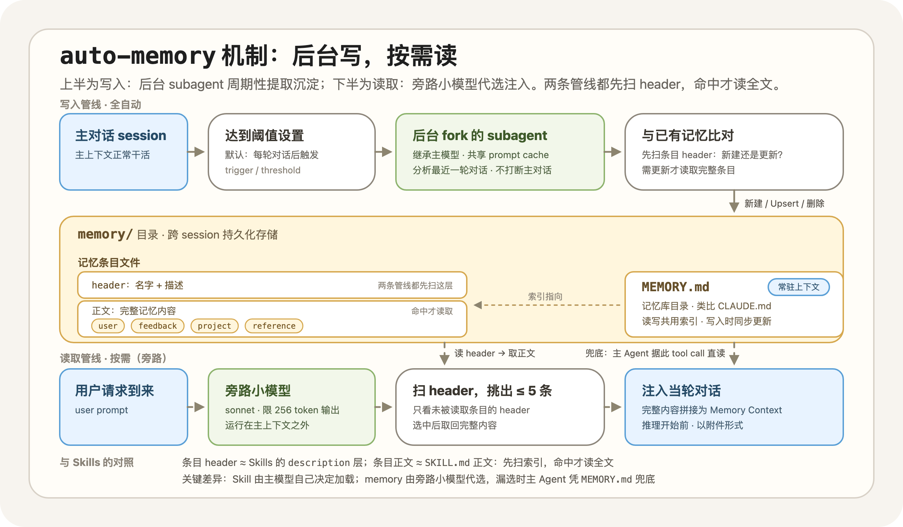

*Claude Code 中的 auto-memory 机制*

Memory 的写入 Pipeline 是全自动的。如果当前是主会话且开启了 Memory，后台会根据阈值设置（默认每轮对话后）Fork 一个继承主模型的 Subagent（继承是为了共享 Prompt Cache）。Subagent 会被要求重点分析最近一轮的对话，并与已有记忆进行**比对**：**如果发现有价值的持久化信号，它会通过新建、修改覆盖（Upsert）或删除已有文件的方式更新 `memory/` 目录及 `MEMORY.md` 索引**。注意，这里的比对和 Skills 的加载以及下文中的 Memory 加载范式是一样的，Subagent 会先扫描所有记忆条目的 header（名字和描述）确认是要更新还是新建，如果需要更新则会继续读取该记忆条目的完整内容。

读取 Pipeline 也是常驻后台的（当开启了相关 feature）：每当有用户的对话 Request 到来时，一个旁路小模型（代码里是获取 sonnet 但限制 256 tokens 的输出）读取所有**未被读取**的 Memory 文件的 Header（和 Skills 一样，每条记忆的名字 + 描述），从中挑出至多 5 条，将完整内容拼接为 Memory Context，在推理开始前注入当轮对话。

其中 `MEMORY.md` 是类似 `CLAUDE.md` 的记忆索引，可以理解为整个记忆库的目录。在 Memory 的读写 pipeline 中它都提供索引作用（符合 Just-in-Time 的原则）。`MEMORY.md` 是常驻上下文的。因此，**它同样服务于主 Agent，当 Memory 读取 pipeline 没有正确的匹配到可能需要的记忆时，主 Agent 可以直接基于 `MEMORY.md` 使用 tool call 把希望阅读的记忆读取到上下文中**。

对比两者，Skills 的 metadata 层和 Memory 文件的 header 格式基本一致，`SKILL.md` 的主体则对应每个 Memory 文件的具体内容。

那差异主要在三个地方：

- **Context 的类型**：Claude Code 把 Memory 限定为四类（user / feedback / project / reference），基本都是信息和偏好（信息性上下文），源码注释还专门要求只存无法从项目状态推导的东西；Skills 装的更多是程序性知识（指导性上下文）。
- **构建/加载机制**：Memory 的构建由后台 Subagent 周期性“无监督”提取，把关的是 Agent 而非人类；Skills 大多由人构造，经过人的审核。至于加载层面，两者都符合 Just-in-Time Context 的加载逻辑，但召回的决策者有差别：Skill 由主模型自己看 `description` 决定加载，Memory 的加载则通常发生在主上下文之外，由旁路模型代为决策。
- **作用域**：Memory 存储项目相关的信息性上下文，通常和项目强绑定。Skills 中的 Context 则更偏向可分享，可迁移。

但我个人觉得，如果从 Context 的角度，它们两者区分的边界可以很模糊。一条“提交代码前先跑代码格式检查”的 feedback memory，和 Skill 里的一条规则可以一模一样，只是从加载与更新机制的角度它们会有更多区别。就我个人而言，我的 `autoMemoryEnabled` 至今是 false：自动生成、无人筛选的记忆会浪费 tokens，偶尔还对解决问题有副作用。关于 Memory 与 Skills 在持续学习领域的思考放在 Appendix C 中。

### 2.5 小结

  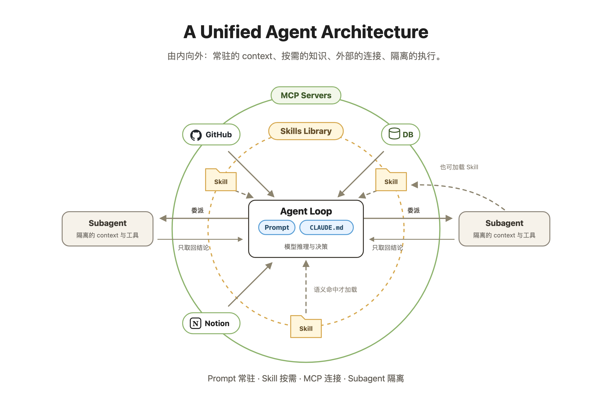

那如此多的概念如何联系在一起？其实其中大部分概念都由 Anthropic 提出，我理解他们的 vision 是**未来所有的解决方案都应该是 General Agent OS (Claude Code like) + Agent Skills + MCP**。

他们认为给 Agent 加一个新领域的能力，往往就是两件事：配好该用的 MCP，装好该用的 Skills。他们自己也确实在按这个叙事推出行业方案：生命科学方向的 [life-sciences](https://github.com/anthropics/life-sciences)（repo 建于 Skills 发布次日，配合 Claude for Life Sciences 上线）和金融方向的 [financial-services](https://github.com/anthropics/financial-services)，每个**“产品”**就是打包好的一组 MCP 加一组 Skills，外加少量 Agent 定义。

简单总结：Prompt 和 `CLAUDE.md` 是人主动塞给模型的 Context；MCP 负责连接外部世界；Subagent 负责把复杂任务拆出去、隔离上下文。Skill 的特别之处是把两件事一起做了：**既装着程序性知识，又自带按需加载的取用方式**。

## 3. Why do we need Skills?

前两节回答了 Skills “是什么”。这一节会更强调“为什么”：**为什么是现在，为什么是这种形态？**

Skills 团队自己讲过一个很形象的类比：报税这件事，你会交给 300 IQ 的数学天才，还是一个经验丰富的税务专家？Barry 说他每次都选后者，没人想让天才从第一性原理现场推导 2025 年的税法。**今天的 Agent 很像那个天才：聪明，但缺少你所在领域的专业经验。**

目前模型的基础智能越过了阈值，Agent 缺的是**程序性知识**。程序性知识塞进一段长 Prompt 或 Context 文件，也能起到类似的效果（内容本身从来不是 Skills 的创新）；Skills 解决的是它的工程问题：放在哪里、什么时候被加载、怎么跨会话复用、怎么分发给整个团队。就像人不会背下整个图书馆，靠的是索引和目录。这才是 Skills 和一段普通 Context 之间真正的区别。所以 **Skills 是 Anthropic 给出的、注入这种知识的标准做法**。Skills 自发布后，很快被 OpenAI 等同行采纳为标准，这也有助于 Skills 和 Agent 共同进化，完整论证放在 Appendix A。

### 3.1 通用 Agent 的崛起

过去大家很自然地认为：不同领域需要不同 Agent。法律 Agent、财务 Agent、科研 Agent，各有自己的工具、System Prompt 和工作流。这个思路看起来合理，因为每个领域的任务差异确实很大。

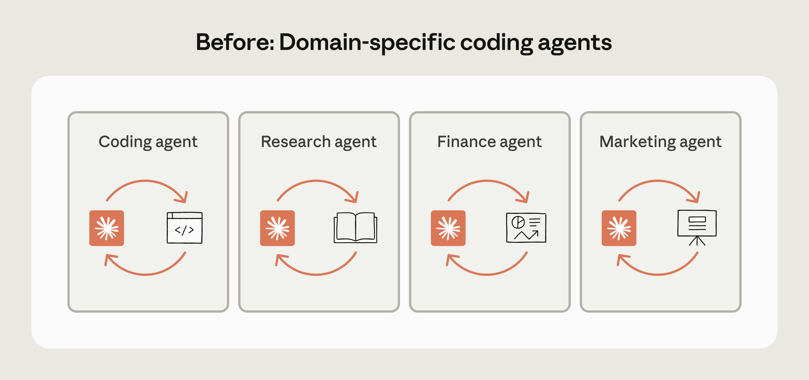

但 Anthropic 基于 Claude Code 的经验给出了另一个判断，并且 Codex 随后发扬光大：

!!! important "Code is all we need"

    我们过去以为不同领域的 Agent 会长得很不一样，每个都需要自己的工具和脚手架。但**底层的 Agent 其实比我们想象的更通用**。我们发现，**代码不只是一个用例，而是通往数字世界的通用接口**。*"We used to think agents in different domains will look very different. Each one will need its own tools and scaffolding... Well, customization is still important for each domain. **The agent underneath is actually more universal than we thought.** What we realized is that **code is not just a use case but the universal interface to the digital world**."*

一个财务报告任务，表面看和写代码无关。但 Agent 可以通过 Tool call（API 或 MCP）拉数据、用 Python 做分析、用代码生成图表，最后生成报告。如果再加载几个财务相关的 Skills（[financial-services](https://github.com/anthropics/financial-services)）和视觉设计相关的 Skills（[skills/frontend-design](https://github.com/anthropics/skills/blob/main/skills/frontend-design/SKILL.md)），你可以在 30 分钟内拿到一份专业级的 report。

此时限制你的不再是个人时间：只要有足够的 tokens，你可以轻松并行 10 份报告，tokens 直接换算成 workforce。营销方案也类似：从 CRM 抓客户数据、跑分析脚本、生成 slide 和 brief。尽管领域不同，Agent 用的基本工具是同一套：**终端、文件系统、代码执行，加上几个外部 Tool / API**。我现在的 codebase 里就有大量 Automation 在帮我做各类任务。

从过去为每个领域精心构建一套 Agent loop，到现在 Coding Agent 涌现出解决各种任务的通用能力，我个人感觉**关键是在模型基础智能达标后，其 Agentic 能力也迈过门槛**。（反例是 Gemini 3.1 Pro 这个模型，Agent 能力严重拖累模型智能）

Claude Code 首先证明了 Coding Agent 可以承担通用任务（大致从 Opus 4.0 系列开始），我用它写博客、写代码、做调研、购物分析、金融投资。Codex 则更进一步，把 Coding Agent **显式"改造"成通用工作台**，提供了更多解决 more than code 任务的插件和设计，也比 Claude Desktop 更早长成我心目中通用智能体工作台的样子。我倾向认为 **General Agent Harness 会越来越热门**，越过 Coding Task 的边界，延伸到任何与认知（Cognition）相关的活动中（推荐观看 [AI Ascent 2026](https://www.youtube.com/results?search_query=aiascent+2026)）。

当底层 Agent 足够通用，工程重点自然从**为每个领域造一个新 Agent**，转向**给同一个通用 Agent 装上可插拔的专业知识**。这和 Push → Pull 是同一个趋势：Agent 越通用，越需要一种轻量的方式按需加载领域知识，而不是每次都从零开始教。

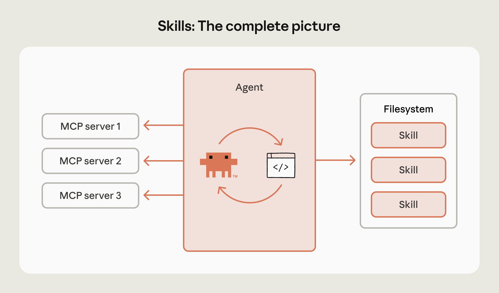

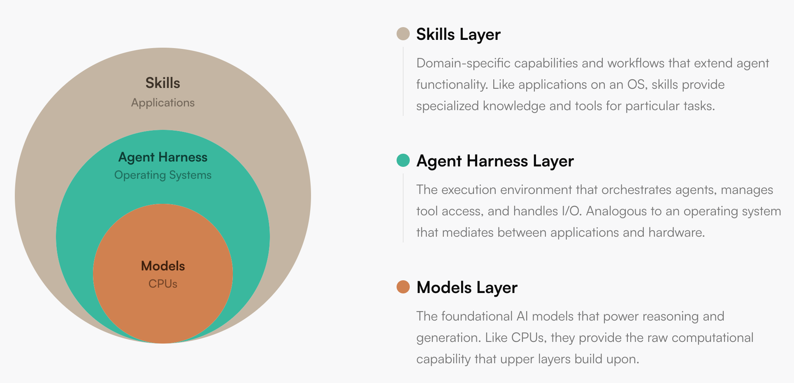

*模型像处理器，Agent Runtime 像操作系统，Skills 是应用层。Source: [Building agents with Skills](https://claude.com/blog/building-agents-with-skills-equipping-agents-for-specialized-work)*

### 3.2 让 Agent 第 30 天比第 1 天强

Anthropic 认为 Skills 是**走向 continuous learning 的一个 concrete step**。这里的 learning 并不是模型参数的更新，指的是让 Claude 写下来的流程、脚本、偏好和失败经验，可以被未来的自己复用。

> Claude 写下来的任何东西，都能被未来版本的自己高效使用。这让学习真正变得可迁移。*"Anything that Claude writes down can be used efficiently by a future version of itself. This makes the learning actually transferable."*
>

任务执行中积累的失败模式、用户偏好、验证流程，沉淀为结构化的上下文：标准流程写入 `SKILL.md`，可复用代码写入 `scripts/`，详细文档写入 `references/`。下次遇到同类任务，Agent 无需从头探索，直接从已有经验出发。

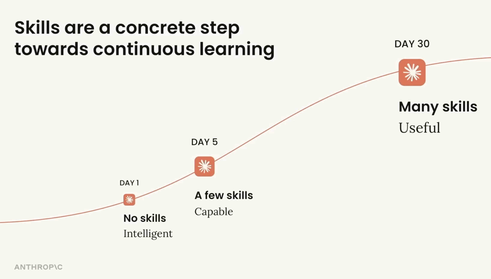

我的实践之一是在项目中维护 `contexts/` 文件夹，将任务拆分为两个阶段：**Context（探索）** 与 **Execution（执行）**。Context 任务负责探索问题空间并输出 Context 文件（包括必要的实验性工具调用）；通过在探索阶段投入更多 tokens（explore token scaling），为执行阶段构建更精准的 Handoff 上下文，以期找到更优的实现路径。因为执行阶段涉及大量代码变更，试错成本远高于探索阶段。

执行任务完成后，我会在当前 Session 中要求 Agent 对比实际的执行轨迹与 Context 任务制定的计划：哪些地方出现了偏差，哪些经验值得沉淀，从而更新到 `contexts/` 和 Skills 中。因为**它同时产出了 prediction（Context 任务给出的计划）与 ground truth（真实执行轨迹加上用户反馈），构成了一个可学习的样本对**。这与翁家翌（OpenAI）提出的[启发式学习（Heuristic Learning）](https://trinkle23897.github.io/learning-beyond-gradients/)有相似之处，区别在于被更新的不是模型参数，而是 Skills 文件或自动化脚本。

基于解决任务的 Session 进行学习，与让 Agent 凭空直接写 Skills 有本质区别：后者没有 ground truth。

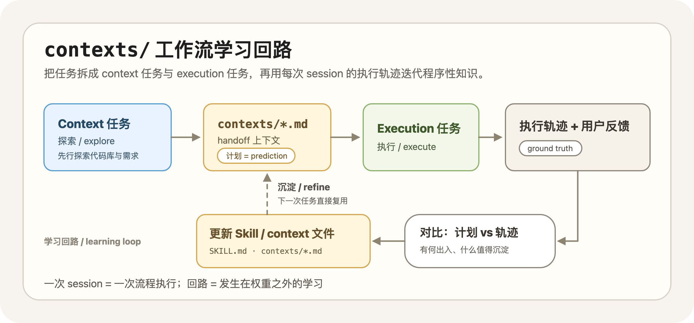

**为什么 Skills 的更新可以视为持续学习？**

我们把持久化一些结论到 Context 文件的过程视为持续学习，你或许会联想到 2.4 节讨论的 Memory。它是否也构成持续学习？我认为同样可以，两者运行的是相同的回路：Session 中产生信息，后台提取，写入文件，下次注入上下文。从这个角度看，auto-memory 是全自动的持续学习，`contexts/` / Skills 工作流则是 human-in-the-loop 的持续学习。差异仍然是 2.4 节归纳的三点，其中我最关注的是**谁来决定写入的内容**。

对照 RLHF（Reinforcement Learning from Human Feedback，基于人类反馈的强化学习）的框架进行思考。RLHF 的核心流程是：模型产出行为，人给出反馈，反馈转化为奖励信号，更新模型，改善下一次行为。Skills 学习的工作流运行的是相似的流程：一次 Session 对应一次行为，**计划与实际的偏差，加上我的评价**构成了人类反馈。区别在于更新的机制：RLHF 将反馈蒸馏为 reward model，再去更新权重；而在这套工作流中，反馈由人直接筛选，被更新的是那份描述流程的文件（Skills）。学习的载体从模型权重变成了 Context 文件。这也为 Appendix D 中 SkillsBench 的实验结果（**模型自写自用，提升接近于零**）提供了一种解释：RLHF 的反馈来源是人，让模型自行编写 Skill 并自行使用，相当于将人从回路中移除。

从形态上看，学习的产物本质上是压缩。一次 Session 的轨迹可达数万至数十万 tokens，合并回 Skill 往往只是几行改动；数十条任务执行的轨迹沉淀下来，可能仅凝结为一份几百行的 `SKILL.md`。Context Engineering 篇中引用过 Ilya Sutskever 关于"压缩即智能"的观点，我认为这里是同一个逻辑：将长轨迹压缩为短的启发式结论。

因此 Anthropic 对 Skills for learning 的愿景是：Day 1 的 Claude 只具备通用知识；Day 30 的 Claude 如果能读取沉淀下来的 Skills，则可以了解团队偏好的格式、常用工具链、内部流程，以及容易出问题的环节。它不需要记住一切，关键在于**在正确的时机取回正确的经验**。因此 Skills 是 Harness Engineering 中不可或缺的一环：通过不断迭代，我构建的 Skills & Hooks 可以帮助我从零构建起几十万行的项目，并在其中高效并行多个任务，我的思考预算只需要花在少数真正需要深入的问题上（推荐阅读：[OpenAI - An open-source spec for Codex orchestration: Symphony](https://openai.com/index/open-source-codex-orchestration-symphony/)）。

!!! tip

    这也是个人开发者在 Harness Engineering 上需要优化的部分。我目前的经验有两条：在 Harness 设计阶段投入越多，后续开发阶段的效率越高；以及要不断扩展自己效率的边界，尽可能让你的 tokens 并行化（Subagent）、自动化（Automation / Loop）。

## 4. How? Best Practices for Building Skills

怎么写好一个 Skill，Anthropic 自身的教程已经相当完整，推荐阅读 [Best Practices](https://platform.claude.com/docs/en/agents-and-tools/agent-skills/best-practices) 和 [Complete Guide](https://claude.com/blog/complete-guide-to-building-skills-for-claude) 这两份文档。更 AI-Native 的做法是：将链接直接提供给 Coding Agent，让它据此 Review 你现有的 Skill。

因此本节不复述教程，而是从实践出发，讨论几个我认为值得分享的点。仍沿用本文的两条主线来组织：Skills 本质是 Context，所以先看**Context 的内容怎么写好**（见 4.1 节）；Delivery 机制是 JIT，再看**结构和触发怎么设计**（见 4.2 节）；最后是**如何迭代与验证**（见 4.3 节），以及具体例子的分析（见 4.4 节）。

在进入最佳实践之前，先思考一个前置问题：什么时候值得写 Skill？Anthropic 给出的标准很清晰：**"这个任务我已经做过 5 次了吗？以后还会再做 10 次吗？"**（*"Have I done this task at least five times? Will I do it at least ten more times?"*）两个问题都回答是，才值得投入时间。

我自己的标准更偏向 **Learn by doing，按需沉淀**。对于明显重复的流程，我会先将其提炼为 Skill，在后续同类场景中直接复用。初版通常难以一步到位，因此我会结合 Session 的实际表现进行迭代（即 3.2 节中提到的流程），一般经过两到三轮调整后，Agent with Skills 的表现趋于稳定。官方推荐的起步方式 **Iterate-on-one-task** 也是同一个思路：先在一个有难度的任务上把单次 Prompt 调通，再将验证有效的指令提炼为 Skill。共同的前提是先有一条成功的轨迹，提炼发生在轨迹之后，而不是凭空设计。

### 4.1 怎么写一个好的 Context

既然 Skills 本质是 Context，那**怎么写好一个 Skill**的前半个答案，就在于一份**怎么写一个好的 Context**。我将其归纳为两个层面：

- **内容层面：已知的不写，未知的写清楚，与当前任务无关的不掺入。**
- **管理层面：保持单一事实来源（Single Source of Truth），维护 Context 文件之间的一致性。**

这两条经验均来自与 Agent 协作过程中的教训。内容层面的问题尤为常见：Agent 在生成和更新 Context 时倾向于填充冗余信息，偶尔还会将 Session 中的任务特定内容混入通用文件。而且，它倾向于将 Context 写成**错题本**式的特例集合，而非可迁移的启发式结论，本质上是一种 hardcoding，相当脆弱。管理层面的问题同样常见：与写代码时类似，Agent 不擅长抽象和归并：同一个结论容易散落在多个文件中，后续更新遗漏一两处，下游 Agent 读到相互矛盾的版本，推理质量随之下降。

关于内容层面，Anthropic 给出的核心建议用一句话概括：**默认假设模型已经很聪明（"Claude is already very smart"）**。Agent 缺的是在你的项目中，怎么做才算正确。由此推导出一条实用的检验标准：每写完一段 Context，都值得回头问一句：**这段内容对得起它占用的 token 吗？** 冗余的 tokens 会浪费宝贵的注意力预算。

关于内容层面的另一个重要维度是**指令的精确度**。借用 Anthropic 提到的一个例子：不同任务的解决路径或者说 Agent Action Space 是不同的。可以将任务想象为两种地形：**窄桥和开阔地**。窄桥两侧是悬崖，容错空间极小，这类任务（如数据库迁移、发布流程）应当将步骤写死，甚至直接提供可执行脚本；开阔地上条条路通终点，只需给出方向和约束，具体路线交由模型判断（如 Code Review 这类高度依赖具体情境的任务）。换言之，**你给模型留多大的自由度，应当取决于任务本身的容错空间，而非你对模型的信任程度**。分析我自己的 Skills，确实自然分化成了这两类：`file-issues`、`submit-pr` 等偏向精确步骤，而 `db`、`web`、`core` 开发和自我分析的 `principle` 这几个 Skill 则偏向启发式约束。

业界的最佳实践中还有两条建议偏向我所说的 Context 管理。**一致性**：同一个概念在全文中使用同一个术语，避免让模型去推测两种不同说法是否指向同一件事。**单一事实来源**：一个结论只在一个位置定义，其他位置通过引用指向它。

### 4.2 符合 Just-in-Time Context 的哲学

结构上的优化，可以对照 1.1 节的三层结构逐层分析。目标是让 Skill 的行为贴合 JIT 的设计哲学：**触发要精准**，Agent 需要时能可靠加载，不被无关请求误触发；**披露要渐进**，细节留在 reference files 中按需取用。做不到这两点，Skill 与一段冗长的 System Prompt 没有本质区别。

**第一层 metadata：控制触发。** `description` 是整个 Skill 中影响范围最大的字段：它本质上充当文本分类器，是主 Agent 唯一用来判断是否需要加载的依据。编写它的过程就是在调节漏触发与误触发之间的平衡。Claude Code 团队对此有一个明确的定位：

> description 不是摘要，是"什么时候该触发这个 Skill"的说明。写给模型看。
> *"The description field is not a summary — it's a description of when to trigger this skill. Write it for the model."*

实操上有四个要点：（1）写清功能和适用场景；（2）包含用户实际会使用的触发短语；（3）统一使用第三人称；（4）出现过度触发时添加负向条件（"Do NOT use for X"）。第三人称是因为 `description` 会与其他 Skills 的 metadata 一同注入 System Prompt，“我可以帮你”这类第一人称会造成叙述视角不一致，官方的观察是这会干扰模型对 Skill 的发现和匹配。调试也有便捷的方法：直接询问 Claude **你什么时候会使用这个 Skill？**，它会复述自己的理解，据此查漏补缺。

**第二层 body：承载指令。** `SKILL.md` 的价值不在于面面俱到，而在于它同时充当**主流程**与**路由**：高频路径在正文中写清楚，进阶细节用一句话指向同目录下的独立文件（如“表单填写规范见 `forms.md`”），为渐进式披露预留入口。当正文逻辑开始分叉，或能力涵盖多个相对独立的子流程时，首先考虑的不是创建新的 Skill，而是将内容拆分为**主文件 + 多个 reference files**，我习惯把这些被引用的文件理解成 sub-skill。官方给出的参考线是 `SKILL.md` 正文控制在 500 行以内，接近上限时就该拆分。

**第三层 `references/` / `scripts/`：支撑按需加载。** reference files 有三条经验。第一，引用只保持一层深度：`SKILL.md → forms.md` 没有问题，`SKILL.md → advanced.md → details.md` 则有风险，官方的观察是关键信息到第二跳之后容易丢失，模型往往只部分读取。第二，超过百行的 reference 文件，开头附一份目录。第三，多领域的 Skill 按领域拆分文件。`scripts/` 则只有一条核心原则：**代码的执行是确定的，自然语言的理解不是**，能在脚本中完成的逻辑，不应交回给模型去解释执行。

!!! note "一份复杂的领域知识，应当组织为一个 Skill + 多层嵌套的 `references/`，还是拆分为多个独立 Skill？"

    前者结构简单、触发统一，但 `SKILL.md` 容易随时间/任务膨胀，逐渐退化为全量加载，甚至不得不多层嵌套；后者每个 Skill 小而精准，但会引入两个新问题：如何做最佳拆分、如何避免 `description` 定义有重叠。目前有些 Harness 支持 Plugin 的形式，但这个规范并未推广，所以我觉得这一问题还有待演进。

### 4.3 Eval 是闭环的关键

为什么 Skill 需要测试？其实我觉得 Agent 时代，测试（Verify / Eval）比生成更重要。对于 Skills，我认为有两个原因：

1. **防退步 / 性能 Regression**：3.2 节把更新 Skill 称作学习，学习就可能学错，改完一版到底变好还是变坏，需要一组固定的测试用例来回答，不能靠体感。通常情况下，大型系统都有多个维度的回归测试（regression test）来捕捉更新带来的潜在性能问题。
2. **能力追踪 / capability tracking**：模型每升级一次，都会有一些 Skill 从补充 Agent 能力变成阻碍 Agent，定期跑一遍用例，才知道哪些 Skills 可能不需要了（without skills 也能完成任务）。

实操中值得关注的工作流是 **Claude A / Claude B 双实例**：A 负责设计 Skill，B 在干净的上下文中测试，避免自我确认偏差。

上图展示了 skill-creator 优化 `description` 的实测效果。图中涵盖 5 类文档对应的 Skills，经过 `description` 调整后，在 held-out 测试集上均获得了触发准确度的提升。基于这个数据可以推导得到：**Skills 触发相关的问题是可 Eval、可优化的**。至于更具体的方法论（Eval 如何构建、测试集如何划分、跨模型测试与盲测 A/B 如何执行）属于进阶内容，为了不影响阅读流畅性，我这里也渐进式披露给大家：建议参阅 [Complete Guide](https://claude.com/blog/complete-guide-to-building-skills-for-claude) 和 [Improving Skill Creator](https://claude.com/blog/improving-skill-creator-test-measure-and-refine-agent-skills)，或交给 skill-creator 代为生成和运行。

### 4.4 三个 Skills 的实践经验

前面的章节构建了最佳实践。我们通过对几个真实 Skills 实践的分析来加深理解。

**案例一：frontend-design，一份只有内容的 Skill。**

[frontend-design](https://github.com/anthropics/skills/blob/main/skills/frontend-design/SKILL.md) 或许是目前关注度最高的官方 Skill：它是 anthropics/skills 仓库（写作时约 149k stars）的代表性示例，Anthropic 为其撰写过[专题分析](https://claude.com/blog/improving-frontend-design-through-skills)，也已收录于 Claude Code 官方插件市场。它没有 `references/` 和 `scripts/`，整个 Skill 仅由一份 55 行、约 1300 词的 `SKILL.md` 构成。对照 4.1 节的标准来看：

- **只写模型默认会做错的部分。** 全文不教任何 CSS 语法（这属于模型已具备的能力），它真正处理的是审美收敛问题：开篇即指出当前 AI 生成的设计集中在三种模式上，并明确表示这三种仅是默认输出，不构成真正的设计选择。
- **开阔地任务，约束思考顺序而非执行路线。** 全文唯一的流程要求是两遍式：先出方案，对照 brief 自查一轮，确认没有落入常见的 AI 模式后再写代码。

这份 Skill 自身的演化过程同样值得关注。写作期间（2026 年 6 月初）它刚经历一次重写：上一版不足 600 词，依赖一份具体的排除清单（不要 Inter 字体、不要紫色渐变，"不要每次都收敛到 Space Grotesk"）；新版将这些逐项排除全部删去，替换为上述三种默认模式的归纳，外加那道自查程序。基于 4.1 节的内容，Anthropic 也将该 Skill 从逐项纠错升级为可迁移启发式版本。

**案例二：react-best-practices，大量规则怎么装。**

[react-best-practices](https://github.com/vercel-labs/agent-skills/blob/main/skills/react-best-practices/SKILL.md) 是 Vercel 官方的 React / Next.js 性能优化 Skill（`vercel-labs/agent-skills`，写作时约 27.8k stars），2.3 节提到我自己 Review 前端代码时一直启用它。它面临的难题与案例一恰好相反：70 条规则、8 个类别，若全部写入正文，Skill 就退化为一段冗长的 Prompt。Vercel 的方案是将三层结构充分利用：`SKILL.md` 仅作不到 150 行的索引，包含三项内容：适用场景、按影响力排序的类别表（请求瀑布和包体积居首，标为 CRITICAL）、每条规则的一行摘要；70 个规则文件放在 `rules/` 下，全部一层深，前缀即类别（`async-`、`bundle-`……），模型按需读取。（另附一份将全部规则展开的 `AGENTS.md`，应是为不支持按需读取的环境准备的）

Vercel 的 Skills 实践中有两个设计值得借鉴。第一，**排序本身就是信息**：注意力预算有限，类别表将优先阅读什么直接编码进了结构。第二，**一行摘要往往已经足够**，比如“互不依赖的异步请求用 `Promise.all()` 并发”，模型读到这一句就知道该怎么做；只有需要看具体代码示例时，才有必要打开完整的规则文件。换句话说，**索引本身已经传递了大部分有用的信息**。这也许是我在 4.2 节结尾那个开放问题的一个真实解决方案：一个 Skill + 一组 `references/`，通过目录与优先级管控规则的膨胀。

**案例三：我自己的实践。**

上面两个都是别人的 Skill，最后留两个我自己的：一个偏个人管理（周记与 Personal Context 的沉淀），一个偏工程协作（30 万行代码库上的 Skills + Hooks）。

我的 Personal Context 用的是 **iCloud & Git + Obsidian + 语音输入法 + HAPI**。iCloud 用于同步，Obsidian 用于跨平台阅读和更新，语音输入法用于随时更新周记，HAPI 则用于在手机上远程控制我的 Mac mini，从而在移动场景下也能处理 Personal Context（使用 Codex 或 Claude Code）。

我的 Personal Context 包括 `PERSONAL.md`（描述我自己的核心信息）、周记、项目记录（开源/小玩具）、博客资料（seed 文件、待读和已读文章）、投资记录（持仓、交易记录）、健身计划与记录。我分别把它们固化到不同的 `references/` 或 Skills 中。例如我有一个 Codex Automation 会每周日晚上 22:00 做自我分析，由于我反复读过《原则》这本书，因此得名 `Principle`。

之前靠我自己手写 Prompt，很麻烦，很多流程也本该固定下来。因此我反复在不同 Session 里调试，优化这个个人 Skill。目前它会自动读取 `PERSONAL.md`、最近两周的周记（其中可能引用投资和健身记录），并使用 GitHub / 本地文件扫描检查我的 Git 提交记录，帮助我**恢复记忆**。最后，它会基于这些记录和一些零碎思考，生成下周周记的初始版本和提醒。之后我会尝试融入更多数据（睡眠、屏幕使用时间等），因此 `Principle` Skill 本质上更像一个固定流程。我还有一个金融分析 Skill 和一个 Codex Automation，负责每天基于持仓推荐一些阅读内容；其中也包含一些 `scripts/`，用于持仓可视化和更新。它离 Agent Trading 还很远，但已经是一个可复用的起点。

最后是偏 Harness Engineering 的 Skills，我在前文也提到过。我所有的任务都有 GitHub Issue 做 tracking，每个项目都有 `contexts/` 文件夹。我的 Skill 中包括很多内容，我简单举几个例子：

- `issue` sub-skill，用于基于 Session 和我的需求提交符合要求的 issue。这里“符合要求”指的是：一个全新 Session 中的 Agent 能够基于 issue body 和项目文件夹独立完成任务，并完成必要的 verify。它的重点是定义完成任务所需的 verify checklist。如前文所说，我会要求 Subagent 使用最佳实践类 Skill 做 Verify（同时也会设计 unit / integration / smoke tests），该 sub-skill 依赖对应的 Template。我也会使用 Hook 来监督 GitHub Issue 的创建是否符合要求。
- `context` sub-skill，会检查新增的 Context 具体应该放到什么位置，同时检查它是否冗余、是否符合单一事实来源，并指导 Agent 做必要的 Context update / refactor。同时我也配备了每日 Automation，基于最近的提交使用该 sub-skill 检查项目上下文是否**健康**。

总之，优秀的 Skills 对于提升效率非常有帮助。我个人的风格一直是先尝试，拿到真实体验之后再帮助自己思考。

## 5. The End

当前的 Skills 看起来很简洁，但我认为未来的复杂度会持续上升：今天几分钟就能写完的 Skill，未来可能需要几周来构建和维护。听过一种声音：Skills 是未来的软件。

Skill 越复杂，越依赖 JIT/Pull 机制才能不撑爆 Context。当然，Skills 也有自己的局限：[Context Engineering 篇](../context-engineering/)提到的四类上下文失效模式（污染、干扰、混淆、冲突）在 Skills 上同样成立。我也会思考模型和 Skills 在互相进化过程中的冲突问题（自我淘汰），以及 Skills 是否会是发展周期中的临时产物。一个精心打磨的 Skill 在下一代模型出来后可能变成无用乃至副作用的上下文（The Bitter Lesson，人为的设定反而偏离了最优路径），所以前文提到的评估体系在这种场景下会非常重要。目前我认为 Skills 还处于野蛮生长的周期。

回到文章开始的两个观点：**Skills 本质是 Context，Delivery 机制是 JIT Context / Pull**。Skills 解决的不只是模型缺什么知识，**还有知识如何在正确的时机、以正确的粒度提供给模型的工程问题**。程序性知识从来不缺（文档里有、人脑里有、训练数据里也有），缺的是让它按需到位的机制/规范。基于这个机制，我们再设计这类知识的 packing 规范，即 Skills。

其实从 Context Engineering 到 JIT Context 再到 Agent Skills，一直有一条主线：**Context is everything**。MCP 让 Agent 能连接更多上下文，JIT 让它学会按需消耗注意力预算（上下文窗口），Skills 让程序性知识（Context）变得可复用、可分发。

Skills 逐步解决了 **怎么做好** 的问题，但 2026 年的主题属于 Long-horizon Agent：怎么让 Agent 一直做下去，持续提供生产力，变为 Agent Workforce。任务拆解、状态恢复、Skill / MCP / Subagent 的编排、针对长程任务的上下文工程，这些属于 Agent Harness，也是我下一篇博客《Agent Harness，一篇就够了》的主题（[Claude Code 源码蒸馏](../../zen-of-harness-engineering/claudecode-distillation-practice/) 里有一些前期实践）。在那一篇里我也想展开一个判断：优秀的 Automation 本质上是真实的劳动，它在你不在场时持续产出。**有点像纳瓦尔宝典里的描述，除了原来的三种杠杆（劳动力、资本、边际复制成本为零的产品）外多了一层 Agent Workforce 的杠杆**。

[JIT Context 篇](../just-in-time-context/) 的结尾中我提到过：**Agent 的能力边界，取决于你的思维边界**。最后简单分享我关于 Skills 的一些小思考：

- 第一，Agent 的 Action Space 太大了，Skills 的核心价值之一是**控制与对齐**：让 Agent 的行为收敛到你真正想要的方向上，而不是在无约束的空间里随机探索。Skills 是为 Agent 注入你的品味。
- 第二，真正需要**你**来定义和优化的，可能更多是**定义问题的 Skills，而非解决问题的 Skills**。解决问题的知识通常是通用的（各类 best practice），而定义问题和你的场景深度绑定：如何把一个模糊的需求拆解成 Agent 可以独立完成的任务描述，这才是生产力的瓶颈。

欢迎交流，也欢迎指正。

## References

🔥 代表个人更推荐阅读的。

**Anthropic 官方系列：**

- [🔥 Introducing Agent Skills](https://claude.com/blog/skills) — Skills 的首发公告（2025-10-16）
- [🔥 Equipping agents for the real world with Agent Skills](https://www.anthropic.com/engineering/equipping-agents-for-the-real-world-with-agent-skills) — Skills 的设计动机与架构原理
- [🔥 Skills Explained: How Skills Compares to Prompts, Projects, MCP, and Subagents](https://claude.com/blog/skills-explained) — Skills 与 Prompt、MCP、Subagent 等五种机制的对比
- [🔥 Extending Claude's Capabilities with Skills and MCP Servers](https://claude.com/blog/extending-claude-capabilities-with-skills-mcp-servers) — 如何将 Skills 与 MCP 配合使用
- [Building Agents with Skills](https://claude.com/blog/building-agents-with-skills-equipping-agents-for-specialized-work) — 用 Skills 构建 Agent 的整体架构与生态分类
- [How to Create Skills for Claude](https://claude.com/blog/how-to-create-skills-key-steps-limitations-and-examples) — Skills 的创建流程与示例
- [Improving skill-creator: Test, measure, and refine Agent Skills](https://claude.com/blog/improving-skill-creator-test-measure-and-refine-agent-skills) — Skills 的分类方式与迭代优化方向
- [🔥 Improving Frontend Design through Skills](https://claude.com/blog/improving-frontend-design-through-skills) — 通过 Skills 解决 AI 生成前端设计趋同问题的案例
- [A Complete Guide to Building Skills for Claude](https://claude.com/blog/complete-guide-to-building-skills-for-claude) — 完整的 Skills 工程实践指南（2026-01-29）

**官方文档与开放标准：**

- [🔥 Agent Skills Overview](https://platform.claude.com/docs/en/agents-and-tools/agent-skills/overview) — 官方文档入口
- [🔥 Skill authoring best practices](https://platform.claude.com/docs/en/agents-and-tools/agent-skills/best-practices) — 编写 Skills 的最佳实践，提出"上下文窗口是公共资源"的观点
- [Using Agent Skills with the API](https://platform.claude.com/docs/en/build-with-claude/skills-guide) — 通过 API 使用 Skills 的开发指南
- [🔥 AgentSkills.io: What are skills?](https://agentskills.io/what-are-skills) — Agent Skills 开放标准的最小规范
- [Anthropic Skills Repository](https://github.com/anthropics/skills) — 官方 Skills 仓库，含 pdf、skill-creator、frontend-design 等示例

**演讲：**

- [🔥 Don't Build Agents, Build Skills Instead](https://youtu.be/CEvIs9y1uog) — Barry Zhang & Mahesh Murag @ AI Engineer 2025，Skills 核心设计者的分享

**社区与外部分析：**

- [🔥 Claude Skills are awesome, maybe a bigger deal than MCP](https://simonw.substack.com/p/claude-skills-are-awesome-maybe-a) — Simon Willison 对 Skills 的早期深度评测
- [🔥 OpenAI quietly adopted Anthropic's Skills format](https://simonwillison.net/2025/Dec/12/openai-skills/) — Simon Willison 发现 OpenAI 静默采纳了 Skills 格式
- [🔥 Agent Skills Work, but the Research Shows Most Teams Are Building Them Wrong](https://www.oreilly.com/radar/agent-skills-work-but-the-research-shows-most-teams-are-building-them-wrong/) — O'Reilly Radar 基于 SkillsBench 的实证分析，含对照实验数据
- [Skills vs MCP Tools for Agents](https://www.llamaindex.ai/blog/skills-vs-mcp-tools-for-agents-when-to-use-what) — LlamaIndex 的对比测试，发现 Skills 在某些场景下触发率偏低
- [You're Probably Using Agent Skills Wrong](https://notes.ansonbiggs.com/youre-probably-using-agent-skills-wrong/) — Anson Biggs 对 Skills 常见反模式的尖锐批评
- [Why Cursor Rules Failed and Claude Skill Succeeded](https://lellansin.github.io/2026/01/27/Why-Cursor-Rules-Failed-and-Claude-Skill-Succeeded/) — Lellansin 的中文文章，对比 Cursor Rules 与 Skills 的设计差异
- [codeaashu/claude-code](https://github.com/codeaashu/claude-code) — 社区整理的 Claude Code 源码，本文 2.4 节与附录 C 的 Memory 机制分析参考了该项目

**学术博客/论文：**

- [Learning Beyond Gradients](https://trinkle23897.github.io/learning-beyond-gradients/) — 翁家翌提出的 Heuristic Learning (启发式学习) 概念，主张通过代码迭代与回归测试实现持续学习
- [CoALA: Cognitive Architectures for Language Agents](https://arxiv.org/abs/2309.02427) — 将认知科学的三类长期记忆（情景、语义、程序性）引入 Agent 架构设计，本文附录 C 的理论框架来源

**个人博客系列前篇：**

- [Context Engineering，一篇就够了](https://keli-wen.github.io/One-Poem-Suffices/one-poem-suffices/context-engineering/) — 上下文工程的四个核心操作：编写、筛选、压缩、隔离
- [JIT Context，一篇就够了](https://keli-wen.github.io/One-Poem-Suffices/one-poem-suffices/just-in-time-context/) — 按需加载上下文的机制：引用即上下文、渐进式披露、注意力预算
- [MCP，一篇就够了](https://keli-wen.github.io/One-Poem-Suffices/one-poem-suffices/model-context-protocol/) — Model Context Protocol 的设计、原理与使用方式
- [Multi-Agent System，一篇就够了](https://keli-wen.github.io/One-Poem-Suffices/one-poem-suffices/multi-agent-system/) — 多智能体系统的架构与编排
- [Prompt Caching，一篇就够了](https://keli-wen.github.io/One-Poem-Suffices/one-poem-suffices/prompt-caching/) — Prompt Caching 的原理与实践

## Appendix A. Skills 的标准化历程

第 3 节开头称 Skills 是注入程序性知识的标准做法，这里给出一些时间线，以下是关键节点：

- **2025-10-16**：Anthropic 首发 Agent Skills，作为 Claude.ai / Claude Code / API 三端通用的能力扩展机制
- **2025-12-12**：OpenAI 被发现静默采纳了同样的 Skills 格式（[Simon Willison](https://simonwillison.net/2025/Dec/12/openai-skills/)）
- **2025-12-18**：Anthropic 将 Agent Skills 作为开放标准发布到 [agentskills.io](https://agentskills.io)，同时上线组织级管理和合作伙伴目录
- **2026-01-29**：发布 The Complete Guide to Building Skills for Claude，将 Skills 作为软件工程对象来对待

三个月内，Skills 从 Claude 的内部能力演化为开放标准（名称本身并不关键，叫 Skills 还是 Flows 都行）。**核心在于，生态正在向同一套约定收敛。**

参照 function calling 的先例，格式一旦固定，模型训练便有了明确的优化目标，均可针对性强化。我倾向认为模型与 Harness 会围绕这个格式持续 co-evolve。今天写的 Skill，很可能会随着模型对该格式的适配度提升而变得更有效（当然，格式的通用性不能保证内容不过时，所以良好的 Eval pipeline 可以有效地管理 Skills）。**格式固定与模型进化之间，往往会形成正向循环。**

## Appendix B. scripts/ 与部署：两种 Agent Framework 的取舍

1.3 节指出 `scripts/` 是 Skill 对部署唯一提出要求的部分，这里具体分析一下。

纯 Context 的 Skill（`SKILL.md` + `references/`）对环境没有额外要求，任何能读文件的 Agent 都能使用。一旦引入可执行脚本，Agent 就需要一个完备的 Sandbox：隔离环境、脚本依赖、权限边界，均需纳入管理。**`scripts/` 的引入，让 Skill 从一份可供阅读的文档变成了一个需要运行时的程序。**

这背后更多是 Agent Framework 两种流派之间的取舍。Code-based 派（LangGraph、ADK、Camel 等）部署友好，横向扩展成本低；filesystem-based 派（Anthropic Agent SDK、Antigravity SDK 等）开发体验更自然，更适合个人开发者：Bash/文件系统本身就是 Agent 能力的延伸（Agent 和 Harness 本就 co-evolved），但每个 Session 可能都要启动一个独立容器。**文件系统让 Agent 更自然地扩展能力，但也将 Sandbox 的成本带进了每一次 Session。** 如何在云端低成本部署 Sandbox-based Agent，目前仍是一个开放问题。欢迎大家为我解惑。

## Appendix C. Memory 与 Skills：三类记忆，两种学习范式

2.4 节提出了几条观察，本节展开其背后的理论依据与技术细节。

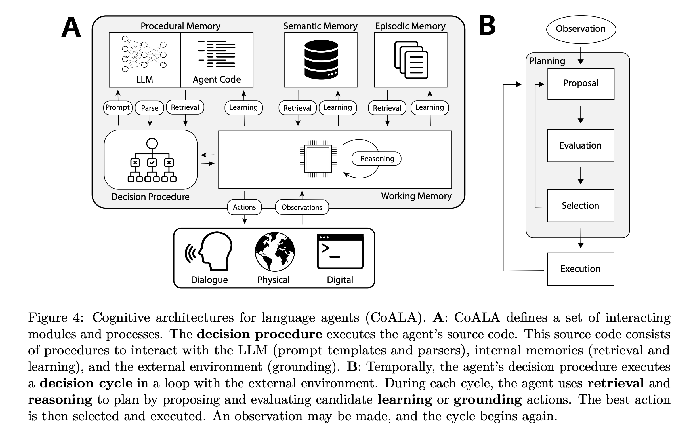

**三类记忆与 Skills 的定位**

认知科学将长期记忆大致分为三类：情景记忆（episodic memory，发生过什么）、语义记忆（semantic memory，知道什么）、程序性记忆（procedural memory，会做什么）。Agent 记忆的研究沿用了这套分类，[CoALA](https://arxiv.org/abs/2309.02427) 按此三类组织 Agent 的长期记忆，并将程序性记忆进一步区分为两种形态：隐式的，存在模型权重中；显式的，写在 Agent 的代码或结构化的 Context 中。

沿用这一框架，Skills 可以理解为显式程序性记忆的一种标准化载体。引言中的命名考据在此形成呼应：Anthropic 选择 "Procedural" 一词，实际上从起点就将 Skills 定位在程序性记忆的范畴内。CoALA 内还提到一个结论：**向程序性记忆写入，比写入情景或语义记忆的风险更高，更容易引入 bug 或偏离设计意图**。这一结论与 Appendix D 的实验数据相互印证。

**从情景记忆到两种学习范式**

对应到 Agent 系统中，情景记忆的原始形态就是 Session 轨迹。但没有人会直接将原始 Session 当作记忆系统使用：信息密度低、噪声高，每次复用都需要重新读取全文。它真正的角色是**原料**：语义记忆和程序性记忆，是从这份原料中提炼出的两种产物，分别对应两条不同的路线。

**路线一：全自动提取。** Claude Code 的 auto-memory 在后台 fork 一个 Subagent，按阈值设置（默认每轮对话后）周期性提取对话要点；产物是四类记忆文件，内容偏向**信息性上下文**。加载环节我在 2.4 节具体提过，这里不是重点（机制图也见 2.4 节）。

**路线二：Human-in-the-loop 沉淀。** 即 3.2 节中的 `contexts/` 工作流。人参与筛选哪些经验值得固化，产物是程序性知识，最终落入 Context 文件或 Skill。

**取舍与展望**

目前我的判断是：全自动路线降低了维护成本，但学习的东西缺乏人工把关，质量存在波动（方向偏离），这是我将 `autoMemoryEnabled` 关闭的原因；Human-in-the-loop 的维护成本更高，但每条记忆都经过人的判断与筛选，SkillsBench 的实验（Appendix D）也更倾向于支持这一方向。

往后看，两条路线未必始终对立。自动提取、人工批准的中间形态，也许是更可持续的方向。这里记录的只是 2026 年年中的一个阶段性观察。

## Appendix D. SkillsBench 的结论

[SkillsBench](https://www.oreilly.com/radar/agent-skills-work-but-the-research-shows-most-teams-are-building-them-wrong/) 的对照实验（84 个任务、11 个领域）提供了几项值得关注的结论。

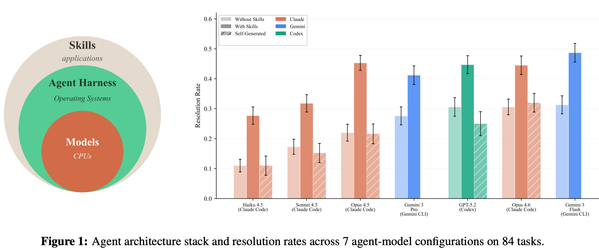

| 发现                                        | 含义                                             |
| ------------------------------------------- | ------------------------------------------------ |
| 经人工筛选与精修的 Skill 平均提升 **16.2%** | Skill 有用，但**前提是由人来把关质量**           |
| Healthcare 提升 ~52%，SWE 仅 4.5%           | 模型预训练覆盖越薄弱的领域，Skill 的边际收益越大 |
| 模型自生成的 Skill 提升 **0%**              | 让模型自己编写 Skill 再自己执行，没有正收益      |
| 小模型 + 精修 Skill ≈ 大模型裸跑            | Skill 是一种**变相的模型能力升级**               |

第三行最值得关注。让 Agent 自己编写 Skill，听上去已经接近自我迭代，但实验给出的答案是没有收益。背后的逻辑我认为是：Skill 本质上是对已有知识的程序化封装，而模型在缺乏外部可验证信号时无法从**自己身上蒸馏出自己尚未掌握的知识**，正如 RLHF 之所以需要 Human，正是因为模型无法可靠地充当自己的裁判。**在持续学习这条路径上，至少在质量把关这一环，短期内仍然离不开人的判断。**

这也解释了 3.2 节中 `contexts/` 工作流为何必须由人来收尾：将预测结果与标准答案进行对比，这件事可以交给 Agent 执行；但**哪些结论值得更新到 Context 中的判断，仍需由人来决策**。
