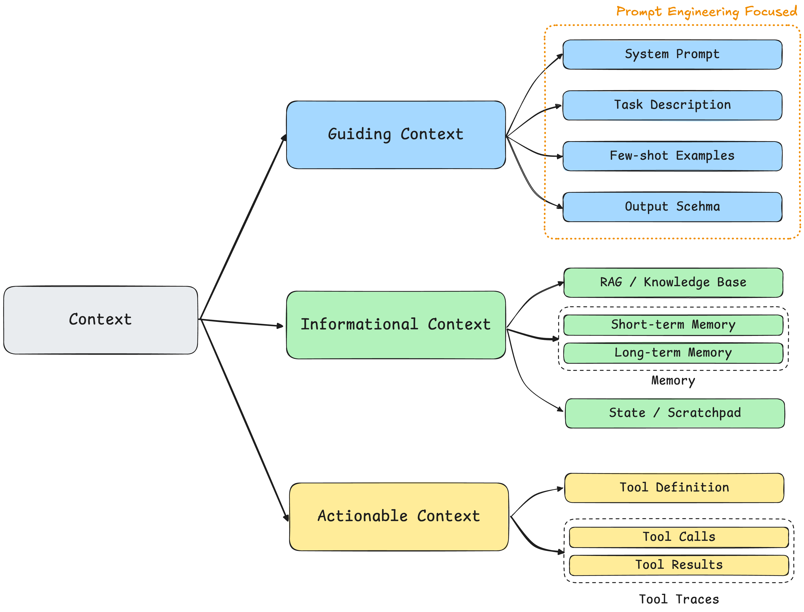

# Context Engineering，一篇就够了。

> “**多数 AI Agent 的失败，并非模型能力的失败，而是上下文工程的失败。**”

Context Engineering（上下文工程），这个术语在前段时间突然流行起来。起初我也质疑这是否又是一次炒概念？它与我们熟知的 Prompt Engineering、RAG 甚至 MCP (Model Context Protocol) 之间，存在着怎样的关联？

Context Engineering 的概念主要源自 Tobi Lütke 和 Andrej Karpathy 的推特：“It describes the core skill better: the art of providing all the context for the task to be plausibly solvable by the LLM.” （提供所有上下文的艺术，以使任务能够被 LLM 合理地解决） && "When in every industrial-strength LLM app, context engineering is the delicate art and science of filling the context window with just the right information for the next step." （上下文工程是一门微妙的艺术与科学，旨在在上下文窗口中填入恰到好处的信息，为下一步推理做准备）

通过对上下文工程这一概念的溯源与分析，本文认为，将上下文工程**简单等同于**“高级的提示工程”或“复杂的 RAG”是一种误读。它更应被理解为一套**哲学和准则**。尽管其核心理念看似直观，但它正是在 Agentic System 发展过程中，为应对工业级应用复杂性而逐步沉淀出的关键准则。对于任何致力于构建鲁棒、可扩展 AI 应用的开发者而言，理解并掌握这套准则至关重要。（这个话题还挺符合我的品味，它适合任何水平的人阅读）

本篇博客旨在回答以下三个问题：

- What？ 什么是 Context Engineering？它和我们熟知的 Prompt Engineering、RAG 有什么本质区别？
- Why？我们为什么需要这样一个新的概念？它的作用是什么？具有什么价值？
- How？ 如何系统性地进行 Context Engineering？Context Engineering 包含哪几个部分？以及这几个部分对应的最佳实践。

由于上下文工程的内涵仍在快速演进，其概念边界较为开放，在一篇文章中全面覆盖所有细节颇具挑战。因此，本文的核心目标并非求全，而是聚焦于其最有价值的核心，力求为读者构建一个清晰、稳固的认知（这样看来叫一篇就够了略微标题党了）。

## 1. What is Context Engineering？

### 1.1 如何定义 Context？

在理解什么是 Context Engineering（上下文工程）之前，我们首先需要明确什么是 Context（上下文）？相当一部分人会认为用户的历史聊天记录就是上下文。这个理解是**部分**正确的，上下文所涵盖的范围要远大于简单的历史对话记录。从本质上讲，**上下文（Context）是提供给 LLM 的、用于完成下一步推理或生成任务的全部信息集合**。引用一张图来进行概括：

虽然上图提供了全面的视角，但其并没有进一步分类。为了更清晰地分析，我倾向于将上下文划分为三个核心类别：

- 指导性上下文（Guiding Context），这类上下文的核心功能是**指导模型该做什么以及如何做**，主要为模型行为设定框架，目标和规则。**Prompt Engineering 一般旨在优化指导性上下文**。它包括：System Prompt；Task Description；Few-shot Examples；Output Schema（前面三个很简单，Output Schema 一般是强制要求模型以特定格式（如 JSON、XML）输出的结构定义）
- 信息性上下文（Informational Context），这类上下文的核心功能是**告诉模型需要知道什么知识**，为模型提供解决问题所必备的事实，数据与知识。它包括：RAG（外部知识库）；Memory（Short-term Memory：当前对话历史，Long-term Memory：跨会话存储的一些重要信息和偏好）；State / Scratchpad（状态维护和草稿纸，例如 Claude Code 在开始计划先的临时 TODO 以及 Thinking 模型下的思考“草稿本”）
- 行动性上下文（Actionable Context），这类上下文的核心功能是**告诉模型能做什么以及做了之后的结果**，为模型提供与外部世界交互的能力。它包括：Tool Definition；Tool Calls & Results / Tool Traces（调用了哪些工具以及工具返回的结果，即工具调用的历史追踪）

所以，**上下文是一个多维，动态，服务于特定任务的系统性概念**。

### 1.2 如何理解 Context Engineering？

明确了“上下文”的定义之后，我们可以回归核心问题：究竟什么是上下文工程？

回顾 Tobi Lütke 和 Andrej Karpathy 的观点：“It describes the core skill better: the art of providing all the context for the task to be plausibly solvable by the LLM.” （提供所有上下文的艺术，以使任务能够被LLM合理地解决） && "When in every industrial-strength LLM app, context engineering is the delicate art and science of filling the context window with just the right information for the next step." （上下文工程是一门微妙的艺术与科学，旨在在上下文窗口中填入恰到好处的信息，为下一步推理做准备）

由此，本文为上下文工程提出如下定义：**Context Engineering 是一门系统性学科，专注于设计、构建并维护一个动态系统，该系统负责在 Agent 执行任务的每一步，为其智能地组装出最优的上下文组合，以确保任务能够被可靠、高效地完成。**

由于上下文工程更接近一种开发哲学，它可以从多个角度被解释。其中一个极具启发性的类比源自 [YouTube: Andrej Karpathy: Software Is Changing (Again)](https://www.youtube.com/watch?v=LCEmiRjPEtQ&t=620s)。

如果把 LLMs （或更广义的 Agentic System）视为一种新型操作系统，LLM 就像 CPU，而上下文窗口（Context Window） 就像 RAM（同样是容量有限，管理 CPU 所需要的内存）。上下文工程则是这个操作系统中的内存管理器。它的职责不是简单地把数据塞满 RAM（上下文窗口），而是通过复杂的调度算法，决定在每一个“时钟周期”，哪些数据应该被加载、哪些应该被换出、哪些应该被优先处理，从而保证整个系统的流畅运行和最终结果的准确性。这也对应了**“上下文工程是一门微妙的艺术与科学，旨在在上下文窗口中填入恰到好处的信息，为下一步推理做准备”**

总得来看，上下文工程标志着我们和 LLM 交互模式的升级，从原来的 Prompt Engineering 优化指导性上下文（Guiding Context）转向“构建一个最高效的信息供给系统”。（为什么有和需要这样的升级呢？你可以简单思考下，我会在第二章尝试回答）

### 1.3 Context Engineering vs Prompt Engineering vs RAG

在你阅读 1.1/1.2 节之前，你可能认为（包括我）Context Engineering 的定义和 Prompt Engineering / RAG 之间有些混淆。有些人认为它就是大号的 Prompt Engineering，另外一些人可能认为，就是通过 RAG 把所有相关信息都放到上下文窗口中。

然而，通过前文的定义，三者的区别与关系变得清晰。它们并不是排斥关系，而是处于不同层级、互相协作的关系。一句话讲清楚：**提示词工程是上下文工程的子集，主要核心职能是优化 *指导性上下文(Guiding Context)*，而 RAG 则是实现动态 *信息性上下文(Informational Context)* 的关键技术手段之一。**

如果你已经理解了它们之间的差异，你可以忽略下面的冗余描述了。

Prompt Engineering 它主要任务是优化单次交互的指令部分，比如在系统提示词中定义角色，添加少样本示例和输出模式引导模型行文。因此，它是一种更细粒度的、面向具体问题的（单轮交互）的工程实践。

RAG 它的职责是从外部的知识库中检索相关信息，将其作为 **信息性上下文** 的一部分填充到上下文窗口中。因此，上下文工程的范畴远大于 RAG，它不仅负责“检索什么”（RAG 的核心），还需要考虑如何将得到的信息性上下文与另外两类上下文进行动态组合。一个先进的 Context Engineering System 甚至可能在某些步骤中完全不使用 RAG，或者在 RAG 失败后使用其他工具。

## 2. Why Context Engineering?

在上一章节，我们解构了“Context Engineering”的定义及其与相关概念的区别。一个自然而然的问题是：**我们为什么需要这样一个新的概念？**

### 2.1 模型之过，还是上下文之失？

在我之前写过的 LLM Accuracy Optimization 系列博客中，提到过一个“优化 LLM 的二维思维模型”（那时候还未出现 Context Engineering 的概念）。当 agentic system 或单次 LLM 调用的输出不及预期时，问题的根源往往可以归结为两个方面：

1. **模型能力局限：** 基座模型自身的能力不足，需要对模型本身进行优化。
2. **上下文信息缺失：** 模型没有接收到生成高质量回复所需的**恰当上下文**。

通常情况下（尤其是现在基础模型的智能已经超过一个阈值），输出不及预期的原因更多指向后者。即我们没有实现有效的上下文工程，导致模型缺失了一些解决问题的关键信息。**模型不会读心术**，因此只能进行不确定的假设，甚至陷入不必要的幻觉。（这也引出了一个值得思考的方向：一个能主动识别并请求补全缺失上下文的 LLM，或许能从根本上解决相当一部分问题？）

### 2.2 两个简单的示例

这两个例子将清晰的展示 Context Engineering 的必要性。

**示例一：缺失上下文的代价**

这个例子源自 [Philipp Schmid](https://www.philschmid.de/context-engineering) 的观察，它展示最基础的上下文缺失是如何造成巨大的结果差异。

想象你的 AI 助手收到一封简单的邮件：

> *“Hi, 明天有空聚一下吗？”*

一个**上下文贫乏 (Poor Context)** 的 Agent，它只能看到这句请求，别无其它上下文。其回应是机械的：

> *“感谢您的消息。我明天有空。请问您希望约在什么时间？”*
>
> **分析：** 此 Agent 未能推进任务，因为它缺乏做出下一步决策所需的**信息性上下文**。

现在，考虑一个**上下文充足 (Rich Context)** 的 Agent。它的系统在调用 LLM 之前，其首要任务是动态地组装一个包含多维信息的上下文：

- **信息性上下文 (Informational):**
  - `[Calendar Data]`：检索你的日历，发现明天日程已满。
  - `[Contact Data]`：识别发件人 Jim 是重要合作伙伴。
  - `[Email History]`：分析过往邮件，确定沟通应采用非正式语气。
- **行动性上下文 (Actionable):**
  - `[Tool Definition]`：提供 `send_calendar_invite` 工具的描述。

基于这个完整的上下文，它能生成一个真正高效的回应：

> *“Hi Jim! 我明天日程完全满了。周四上午有空，你看方便吗？我发了一个暂定邀请，如果时间合适请确认。”*
>
> **分析：** 这里的“魔力”，并非源于更智能的模型，而是一个能够为特定任务**动态组装恰当上下文的系统**。

这个例子展示了 Context Engineering 必要性的第一个层面：**缺乏上下文，将造成显著的性能鸿沟。**

**示例二：上下文退化的挑战**

第一个例子似乎暗示了一个简单的解决方案：把所有可能的上下文都提供给模型。暂且不考虑模型能力（大部分 LLM 并没有较长的上下文容量）和经济成本。当任务变得复杂和长程时，这种“简单的累加”策略不仅会失效，甚至会降低模型的表现。例如，你与 Jim 的往来邮件有上千封，其中不乏长篇内容，将这一切全部输入给 LLM 并非明智之举。

这里我通过另一个例子来进一步的介绍 Context Engineering的重要性（受 Cognition AI 博客的启发）

想象一个 Agent 被赋予一项长期任务：在一个大型代码库中，为期数天，实现一个涉及多个文件和依赖项的新功能。为了方便阐明，我们假设采用的是线性 Agentic System（因为并行架构存在决策不一致等内在复杂性，在某些场景例如 Coding 下并非最优选择）。 

- **一种朴素的策略：** 为了保证模型“无所不知”，系统将每一次交互都记录下来——每一条用户指令、文件读取、编译错误、成功的工具调用——并将这整段历史作为上下文，在每次调用 Agent 时都完整地传递给 LLM。

- **必然出现的失败级联**
    1. **性能下降：** 首先，性能会悄然下降。早期任务中无关紧要的细节（例如一次已解决的语法错误）会不断稀释当前步骤所需的核心信息，造成**上下文干扰 (Context Distraction)**。
    2. **成本与延迟激增：** 随着上下文线性增长，每次 API 调用的 Token 数量急剧膨胀，导致成本失控和更高的延迟。
    3. **最终崩溃：** 最终，系统将撞上架构限制——**上下文溢出 (Context Overflow)**。当累积的信息总量超过模型的上下文窗口上限（无论是 200K 还是 1M tokens），API 调用将直接失败，可能导致任务中断，或因信息截断而引向错误的结果。

Context Engineering 便是旨在解决这类问题的。例如，它可以通过对上下文进行智能管理与压缩，仅将高价值的结论与信息注入上下文（相当一部分 token 是没有价值的分析），从而规避上述风险。下图是一个简单的示例。

这个例子表明了：**上下文是一种需要被主动管理的、有限的资源。** 简单的累加策略在规模化应用中是不可持续的。

### 2.3 小结

随着基础模型的能力普遍越过一个关键阈值，上下文工程不仅成为提升系统表现的更高优先级选项，在许多场景下，它甚至是唯一可行的路径。上下文的缺失固然会导致 Agentic System 性能下降、幻觉频发，但无差别地堆砌所有历史信息注入上下文，同样会引发各类**上下文退化**问题。

因此，上下文的重要性及其管理复杂性逐步被所有 AI 工程师所熟知。这就要求我们必须建立一套系统性的方法论，来对上下文进行智能的、动态的**写入（Write）、选取（Select）、压缩（Compress）和隔离（Isolate）**。这四个操作构成了上下文工程的实现细节，也正是我们将在下一章探讨的核心内容。

## 3. How? The Best Practice of Context Engineering

> *“Prompt engineering” was coined as a term for the effort needing to write your task in the ideal format for a LLM chatbot. “Context engineering” is the next level of this. It is about doing this automatically in a dynamic system. It takes more nuance and is effectively **the #1 job of engineers building AI agents**. —— Cognition AI*
>
> “提示工程”一词被创造，指代为大型语言模型聊天机器人编写理想格式任务所需付出的努力。“上下文工程”是其更高层次。它指的是在动态系统中自动完成这项工作。这需要更精妙的考量，并且实际上是**构建 AI 智能体的工程师们的首要任务**。—— Cognition AI

上下文工程的实践可从两个维度展开：首先识别常见的失效模式，进而构建对应的工程方法。本章将从问题诊断与解决方案两个层面进行分析。鉴于技术快速演进，以下方法代表当前阶段的通用实现，而非永恒结论。

### 3.1 什么是上下文退化？

在介绍上下文工程的最佳实践前，我们有必要想想工业级 Agentic System 一般会遇到何种上下文相关的问题。了解了问题所在，才能更好的理解对应的解决方案。最常见的问题是 Informational Context 的缺失，此时需要优化的应该是 RAG 即检索部分。仅仅缺少相关信息的这类问题的解决方案比较成熟。但在工业级的长程、复杂 Agentic System 中，一个更根本且更隐蔽的威胁是**上下文退化**。

以 Coding Agent 为例，单次任务的 token 消耗通常是普通 chatbot 的数倍。Anthropic 的 Multi-Agent Research System 的 token 消耗量达到普通应用的 15 倍。这种消耗模式使得上下文窗口管理和跨 agent 的上下文传递成为核心技术挑战。关于 Long Context 可能引起的问题，参考我基于博客 [How Long Contexts Fail](https://www.dbreunig.com/2025/06/22/how-contexts-fail-and-how-to-fix-them.html) 进行的总结。

长上下文带来成本与协同压力，更易暴露四类上下文失效：污染、干扰、混淆、冲突。它们常彼此耦合，并直接损害推理稳定性与跨代理传递。

- 上下文污染（Context Poisoning），主要是幻觉进入 Context 导致异常结果。
- 上下文干扰（Context Distraction），当 Context 接近溢出时，模型训练中获得的知识会被“覆盖”导致模型降智。
- 上下文混淆（Context Confusion），冗余且不相关的 Context 让输出结果偏离期望。
- 上下文冲突（Context Clash），当上下文中的信息互相矛盾时，比如上下文存在过去错误的答案。

### 3.2 上下文工程的最佳实践

为应对上述挑战，业界已逐步收敛出一套系统性的应对框架。参考 [Lance's Blog](https://rlancemartin.github.io/)，如下图所示将上下文工程分为四个部分：**写入（Write）、选取（Select）、压缩（Compress）和隔离（Isolate）**。每个部分的具体实现策略和细节有太多可以深挖的，这里仅作大致的介绍。

**写入（Write）**

写入主要是将 **上下文持续久化，超越上下文窗口的限制**，在未来按需取用。通常情况下分为：

- **会话内写入 (Session-level Write):** Agent 将中间思考、计划或临时数据写入一个会话内的**草稿纸 (Scratchpads)**。这是一种轻量级的、非持久化的写入，用于管理当前任务的复杂性。
- **持久化写入 (Persistent Write):** 系统将具有长期价值的信息（如用户偏好总结、关键事实）写入外部的**记忆 (Memory)** 系统，如向量数据库或知识图谱。这实现了跨会话的知识积累。例如，ChatGPT 和 Cursor 等应用通过这种方式，让 Agent 在与用户的持续交互中“学习”和“成长”，用户在解决某些问题时无需手动引入上下文。

Anthropic 也曾在博客中建议，**Subagent output to a filesystem to minimize the ‘game of telephone.’** 通过把 subagent 的输出写到文件以避免无意义的上下文传递，上下文窗口占用等。

**选取（Select）**

选取的目的，是在每次 LLM 调用前，从所有可用的信息源中，动态地拉取与当前子任务最相关的信息。这是保证上下文信噪比的关键。

上下文工程中的选取包括三类：

- **确定性选取 (Deterministic Select):** 指根据预设规则加载上下文。例如，编码 Agent （Claude Code）在启动时，**固定加载** 项目根目录下的 `CLAUDE.md` 文件，这是一种简单高效的先验知识注入。
- **模型驱动选取 (Model-driven Select):** 当可用信息源过多时（如海量工具或文档），可以利用模型自身的能力进行筛选。
- **检索式选取 (Retrieval-based Select):** 这是最主流的方式，其核心范式是通过相似度检索，从记忆、草稿纸或外部知识库中**选取**信息。因此，选取操作的成败，在很大程度上依赖于底层检索系统的质量。

**压缩（Compress）**

压缩的目的，是在信息进入上下文窗口**之前**，对其进行有损或无损的压缩，用更少的 Token 承载最核心的信号。 这是在上下文窗口容量有限的情况下，容纳更多有效信息的直接手段。

前文提到，Claude Code 等 Agentic System 需要大量的 token 开销。因此，在上下文窗口接近溢出时，它们通常会采取所谓的“auto-compact”，如上图左边所示，它会自动的总结 Context 保留“它认为最重要的部分“。因此自动压缩的策略及其性能对后续任务处理的影响非常大。根据实际使用情况，Claude Code 的 auto-compact 功能仍不完善，直接以最小上下文重启更稳妥。

再次引用 Section 2.2 中的图片。Cognition AI 为了压缩 context，从而高效的在 agent 之间传递，使用了 fine-tuning 过的“压缩大语言模型“专门执行压缩步骤。

另有修剪策略：如硬截断超限历史，代价是失去部分语境。

**隔离（Isolate）**

相较于前三个在“信息流”内部进行优化的原则，隔离是一种在**系统架构层面**进行的、更根本的上下文管理策略。隔离的目的，在多信息流之间设置边界，由子流程先行消化，仅上交要点。**可视为跨流层面的‘压缩’**。

Anthropic 提到过一个很有意思的观点：“The essence of search is compression: distilling insights from a vast corpus.” 翻译过来便是：**”搜索即压缩，从庞大的语料库中提取洞见“**。这不免让人想到源自 Ilya 的**压缩即智能**。

在多智能体系统中，子智能体扮演了“智能过滤器”的角色。它们在各自的领域内**隔离且并行**工作，消化大量原始信息，然后将最关键的“**压缩后**”的洞见（the most important tokens）提交给主智能体。

这种机制极大地减轻了主智能体（Lead Agent）的认知负担。它无需亲自阅读每一份原始文档，只需处理由各个专家团队提交上来的、经过预处理和提炼的“摘要报告”。因此，**上下文工程中的隔离，最经典的表现就是多智能体架构，由于 Lead Agent 只接收隔离上下文中最有价值的部分，可以很大程度的避免 Long Context 带来的潜在问题，例如 上下文干扰/上下文冲突，隔离也侧面提高了上下文中的信息密度。** Tool call 以及类似的沙盒环境也都体现了同等的隔离思想。

!!! info "压缩 vs 隔离 的思考"

    - **压缩**作用于**单一信息流的内容**，旨在**提升其内在的信息密度**。
    - 隔离则作用在多条信息流上，旨在管理系统的复杂性，同时也能起到广义的压缩作用。

    它们的目的，在我看来殊途同归，最终都是为了提升 Context 中的信息密度。一个成熟的系统，往往会**同时**运用这两种策略。

!!! question "一个值得思考的问题"

    **Prompt Engineering 在这个框架中的位置？**

    细心的读者可能会发现，我们反复强调"提示工程是上下文工程的子集"，但上述的"写、选、压、隔"四大原则，似乎并未直接包含"如何设计 System Prompt"这类提示工程的核心活动。

    我认为这主要是视角的不同。这个四个最佳实践，主要关注的是如何管理**动态、流动的信息**（如 RAG 结果、对话历史）。而由提示工程产出的"指导性上下文"（如 System Prompt），在这个框架中，更多被视为一种**相对静态的核心配置**。会在"选取"的部分被加载到上下文中。

## 4. Conclusion

行文至此，我们已完整解构了上下文工程的“是什么”、“为什么”以及“如何做”。它并非是简单的炒概念，而是 AI 应用开发从 Demo 走向工业级应用中产生的开发哲学与准则。

我们的工作重心，也不可逆转地从“如何找到那句完美的 prompt”，转向“**如何设计一个能够为模型在每一步都动态组装出完美上下文的、健壮可靠的系统**”。从原来的“炼丹/找 prompt”回归到更扎实、更可靠的**系统工程**上来。

理解并熟练运用**写入、选取、压缩、隔离**这四大最佳实践，将是区分一个“有趣的 demo ”和一个“可靠的、可规模化的应用”的关键。

最后，让我们再回过头看看 **MCP（Model Context Protocol，模型上下文协议）**。理解了上下文工程，也许我们就能更好地体会这个命名的用意。MCP 是面向工具与数据的标准化接口/上下文交换协议。本质上是为“**行动性上下文**”和部分“**信息性上下文**”的标准化交互所做的努力，让 Agent 能够更顺畅、更安全地与外部工具和数据源（即上下文的来源）进行通信。从这个角度看，MCP 是实现稳健的上下文工程所需的基础设施之一，它为这个复杂的系统工程提供了标准化的接口（现在看来不得不感叹 Anthropic 在开创标准上一直走在前沿）。

**多数 AI Agent 的失败，并非模型能力的失败，而是上下文工程的失败**。归根结底，无论是精巧的 prompt ，还是RAG，抑或是 MCP，它们都指向同一个目标：**在模型做出决策前，为它准备好一份恰到好处的上下文**。 希望阅读至此你对 Context Engineering 会有一些更深的理解。Context Engineering 有点像 Agentic System 开发之禅，我的文字功力尚浅难以完全表达，且任何代码示例只能展示上下文工程复杂系统的一小部分，所以本篇主要是在概念上进行解惑，任何问题希望大家批评指正。

下一篇博客，可能会是《Agentic RAG，一篇就够了》，在这篇中我会尽量引入一些可实操的案例。

## References

🔥 代表我更推荐的。

- [Tobi Lütke Tweet](https://x.com/tobi/status/1935533422589399127)
- [Andrej Karpathy Tweet](https://x.com/karpathy/status/1937902205765607626)
- [🔥 Context Engineering 101 cheat sheet](https://x.com/lenadroid/status/1943685060785524824)
- [Blog: The New Skill in AI is Not Prompting, It's Context Engineering](https://www.philschmid.de/context-engineering)
- [LlamaIndex: Context Engineering - What it is, and techniques to consider](https://www.llamaindex.ai/blog/context-engineering-what-it-is-and-techniques-to-consider)
- [LangChain: The rise of "context engineering"](https://blog.langchain.com/the-rise-of-context-engineering/)
- [Youtube Andrej Karpathy: Software Is Changing (Again)](https://www.youtube.com/watch?v=LCEmiRjPEtQ&t=620s)
- [12-factor-agents: ch3 Own your context window](https://github.com/humanlayer/12-factor-agents/blob/main/content/factor-03-own-your-context-window.md)
- [🔥 Lance: Context Engineering for Agents](https://rlancemartin.github.io/2025/06/23/context_engineering/)
- [🔥 Cognition AI: Don’t Build Multi-Agents](https://cognition.ai/blog/dont-build-multi-agents#principles-of-context-engineering)
- [🔥 How Long Contexts Fail](https://www.dbreunig.com/2025/06/22/how-contexts-fail-and-how-to-fix-them.htm)

