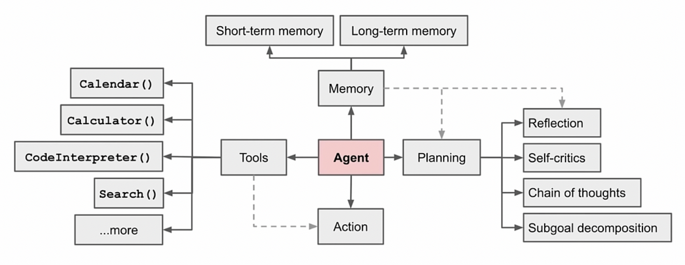
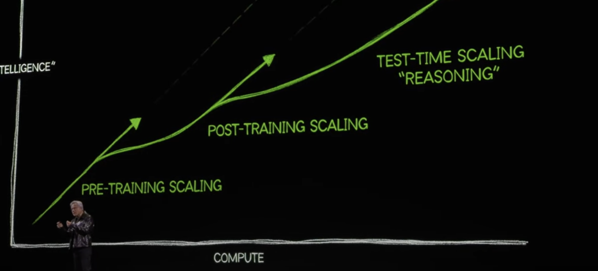
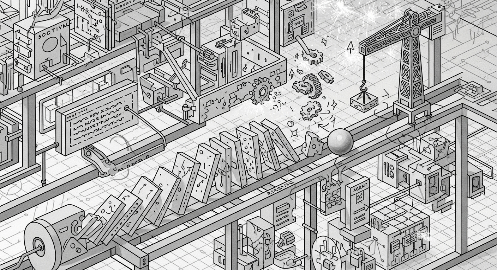

# Multi-Agent System，一篇就够了。

`READ⏰: 45min`

副标题：Anthropic -- 范式转移，从模型智能到系统智能

*Anthropic 发现，在他们的内部研究评估中，一个以 Claude Opus 4 为主智能体、Claude Sonnet 4 为子智能体的多智能体系统，其性能比单智能体的 Claude Opus 4 高出 90.2%。当智能达到一定阈值，多智能体系统就成为扩展性能的重要方式（Once intelligence reaches a threshold, multi-agent systems become a vital way to scale performance. ）*

就像人类社会意义，在过去相当漫长的时间里，人类的单体智能并未有显著式的增长，但人类社会在信息时代的整体能力却在指数级提升。一方面是因为计算机/更强大工具的出现，另一方面也是人类协作与群体智慧的结果。

这就是为什么，我和越来越多人关注多智能体系统，随着单个 LLM 的能力增长逐渐放缓，Multi-Agent 无疑会成为新的研究热点。本篇博客旨在回答三个问题：

- What？什么是多智能体系统？（这个问题非常简单）
- Why？我们为什么需要多智能体系统？（引文也提到一部分）
- How？构建多智能体系统的最佳实践是什么？

本篇博客主要源自 Anthropic 在前段时间发布的[《How we built our multi-agent research system》](https://www.anthropic.com/engineering/built-multi-agent-research-system#)，我很早就有写这博客的想法，但总感觉流于翻译，反复阅读尝试基于此和个人的理解撰写一篇关于多智能体系统的博客。没有结合代码一起来，就当一个简单的入门 intro 吧～ 欢迎批评指正。

## 1. What is Multi Agent System?

一个多智能体系统是由**多个能够自主行动的智能体（Agent）组成的计算系统**。这些智能体在一个共享的环境中进行交互，彼此之间可以通信、协作、竞争或协商，从而解决单个智能体难以或无法解决的复杂问题。

对于绝大部分普通用户（包括最初的我）很容易偏颇的认为，所谓的 Multi Agent System 不过是 prompt engineering，给不同的 Agent 设置不同的角色扮演就变成了多智能体系统。实则不然，高级的 Prompt Engineering 是构建多智能体系统的**必要条件**。比如：

- **角色设定：** “你是一个项目总监 Agent...”
- **流程定义：** “你的工作流程是规划、委派、整合...”

**但是，一个真正健壮、高效的多智能体系统，还包含了远超 Prompt Engineering 的“系统工程”设计**：比如**系统架构设计**，用编排者-工作者（orchestrator-worker）模式，还是评估器-优化器（Evaluator-optimizer）（一些 Agent 负责生成结果，另一些 Agent 负责评估和反馈），还是更复杂的层级结构？这需要根据任务类型进行权衡，是软件架构层面的思考。再比如**工具设计与开发**，单 Agent 主要由四个关键组件构成，Agent 使用的工具（API，MCP Tool）对性能有显著影响。例如，工具是否能被 Agent 正确理解，工具被正确调用率如何？除此之外还有状态管理（持久化 memory 与异常恢复），成本控制等等。

!!! note

    我们对多智能体系统的认知，有时会陷入与对"管理"相似的误区。

    外行视角下的管理，似乎只是开会与分配任务，容易产生"其本质不过是上传下达"的简化认知。同样，对多智能体系统的初步理解，也可能停留在"将一个大 Prompt 拆分为几个小 Prompt"的表层操作上。

    然而，无论是管理人类团队还是构建多智能体系统，**核心挑战都是从"依赖个体超级能力"转向"设计一个能让平凡个体创造超级结果的系统"。**

## 2. Why Multi Agent System?

在上一节，我们描述了什么是多智能体系统，并理解了它远不止是 Prompt Engineering，更是一项复杂的系统工程。但一个更深刻的问题是：**我们为什么非要走这条更复杂的路？** 一个更强大的单智能体，比如未来的 Gemini 3，Claude 5 或 GPT-6，难道不能解决所有问题吗？

Anthropic 的答案是否定的。他们用实践证明，多智能体系统解决的是单智能体在**结构上**就难以克服的**根本性问题**。

### 2.1 非线性与涌现性

现实世界中真正有价值的任务——比如进行一项前沿科技的市场调研，或为一家公司制定未来三年的增长战略——其本质是**开放式的**和**不可预测的**。你无法在开始时就用一个固定的流程图来规划所有步骤。恰恰相反，解决这类问题的过程本身就是一个不断发现新线索、调整方向、甚至彻底改变初始假设的动态过程。

**困境：单智能体的“隧道视野”**

先不考虑多智能体的并行执行带来的高效，一个单智能体就像一个独自探案的侦探，它沿着一条线索深入挖掘，可能会因为过于专注而错过其他同样重要的线索，难以在深入细节的同时保持对全局的“上帝视角“般的观察。它的思考是**线性**的，应对一些”意外情况“非常脆弱，比如一旦初始路径有误，**它的调整能力非常有限**，因为它只有一个“大脑”和一个“上下文”。用 Anthropic 的话说，“A linear, one-shot pipeline cannot handle these tasks”。

**优势：多智能体的“上帝视角”**

我们以编排者-工作者（orchestrator-worker）模式为例，Anthropic 的 Research 功能便是基于此类模式，如上图所示，多智能体系统则从结构上天然解决了单智能体的困境。它引入了两个核心概念：**并行探索**和**关注点分离（Separation of Concerns）**。

*   **并行探索：** 主智能体（Orchestrator）如同迷宫入口的总指挥，派遣多个子智能体同时探索不同的路径。这确保了在任何时刻，系统都在进行广度优先的探索，极大地增加了发现“最优解”的概率。同时，依据概率论的先验，可以用类似投票的方法保证结果的稳定性，减少方差。
*   **关注点分离：** 每个子智能体都是一个独立的“专家”，拥有**自己独立的上下文窗口**、工具集和探索历史。一个负责技术分析的 Agent 不会被市场新闻所“污染”。这种隔离保证了每个子任务的深度和纯粹性。

如 Anthropic 强调的：**“你无法硬编码一个探索复杂主题的固定路径，因为这个过程是内在动态和路径依赖的。（You can’t hardcode a fixed path for exploring complex topics, as the process is inherently dynamic and path-dependent. ）”** 多智能体系统正是为了拥抱这种动态性而生的。

### 2.2 从 pre-train scaling law 到 inference compute scaling law

在过去的一段时间，我们听到的 Scaling law 更多情况下是描述预训练领域，即通过更大的参数/更多的数据来让基础模型更聪明。但目前的一些实验结果和研究在逐步表明：**在达到一定智能阈值后，性能的决定性因素，变成了你能否为问题投入足够多的“有效算力”，即 Token。**Multi Agent System 天然可以承载更多的 token 消耗，因为多智能体系统多 agent 的结构决定了它几乎无上限的 token 容量。未来，也许会有更多厂商在多智能体系统上投入更多 token 来探索 inference compute scaling law。

在 Anthropic 的实践中，他们发现三个因素解释了 [BrowseComp](https://openai.com/index/browsecomp/) 评估（测试浏览智能体定位难找信息的能力）中 95% 的性能差异。**其中 Token 使用量本身解释了 80% 的差异，而工具调用次数和模型选择是另外两个解释性因素。**这一发现验证了 Anthropic 的多智能体架构，该架构将工作分配给具有独立上下文窗口的智能体，以增加并行推理的能力。

这正是多智能体系统发挥其魔力的关键点。单智能体受限于其一次性的上下文窗口大小和处理能力，其“Token 预算”存在物理上限。而多智能体系统，通过将一个大任务分解成多个子任务，并分配给拥有独立上下文窗口的多个子智能体来执行，**本质上是一种极其高效地扩展总 Token 使用量的架构**（对应上文中的“几乎无上限的 token 容量”）。

同时，这些架构也存在成本上的问题。在实践中，这些架构消耗 Token 的速度很快。基于 Anthropic 的数据，智能体通常比聊天交互（chatbot）多使用约 4 倍的 Token，而多智能体系统比聊天多使用约 15 倍的 Token。为了在经济上可行，多智能体系统需要用于那些任务价值足够高，能够支付得起性能提升带来的成本的任务。

!!! tip

    💡我认为这个优势足够有价值。因为它可能开辟新的赛道，就目前而言大部分厂商在基模训练这块已经失去参赛资格。但是，多智能体系统可能会开创新的赛道，**从单纯追求基模的硬智商到建立系统化/工程化的多智能体系统**。基于非 SOTA 模型在某些特定领域取得领先。

### 2.3 搜索即压缩，压缩即智能

Anthropic 还提到了一个很有意思的观点：“The essence of search is compression: distilling insights from a vast corpus.” 翻译过来便是：**”搜索即智能，从庞大的语料库中提取洞见“**。这不免让人想到源自 Ilya 的**压缩即智能**。

在多智能体系统中，子智能体扮演了“智能过滤器”的角色。它们在各自的领域内**并行**工作，消化大量原始信息，然后将最关键的“压缩后”的洞见（the most important tokens）提交给主智能体。

这种机制极大地减轻了主智能体（Lead Agent）的认知负担。它无需亲自阅读每一份原始文档，只需处理由各个专家团队提交上来的、经过预处理和提炼的“摘要报告”。这使得主智能体可以专注于更高层次的战略规划、逻辑推理和最终决策，从而产生更高质量的综合性输出。

### 2.4 小结

综上所述，多智能体系统为应对复杂性问题提供了一个有效的架构选择。它通过模拟协作模式，旨在突破单体智能固有的局限；通过架构创新，提升了系统在推理上可投入的**“算力预算”上限**；并通过分层信息处理，实现了高效的洞察提炼。

## 3. How? The best practice for Multi Agent System

在分析完是什么和为什么之后，我将尝试结合 Anthropic 的博客，萃取一些多智能体系统构建的最佳实践。

### 3.1 Anthropic: Architecture overview for Research

Anthropic 在博客中的例子是他们如何设计 Claude Research 功能的。Research 或者说 Deep Research 是近期的潮流，这个任务本质上是检索大量信息，从中提炼有价值的内容形成一个总结，在任何领域都有用武之地。

在深入其架构细节之前，我推荐大家简单思考下基于 Multi Agent System 的 Deep Research 与 RAG（检索增强生成）的不同。传统 RAG 采用的是**静态检索**：一次性地根据用户查询抓取最相关的文本块，然后基于这些固定的信息生成答案（当然，我觉得 Anthropic 这里说的是非常传统的 RAG，Agentic RAG 其实和 Deep Research 的界限很模糊？）。

而基于 Multi Agent System 的 Deep Research 则是一种**动态、多步的研究过程**。它并非一次性“获取”信息（搜索 + 重排），而是通过智能体的主动探索去“生成”洞察。并根据研究途中的新发现，实时调整策略。

Anthropic 采用的是经典的**编排者-工作者（Orchestrator-Worker）模式**：

上图完整展示了其工作流程。当用户提交一个查询时，系统的工作流如下：

1. **启动与规划：** 系统创建一个**主研究员智能体 (Lead Researcher)**。它首先思考并制定一个研究计划，并将这个计划**保存到记忆 (Memory)** 中。这是至关重要的一步，因为它确保了在长流程任务中，即使上下文窗口被截断，核心目标和计划也不会丢失。
2. **委派与并行：** 主智能体根据计划，创建多个**专门的子智能体 (Subagents)**，并为每个子智能体分配具体的、独立的子任务。（在图中，创建了两个 sub-agents）
3. **执行与评估 (引入“交错思考”)：** 每个子智能体独立地执行任务（如网络搜索）。关键在于，它们使用 **“交错思考” (Interleaved Thinking)** 的技术。这意味着，在两次工具调用之间，Agent 会插入一个“思考步骤”，用于评估上一步工具返回的结果质量，识别信息差距，并迭代优化自己的下一步行动。
4. **综合与决策：** 子智能体将它们的发现返回给主智能体（**压缩**）。主智能体**综合这些结果**，并判断是否需要进一步的研究。如果需要，它可以创建更多的子智能体或调整策略。
5. **引用与输出：** 一旦收集到足够的信息，系统会调用一个专门的**引用智能体 (CitationAgent)**，它负责处理所有文档和研究报告，确保所有声明都有据可查。最终，一份带有精确引用的完整研究结果将返回给用户。

### 3.2 8 条多智能体系统构建的最佳实践

多智能体系统与单智能体系统有关键区别，其中包括协调复杂性的迅速增长。智能体开发的早期容易犯一些错误，比如为简单查询生成 50 个子智能体，无休止地在网上搜索不存在的来源，以及智能体之间通过过多的更新互相干扰。虽然， 上文中提到多智能体系统不等价于 Prompt Engineering 但**由于每个智能体都由 Prompt 引导，Prompt Engineering 是我们改进多智能体系统行为的主要手段。**Anthropic 基于他们的经验总结了 8 条最有价值的 Agent Prompt Engineering 实践。

我基于个人理解分为了三类，分别是：管理层面；执行层面；细节层面。做了个简单示意图如下：

**管理层面**

这部分主要偏向主智能体（Orchestrator）需要的管理哲学。它关乎方向、资源和目标。

- **学会有效授权 (Teach the orchestrator how to delegate)** 将模糊任务清晰化。为子智能体提供明确的目标、格式、工具和边界，这是项目成功的基石。避免让 Lead Agent 给出诸如 “研究半导体短缺” 模糊不清的指令，这可能会导致 Sub Agent 做重复的工作。Anthropic 最初允许允许 Orchestrator 给出简单的、简短的指令，但发现这些指令常常模糊不清，导致 Sub-agent 误解任务或执行与其他智能体完全相同的搜索
- **合理分配资源 (Scale effort to query complexity)** 其实相当于在 prompt 中 hardcode 一些先验。防止在简单问题上“杀鸡用牛刀”。*“Simple fact-finding requires just 1 agent with 3-10 tool calls, direct comparisons might need 2-4 subagents with 10-15 calls each, and complex research might use more than 10 subagents with clearly divided responsibilities.”* （简单的事实查找通常只需要一个 Agent 进行 3 到 10 次工具调用等等，诸如此类的先验知识）

**执行层面**

这部分主要偏向子智能体（Sub-agent）在执行任务时需要遵循的具体策略。它关乎效率、质量和速度。

- **先广后精的探索策略 (Start wide, then narrow down)** 搜索策略应模仿专家级的人类研究：在深入具体细节之前先探索整体概况。智能体通常默认使用过长、过于具体的查询，这会导致返回结果很少。**Anthropic 发现通过提示智能体从简短、宽泛的查询开始**，评估可用的信息，然后逐步缩小焦点，可以有效纠正这种倾向。
- **引导思考过程 (Guide the thinking process)** 这条现在比较常见了，在 Claude 中对应扩展思考（Extend Thinking）使用扩展思考可以为智能体后续的行为提供“草稿纸”。有助于智能体的规划，设计。同时引入上文中提到的**“[交错思考](https://docs.anthropic.com/en/docs/build-with-claude/extended-thinking#interleaved-thinking)”**，让智能体在工具调用之间能够进行思考，从而可以动态调整。
- **并行工具调用优化速度和性能 (Parallel tool calling transforms speed)** 复杂的研究任务（DeepResearch）自然涉及探索许多来源。Anthropic 在早期的智能体执行时使用顺序搜索，速度慢得令人痛苦。为了提速，引入了两种并行化：（1）主智能体**并行**启动 3-5 个子智能体，而不是串行启动；（2）子智能体**并行**使用 3 个以上的工具。这些改变使复杂查询的研究时间减少了高达 90%，让研究功能在几分钟内完成更多工作，而不是几小时，同时覆盖的信息比其他系统更多。更进一步总结就是：**在任务级和工具级同时实现并行化**。

**细节层面**

这部分更多的是指导在构建多智能体系统的细节部分。它关乎如何调试 prompt，如何设计与选择工具等。

- **像你的智能体一样思考 (Think like your agents)** 要迭代 prompt，必须理解它的效果。类似于单步调试，逐步观察智能体的工作。这样有助于你发现智能体是在哪些环节出问题的，例如“智能体在已有足够结果时仍继续工作，使用过于冗长的搜索查询，或选择不正确的工具”。
- **工具设计与选择至关重要 (Tool design and selection are critical)** 工具之于 LLM 有点像 UI 之于人类。UI 的全称是 User Interface，面向用户的接口。**所以，工具例如 MCP 等就是面向 LLM 的接口。使用正确的工具是高效的乃至必要的**。糟糕的工具描述会使智能体走上完全错误的道路，所以每个工具都需要一个明确的目的和清晰的描述。同时，Anthropic 还设计明确的启发式规则：**首先检查所有可用工具，将工具使用与用户意图匹配，进行广泛的外部探索时搜索网络，或优先选择专用工具而非通用工具（*examine all available tools first, match tool usage to user intent, search the web for broad external exploration, or prefer specialized tools over generic ones***）
- **赋予智能体自我进化的能力 (Let agents improve themselves)** 当大模型自己优化自己，如同我们在 Claude Code / Cursor 等 AI Coding 软件把它们写的 bug 让它们自己解决。Claude4  等模型也可以是出色的提示工程师。当给定一个 Prompt 和一种失败场景时，它们能够诊断出智能体失败的原因并提出改进建议。甚至，你可以尝试开发一些工具测试 Agent，来自动优化一些 MCP 工具。

根据我的经验，大部分的 tips 还需要读者结合自己的实践去进一步理解。总的来说，智能体的 prompt 应该侧重于灌输良好的**启发式**方法，而非 hardcode 的规则（这样就变得有点 if-else 的死板）。Anthropic 认为：**除了上述的 8 个建议，你需要深入你所要做的领域，比如当你做 Deep Research 时你需要思考专业的人是如何进行研究任务的？总结后启发式的融入我们的 prompt 中，比如将大的研究问题分解成小问题，以及识别何时应该注重深度与广度。然后，通过设定一些明确的边界避免多智能体系统完全失控。在做到上述两步后，构建一个可观测的测试用例反复迭代。这就是多智能体系统开发的最佳实践。**

### 3.3 从原型到产品的最后一公里

我认为无论是 agent 还是 multi agent system，构建原型都远比构建一个可以长期运行，不需要太多人工介入的 pipeline 简单的多。所以，在构建好原型后，如何走完从原型到产品的这最后一公里呢？主要分为两大挑战：**科学的评估**与**可靠的工程化**。

**第一步是评估**，如何 agent 进行有效的评估？agent 和传统的数据结构算法或者业务代码不同。传统的软件执行通常有明确的大致（多线程/多进程可能没那么固定）可预期的步骤，比如：给定输入 X，系统应遵循路径 Y 产生输出 Z。但是 agent 尤其是 multi agent system 并非如此。即使起点相同，它们可能会采取完全不同的有效路径来达到目标。它们可能使用不同的工具，检索不同的来源。因为，通常情况下解决问题并不只有一条正确路径，因此仅检查 agent 是否符合我们预设的所谓“正确的路径”不够严谨。我们需要**更先进的评估方法，兼顾结果的检查和过程的检查。**

**立即用小样本开始评估**。在 agent 开发的早期阶段，任何改变往往会产生巨大影响，**因为有大量唾手可得（low-hanging fruit）的改进空间**。一个 prompt 的调整可能会将成功率从 30% 提高到 80%。改进幅度这么明显，仅用几个测试用例就能发现变化。Anthropic 团队从大约 20 个代表真实使用模式的查询集开始。测试这些查询通常能让我们清楚地看到变化的影响。**经常有 AI 开发者团队推迟创建评估数据集，因为他们认为只有包含数百个测试用例的大型评估集才有用。然而，最好是立即用几个例子进行小规模测试，而不是等到能够构建更全面的评估时再开始。**

**在合适时使用 LLM 作为评估者进行扩展。** 如上文所说，在 Cursor 等 AI Coding 中使用 AI 解决 AI 生产的 Bug。在恰当的时候利用 AI 评估 AI。我们需要对结果（输出）制定正确的评分标准，例如：事实准确性（声明是否与来源匹配？）、引用准确性（引用的来源是否与声明匹配？）、完整性（是否涵盖了所有被要求的内容？）、来源质量（是否使用了主要来源而非质量较低的次要来源？），以及工具效率（是否以合理的次数使用了正确的工具？）并把它合理的嵌入到 Prompt 中。我们可以使用多个 LLM 并行的对不同部分进行评分（每个 LLM 负责一个指标），**但是实验结果证明单个 LLM 调用，即使用单个 Prompt 输出一个评分结果是最统一的，并且和人类的判断最接近。**

**必要时引入人工介入。** 有时候自动化评估会遗漏一些边缘情况。例如，Anthropic 在实验中发现，早期 agent 在搜索时，倾向于选择 SEO 优化过的内容而非类似学术 PDF和个人博客等更权威但排名较低的来源。因此，他们手动的在 prompt 中加入了启发式的规则解决了这个问题。这说明，尽管我们都期望能自动化所有内容，但是人工介入在某些情况下仍是必要的。

多智能体系统很容易引发蝴蝶效应，对智能体的微小改动可能会不可预测的改变整个系统的走向。因此，构建成功的产品时，除了对单个 agent 行为的了解和分析外更需要你理解整个系统的**交互模式**。因此，**prompt 的最佳实践应该是启发式的，而非严格的 hardcode。应该关注的是如何管理划分问题，如何解决问题等等。过于严格的 hardcode 只会变成 if-else 式的工作流。做到这点并不容易，需要仔细的设计 prompt / 工具，应用启发式的方法以及完整的评估反馈体系。**

**第二步是生产化/工程化，**如何构建稳定可靠的产品级 agentic system 是当前时代的新挑战。上文所说，多智能体系统很容易引发蝴蝶效应。在传统软件中，一个 bug 可能会破坏一个功能、降低性能或导致服务中断。在 agentic system 中，微小的变化会级联成巨大的行为变化，这使得为必须在长期运行过程中维持状态的复杂智能体编写代码变得异常困难。

关于这块，由于我也没有做过非常复杂的生产级 agentic system 开发，我只能高度总结 anthropic 的经验。Anthropic 分享了他们在生产化中遇到的四大挑战与对策：

- **状态与错误 (Stateful & Errors):** Agent 是长期运行、有状态的。一个微小的系统失败都可能对 Agent 造成灾难性影响，而重启的代价（Token 消耗、用户体验）是昂贵的。**对策是构建能从断点恢复的系统，并结合模型的智能（如告知 Agent 工具失效，让其自行适应）和工程的确定性（如重试逻辑、检查点）来优雅地处理错误。**
- **调试 (Debugging):** Agent 的非确定性让复现 Bug 难于登天。**对策是唯一的出路——全面的生产链路追踪 (Full Production Tracing)。** 必须记录下 Agent 的每一步决策、每一次工具调用和返回结果，才能系统性地诊断失败根源。
- **部署 (Deployment):** 如何在不中断正在运行的 Agent 的前提下，更新这个持续运行的复杂系统？**对策是采用彩虹部署 (Rainbow Deployments)，让新旧版本的系统并行运行，逐步将流量从旧版本切换到新版本。**
- **瓶颈 (Bottlenecks):** 当前的同步执行模式简化了协调，但也造成了瓶颈——整个系统被最慢的子 Agent 拖累。**未来的方向是异步执行，虽然这会带来状态一致性、错误传递等新挑战，但其性能收益将是巨大的。**

## 4. 总结

行文至此，我们已完整解构了 Anthropic 在构建多智能体系统上的思考与实践。本文从“是什么”和“为什么”出发，探讨了多智能体系统的必要性：它旨在解决单体智能在处理复杂、开放式问题时，结构上存在的“隧道视野”与“算力天花板”问题。

随后，我们拆解了其“如何构建”的核心：从“编排者-工作者”的系统架构，到 8 条多智能体系统构建的最佳实践，再到从原型走向产品必须跨越的评估与工程化挑战。

这个过程，可以看作是从培养一个能力出众的“个体英雄”（单体 Agent），转向构建一个能让众多成员高效协作的“组织”（多智能体系统）的思维转变。

单体智能的上限，取决于其个人能力（模型智能）；而系统的表现，则更多地由其顶层设计（架构）、协作流程（Prompting Principles）、评估体系和工程鲁棒性共同决定。

Anthropic 的分享揭示了一个重要的趋势：**AI 应用的竞争焦点，可能正从模型本身的“军备竞赛”，转向如何构建高效、可靠的智能“系统”的工程与组织能力上**。这个赛道，我觉得反而会宽敞的多，因为基础模型的一定是少数玩家的赛道，应用层有更广阔的真空。如同 2025 红杉 AI Ascent 分享里面说的，自然厌恶真空：

对从业者而言，这意味着除了“使用 AI”的能力之外，“组织 AI”的能力，构建 Agentic System 的能力正变得愈发关键。这或许是这篇文章带给我们的，最值得深思的启发。

## References

- [How we built our multi-agent research system](https://www.anthropic.com/engineering/built-multi-agent-research-system)
- [anthropic-cookbook: agent prompts](https://github.com/anthropics/anthropic-cookbook/tree/main/patterns/agents/prompts)