# ZeRO: Zero Redundancy Optimizer，一篇就够了。

## ZeRO Read Report

这几天拜读了 ZeRO，参考了很多人的读书笔记，也发现大家笔记中一些缺失的地方，遂写了一篇尽可能全的读书笔记。水平有限，难免贻笑大方，权当抛砖引玉，望大家指正。

**Update 2024/07/24: 将评论区的一些补充解释更新在文章中。如果有额外的困惑可以查看评论区是否有相同的问题，如果没有相同的问题，欢迎大家提问～ 近期会尝试写 Megatron-LM 的《一篇就够了》，到时候希望大家多多指正。**

**Update 2023/11/06: 添加了通信量的可视化分析**

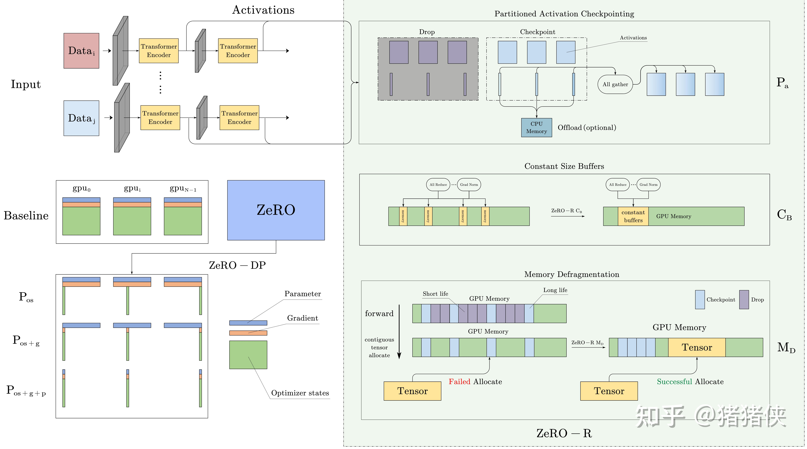

*ZeRO 框架总览*

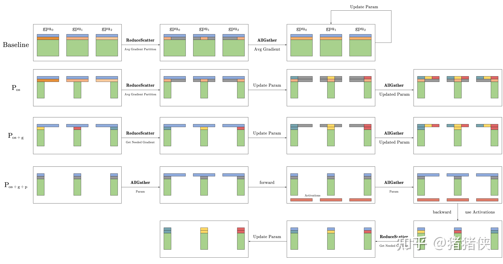

*ZeRO-DP 通信量分析可视化*

### 1 Existing Problem

大型深度学习模型可显著的提高指标（诸如准确性等）。但是目前训练超大参数规模（trillions parameters）的模型仍然有许多显存方面的问题。目前常见的解决方案是数据并行（Data Parallelisms, DP）和模型并行（Model Parallelisms, MP）由于有限的设备内存存在基本的限制，并且在计算、通信和开发效率上都面临问题。

基础的 DP 方法并不能降低每个设备（GPU）上的内存占用（因为他会拷贝模型，如下左图），所以模型参数数量受独立设备内存的限制，设备的数量无法解决这个问题。为了解决独立设备内存的限制，有诸如流水线并行（Pipeline Parallelism，PP），MP 或者借助 CPU 内存的方法，但这无一不是以牺牲了某些关键性能为代价，诸如：内存，计算/通信开销。

  

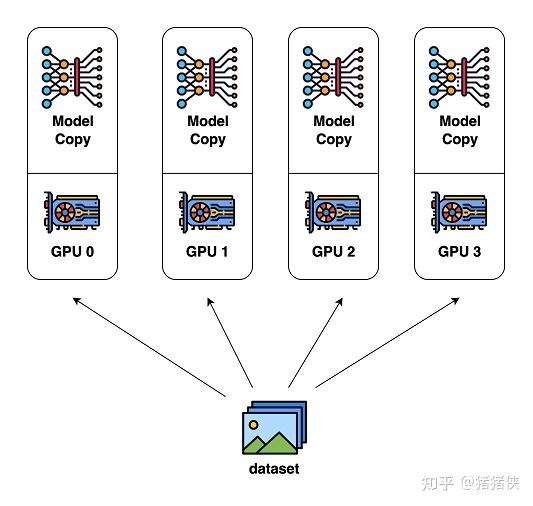

*DP*

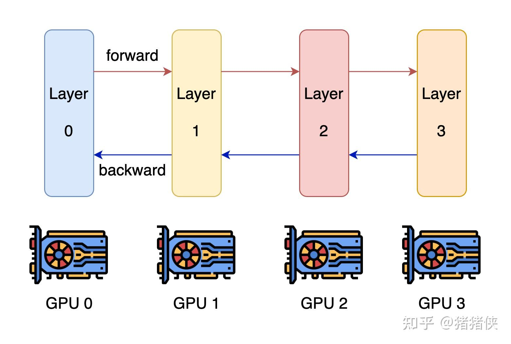

*MP*

其中，最有效且最有前景的是 MP。MP 的工作原理是垂直地切分模型，将网络和参数切分到多个设备，需要每层之间进行大量的通信。如上右图所示，MP 在单个节点/设备内部工作良好，但在超出单个节点/设备时，由于通信开销，效率会迅速下降。

### 2 ZeRO Overview

ZeRO (Zero Redundancy Optimizer) 的开发便是用于解决 DP 和 MP 存在的问题，可以说是集百家之精华，并去其糟粕。ZeRO 消除了数据和模型并行训练中的内存冗余，同时保留了低通信量和高计算粒度，使我们能够根据设备数量按比例缩放模型大小，并保持持续的高效率。

但是直接的介绍 ZeRO 所做的优化并不符合科研/工程的逻辑，我们首先需要深入的了解 DP/MP 目前面临的问题：

- [ ] 内存为什么占用这么大？
- [ ] 是否有优化的空间（是真实参数所占内存还是由于设计存在冗余）？
- [ ] 以及我们如何优化？

接下来我们将先探讨内存的具体开销，然后再基于此介绍 ZeRO 的优化和通信量分析，如果想直接阅读 ZeRO 的优化和通信量分析请翻看到第四节。

### 3 Where Did All the Memory Go?

举论文中的例子，一个拥有 1.5B 参数的 GPT-2 在使用 FP16 训练时只需要 $\mathrm{2byte \times 1.5 * 10^{9} \approx 3GB}$ 来存储模型参数，但是却无法在单张 32GB 的 GPU 上进行训练。所以内存去哪了呢？

通过实验发现，训练期间大部分的内存被模型状态（Model States），也就是：优化器参数（Optimizer states），梯度（Gradients）和模型（Parameters）所消耗。除此之外，残余状态（Residual States）消耗了剩余的内存，残余状态包括：前向传播时得到的 Activations，进行计算通信的临时缓冲区还有没有被妥善管理的内存碎片。

接下来我将分两个部分（Model 和 Residual）来探索内存是如何消耗的，是否存在优化空间。

### 3.1 Model States Memory

混合精度训练（mixed precision training）和 Adam 优化器基本上已经是训练语言模型的标配，我们先来简单回顾下相关概念。

Adam 在 SGD 基础上，为每个参数梯度增加了一阶动量（momentum）和二阶动量（variance）。而混合精度训练，字如其名，同时存在 FP16 和 FP32 两种格式的数值，其中模型参数、模型梯度都是 FP16，此外还有 FP32 的模型参数备份，如果优化器是 Adam，则还有 FP32 的 momentum 和 variance。

**Update 2024/07/24**

有同学问**：Adam 为什么要有 FP32 的模型参数备份？**之所以要备份是因为 FP16 累加误差会积累。

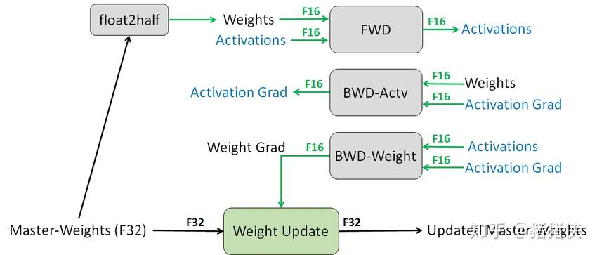

为了使分析更为通用，假设我们使用 Adam 优化器并使用混合精度训练。那么假设我们的模型拥有 $\Psi$ 规模的参数，那么 Model States 的内存总开销为：

$$
\begin{array}{rl} \mathrm{Model\; States\; (bytes)}  &= \overbrace{2 \times \Psi}^{\text{Param}} + \overbrace {2 \times \Psi}^{\text{Gradient}} + \overbrace{3\times 4 \times \Psi}^{\text{Optimizer, 3 for Adam,  4 for  FP32}} \\ &= 16 \times \Psi\\ \end{array}
$$

我们发现，如果使用 Adam 优化器和混合精度训练， Optimizer States 占用了整体内存开销的 75%，这导致 Model States 的内存开销为 24GB 远高于用于存储模型的 3GB。

显然，我们这里回答了一部分之前提出的问题，内存占用之所以这么大主要原因是 Optimizer States 的占用。且由于存储模型所需要的内存远小于整个 Model States 占用的内存，当前的设计是存在大量的优化空间的。

### 3.2 Residual States Memory

接下来我们要继续带着前面的问题去探索残余状态（Residual States）的内存开销。值得注意的是，Model States 中的概念比较直观，其分析也清晰明了。而 Residual States 中存在较为少见的概念且网络上的博客，报告大部分缺乏对此处的分析，我将尽量用简洁的语言解释一些术语。

### 3.2.1 Activations

首先是激活值（Activations），举一个例子用序列长度为 1K、批量大小为 32 去训练 1.5B 参数的 GPT-2 模型需要约 60 GB 的内存[^1]。这开销显然是非常大的，一个常见的优化方法是 Activation checkpointing，使用该方法后可以将内存开销降低为 8GB，但是对于极大规模的模型，即使使用 Activation checkpointing 激活内存也会相当的大。

> **Q：什么是 Activations？**  
> 绝大部分读者在初次读到这个概念时可能比较困惑。我的解释如下：  
> - 在神经网络中，Activations 是指在每一层的神经元上进行计算的结果。  
> - Activations 是在网络的**前向传播**阶段产生的，这是神经网络预测的阶段。在反向传播阶段，模型将结合梯度和这些 Activations 来更新网络的参数。（也就是说 Activations 的生命周期从前向传播开始到反向传播结束，清楚这个概念**有助于了解**后续在 Residual States Memory 上的优化）  
> **Q：什么是 Activation Checkpointing？**  
> 其具体内容为：在前向传递中只保存网络中特定点（即 checkpoint）的 Activation，并在反向传播期间重新计算所需的 Activations。这种方法的代价是额外的计算时间，因为某些激活需要在反向传播过程中重新计算。在处理巨大的神经网络和长序列时非常有用，因为它可以显著减少所需的内存占用。  
> 进行一个小拓展， Checkpointing 如何选择保留哪些 checkpoints 呢？随机显然是不可取的，我们的基本理念是：“保存网络中计算代价高但内存占用小的层的 Activations”，**具体的策略可以是固定的或者启发式的**。

### 3.2.3 Temporary buffers

存储中间结果的临时缓冲区对于大型模型而言也消耗了相当数量的内存。一些操作如：Gradient AllReduce 或 Gradient norm computation 在使用高性能库时会尝试将**所有参数融合到一个单一的缓冲区中以提高吞吐量**，并且这些缓冲区的大小大多情况下与模型大小有关。并且这样的融合缓冲区还可能提升参数的精度，例如 FP16 规格的梯度张量在融合缓冲区中存为 FP32 规格。

**很多小伙伴可能不知道为啥这会影响内存开销？**因为，当模型大小很大时，由于某些操作/高性能库的原因，会等待装填或者分配一个非常大的融合缓冲区去执行操作，这虽然会带来带宽和效率上的优势，但是有时却成为了内存瓶颈。例如对于一个 1.5B 的模型，一个 FP32 的融合缓冲区将消耗 6GB 的内存。这显然是无法接受的，**速度慢是可以接受的，无法训练是难以接受的**。

### 3.2.3 Memory Fragmentation

内存碎片是操作系统中的基础概念，当内存碎片过多时会出现总内存充足但无法分配的情况。换句话来说：如果没有足够的连续内存来满足内存请求，即使总可用内存大于请求的内存，内存请求也会失败。通过实验发现，这类现象在大模型训练时非常明显。

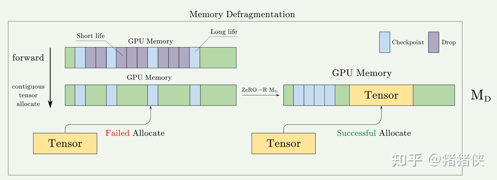

> **Q：一个自然的问题是，内存碎片是怎么产生的呢？为什么 PyTorch/TensorFlow 不会去管理呢？**  
> 给出一个个人的解释（可以结合上图来看）。记得前文中在 Activation 中的提醒嘛？Activations 的生命周期是从某一次前向传播生成开始，到该次反向传播计算参数更新后结束。在理想情况下 Activations 占用的内存是连续的，但是由于 Activation checkpointing 的存在，其中某些 Activations 会被释放，也就是他们提前结束了生命周期。这时候被选为 checkpoints 的 Activations 张量还没有被释放，这些 checkpoints 实际上就把内存划分成多个不连续的碎片。  
> 而深度学习框架之所以不会解决这些事情也是可以理解的，作为深度参与过神经网络框架开发的人来说，我们在进行这些策略的制定时会非常小心：  
> **- 现有策略**：框架可以已经有非常可用的内存管理策略，或者框架基于某些其他的内存管理策略。  
> **- 性能考虑**：内存碎片整理（即重新组织内存以减少碎片）是一个计算密集型的操作，可能会影响训练性能。因此，框架可能会避免频繁地进行这种操作。  
> **- 复杂性与可用性**：内存管理是一个非常复杂的问题，也是很重要的问题。尽管我们在设计时会尽力地在内存管理上做了很多优化，但我们会在性能、内存使用效率和编程复杂性之间进行权衡。  
> 如同强大的编译器可能无法优化一些显而易见的代码，CSAPP 中说过编译器的优化永远无法替代人的作用，想要优化需要我们设计专门的内存分配器/策略。

### 3.3 Memory Summary

本段重要是介绍了内存是如何被使用的。分别介绍了 Model States 和 Residual States 的内存开销。

基于内存开销的时候分析，我们发现了现有框架的一些显著的缺陷，诸如：Adam 内存占用过高，Activations 即使在使用 Checkpoint 优化后仍然可能存在性能瓶颈。还有一些不易发现的缺陷：各种高性能库/通信操作为了优化性能/吞吐量却使用了无限制的临时缓冲区，以及由于例如 Activation checkpointing 等优化导致的内存碎片。这些缺陷为我们指明了优化的方向。

- [x] 内存为什么占用这么大？
- [x] 是否有优化的空间（是真实参数所占内存还是由于设计存在冗余）？

经常进行性能优化的小伙伴可能清楚，相比于如何优化，如何找到 bottleneck 可能才是重中之重。接下来我们将会回答前面提出的最后一个问题。**简单的介绍 ZeRO 分别在 Model States 和 Residual States 层面上的优化，并重点介绍其中比较困惑或有趣的地方。**因为其中的优化其实大部分不难理解。

## 4 Deep Dive into ZeRO

下图是经过我总结后把 ZeRO 进行的优化可视化之后的结果，之后的介绍也主要是依附于这张图并在必要的地方补充一些数学推导，尽可能保证阅读的流畅和愉快✨。

ZeRO 有两组优化：ZeRO-DP 旨在减少模型状态的内存占用，ZeRO-R 旨在减少剩余内存消耗。我们将介绍优化和背后的理念，这使得 ZeRO 能够在保持高效的同时减少内存占用。请注意，效率是这里的关键：如果缺少这个约束，将所有参数状态移至 CPU 内存或任意增加 MP 并行程度（ $N_M$ ）等简单解决方案都可以减少内存开销。

### 4.1 ZeRO-DP: Optimizing Model States Memory

进行优化前到一些前置理解：

- DP 比 MP 具有更好的扩展效率（计算效率），因为 MP 减少了计算的粒度，同时增加了通信开销。
- DP 在内存方面效率低下，因为 Model States 在所有设备中都被冗余存储。相反，MP 分割模型状态以获得更高的内存效率。
- DP 和 MP 都保留了整个训练过程中需要的所有模型状态，**但并非所有时间都需要所有内容**。例如，每层对应的参数只在该层的前向传播和反向传播期间需要。

所以 ZeRO-DP 结合了 DP 和 MP 的优势。 ZeRO-DP 分割 Model States，而不是在某个设备中复制它们，并使用动态通信调度，利用 Model States 的内在时间性质，同时将通信量降到最低。通过这样做，ZeRO-DP 随着DP 并行程度的增加**线性**减少了每个设备的模型内存占用，同时保持通信量接近基础 DP 的水平（这对效率非常关键）。

接下来我们讲进一步介绍如何优化。

如 ZeRO Framework 这张图（后续 ZeRO Framework 均指代该图）或者 ZeRO 论文中非常经典的图，我们发现 ZeRO-DP 的优化主要分别三层，这也分别针对了前文中对 Model States 的三个组成部分，此处为了阅读的流畅，我们**先忽略通信量的分析，我们将在后文专门讲解**。

### 4.1.1 $P_{os}$ : Optimizer State Partitioning

不妨定义 $N_d$ 为 DP 的并行度，或者粗暴的理解为 GPU 数量都行。首先是占用 Model States 比例最高的 Optimizer States，我们将其划分为 $N_d$ 份，存储在不同的 GPU 上，并将该优化命名为 $P_{os}$ 。当 $N_d$ 逐渐增加时，可以理解为：

$$
\begin{array}{rl} \mathrm{Model\; States\; (bytes)}|P_{os}  &= \overbrace{2 \times \Psi}^{\text{Param}} + \overbrace {2 \times \Psi}^{\text{Gradient}} + \overbrace{\dfrac{12 \times \Psi}{N_d}}^{\text{Optimizer}} \\ &\approx 4\Psi |N_d \rightarrow \infty \\ \end{array}
$$

也就是，通过 $P_{os}$ 我们将内存开销降低了接近 4 倍。

### 4.1.2 $P_{g}$ : Gradient Partitioning

同理，我们在这个部分进行 Gradient 的划分，我们将其划分为 $N_d$ 份，存储在不同的 GPU 上，并将该优化命名为 $P_{g}$。如同同时运用 $P_{os+g}$，当 $N_{d}$ 逐渐增加时，可以得到：

$$
\begin{array}{rl} \mathrm{Model\; States\; (bytes)}|P_{os+g}  &= \overbrace{2 \times \Psi}^{\text{Param}} + \overbrace{\dfrac{14 \times \Psi}{N_d}}^{\text{Gradient + Optimizer}} \\ &\approx 2\Psi |N_d \rightarrow \infty \\ \end{array}
$$

也就是，我们可以通过 $P_{os+g}$ 降低模型 8 倍的内存开销，多么简单直观！

### 4.1.3 $P_{p}$ : Parameter Paritionging

如前文中 $P_{os}$ 和 $P_{g}$ 一样，我们让每个进程只存储与其分区相对应的参数，当前向和反向传播需要其分区之外的参数时通过通信操作（broadcast）从对应的 DP 进程中接收它们。**虽然乍一看这似乎会产生大量的通信开销，但论文表明这种方法仅将基础 DP 系统的总通信量增加到 1.5 倍，我们将在下一个小节进行整体的分析。** 而其重要的性质便是：$P_{os+g+p}$ 结合能实现与 $N_{d}$ 成比例的内存减少。

$$
\begin{array}{rl} \mathrm{Model\; States\; (bytes)}|P_{os+g+p}  &=  \overbrace{\dfrac{16 \times \Psi}{N_d}}^{\text{Param + Gradient + Optimizer}} \\ &\approx 0 |N_d \rightarrow \infty \\ \end{array}
$$

这具有深远的意义：它代表只要有足够数量的设备来共享 Model States，ZeRO 就可以使 DP 适应任意规模的模型。

### 4.1.4 ZeRO-DP Communication Analysis

由于 ZeRO-DP 通过消除内存冗余来增加模型大小，因此很自然的问题是：我们是否正在用通信量来换取内存效率。接下来我们将进行详细的分析！

首先我讲介绍结论：ZeRO-DP 使用 $P_{os}$ 和 $P_{g}$ 不会产生额外的通信，同时最多可减少 8 倍的内存开销，使用 $P_{p}$ 时，ZeRO-DP 最多会产生 1.5 倍的通信量，但是可以进一步减少 $N_d$ 倍的内存占用。

首先，我们首先简要概述标准 DP 的通信量。【如果你还不是很了解基本的通信原语请参考附录A. Collective Operations，**这会影响到你能不能理解后续的分析**】

### **标准 DP 通信量分析**

在标准的 DP 训练中，在反向传播结束后，所有的 Gradient 会被平均。这个平均的过程使用 AllReduce。对于规模极大的模型，AllReduce 通信是整个通信带宽的瓶颈，因此分析主要集中在 AllReduce 上。因此，我们将分析限制为发送至每个 DP 进程和来自每个 DP 进程的总通信量。

而 AllReduce 实际上是分为 ReduceScatter 和 AllGather 两步操作的（**参考**附录B. Ring AllReduce Operation），这两步如果我们都使用最优的实现方式也就是：Ring-RedcueScatter 和 Ring-AllGather，那么单个设备在 Ring-RedcueScatter 或者 Ring-AllGather 的过程中，都会有 $\Psi$ 的通信量。整个AllReduce 的单显卡通信量为 $2\times \Psi$ 。

> 其实这里有一个很关键的分析，我们要理解传统 DP 每一步通信的目的：  
> - ReduceScatter: 把 Gradient 切好平均好放在每个设备上。  
> - AllGather: 把计算好的 Gradient 分发到每张卡上。  
> 其实，在 ReducScatter 之后，每张卡上就足够进行独立的模型更新了。因为你有 Optimizer Sates 和平均后的 Gradient，你可以更新完对应部分的模型参数然后通过 AllGather 分发。ZeRO 正是抓住了这部分的冗余才有了后续的优化。

### $P_{os}$ **通信量分析**

由于 $P_{os}$ 对 Optimizer States 进行了分区，所以每次我们先用 ReduceScatter 把梯度 Reduce 到不同显卡上，每个显卡有一份平均后的 Gradient （这里的一份代表的是每个 Device 有一小份平均后，特有的 Gradient），利用这个 Gradient 更新 Optimizer 和参数，再把更新后的模型参数通过 AllGather 分发到所有显卡上。基于前面的分析 ReduceScatter 和 AllGather 的通信量都为 $\Psi$，所以总体总的来说，通信量仍然是 $2 \times \Psi$ 。

而且我们会发现**每张显卡实际上拥有完整的Gradient，但是由于 Optimizer States 的分区，每个显卡只需要一部分 Gradient。这里实际上每张卡都冗余存储了 Gradient。** 这也是为什么 $P_{os}$ 的通信量等于 $P_{os+g}$。

### $P_{os+g}$ **通信量分析**

由于对 Gradient 进行了分区，在更新参数前，先通过 ReduceScatter 把每个 Optimizer States 所需要的 Gradient 发送到对应的设备上。所以，这个操作的通信量仍然是 $\Psi$（请反复理解下）。

每个分区好的 Optimizer Sates 获得对应的 Gradient 更新其参数后，只需要执行一次 AllGather，把自己更新的模型参数发出去并收集别人更新的模型参数，基于附录中的分析这同样是 $\Psi$ 的通信量。因此每个训练步骤的总通信量为 $\Psi + \Psi = 2 \Psi$ ，与标准的 DP 完全相同。

### $P_{os + g + p}$ **通信量分析**

由于对参数进行了分区，那么一个显而易见的实时是**在前向和反向传播阶段**都需要一次 AllGather 来进行保证计算的正确。值得说明的是，模型参数的分发是按神经网络的计算顺序去流水线分发的，因为如果不考虑计算的过程直接分发会**导致一些参数被多次的分发并直接丢弃**。从整宏观的角度来看，相当于每次训练需要多两次 AllGather 操作。那么可能有人就会有疑问：**那为什么通信量不是** $4\times \Psi$ **呢？**

**这是因为，由于模型参数恰好也分区了，所以我们不需要更新完参数后通过 AllGather 去共享模型参数了。**我们只需要在更新参数前，使用 ReduceScatter 把对应的 Gradient 进行分发。

综上，总的通信量为 $2\times \Psi (\texttt{forward + backward}) + \Psi(\texttt{gradient average}) = 3\times \Psi$ ，为标准 DP 通信量的 1.5 倍。

**Update 2024/07/24**

有同学在评论区里面表述：“**因为要 AllGather 后才能进行下一步，所以 $P_{os + g + p}$ 的峰值内存和 $P_{os + g}$ 差不多？**“

这个理解实际上**是有误的。**这部分在原论文中有解释：  
*"After parameter partitioning, each data parallel process only stores the parameters that it updates. Therefore, during the forward propagation it needs to receives the parameters for all the other partitions. However, this can be pipelined to avoid the memory overhead. Before computing the forward propagation on the part of the model corresponding to a particular partition, the data parallel process responsible for that partition can broadcast the weights to all the data parallel processes."*

尝试总结一下，虽然我们的确需要 AllGather 来得到参数，但是**这并不是同一时刻发生的**，是随着计算过程，逐 layer 进行通信的，我们在每个 Layer **需要计算时**广播对应的参数，所以每个 Device **只会保留当前计算需要的一部分** Parameters 而非所有，并在计算完成后丢弃这部分参数。

举个例子可能会更方便理解，假设有 64 个 Devices 进行 ZeRO-3 优化。模型有 64 \* 3 = 192 层 Block 组成（这里是简化情景），那么可以理解为在前 3 个 block 进行计算时，Device1 需要将这 3 个 block 的 Parameters 进行广播，**此时其他 63 个 Devices 有两个不同的 Parameters 分区（自己的和 Device1 广播的）**，当这 3 个 block 完成计算后，这些参数会被丢弃，然后进行后续 3 个 block 的计算（这时候由另外一个比如 Device2 去广播参数）。所以，峰值情况下，每个 Device 的内存占用仅相当于 2 / 64 总 parameters 占用 。

同样来自原文 “*In other words, we reschedule the parameter all-gather by spreading it across the entire forward propagation, and discarding the parameters once they have been used.* ”，意思是：我们在 forward 的过程中逐步的通信 parameters，等价于一个改良版的 AllGather 操作。

### ZeRO-DP 通信量分析的可视化

*ZeRO-DP 通信量分析的可视化，注意黑色加粗的代表通信操作*

其实这张图很早就绘制完成了，但是我在绘制的过程中有一些疑惑，我反复翻阅了几遍论文，DeepSpeed 的官方 Doc 并且还提了一个很傻逼的 issue（目前没用回应 TAT）。所以我在这里公开一下我的疑问，也许对你的理解有帮助。

> 问题是：在 $P_{os + g}$ 时我们发现，在反向传播得到梯度后，我们需要一次 ReduceScatter 帮这些梯度找到对应的更新参数。乍一听很合理，但是我想知道，通常情况下 Gradient，Model Parameters 以及 Optimizer States 应该是有具体的映射。从最简单的模型来说，我们完全可以在 partition 的时候把 Gradient，Model Paramenters 按照对应关系进行划分，从而避免这次 ReduceScatter。这样通信量直接变成了原来的一半，Amazing，新的论文在朝我挥手 ！

实际上并不是这样的 /(ㄒoㄒ)/\~~，我把自己给绕了进去，参考原文：

**"Therefore, as each gradient of each layer becomes available during the backward propagation, we only reduce them on the data parallel process responsible for updating the corresponding parameters."**

仔细阅读，这里的意思是：在反向传播时，我们会动态的获得某些层的 Gradients，由于 partition，这些 Gradients 需要通过通信操作找到对应的 Model Parameters，也就是每个 process **实际上**都会产生所有参数的梯度，但是某些梯度在得到后被动态的通信到对应的 process 中。这也是为什么论文中在这段后立刻提到了：bucketization strategy，因为我们要频繁的进行小批量的通信，所以才需要优化。在可视化中， $P_{os+g}$ 处，最开始的不同颜色实际上代表的就是 device 产生了不属于自己的 Gradients，需要通过通信发送走。

### 4.2 ZeRO-R: Optimizing Residual States Memory

### 4.2.1 $P_a$ : Partitioned Activation Checkpointing

一些见解：

- MP 对模型状态进行分区，但通常需要复制 Activations Memory。例如，如果我们垂直分割线性层的参数并在两个 GPU 上并行计算它们，则每个 GPU 需要整个 Activations 来计算其分区。  
- 对于 GPT-2 或更大的模型，算术密度（每次迭代的计算量与 Activation Checkpoints 数量之比）非常大（ $\ge 10K$ ），这也意味着使用 Activation Checkpointing 会带来极大的计算开销，并且这些计算开销随着隐藏维度线性增加。这导致，**在带宽很低的情况下，保存 Activations 而非重新计算它们会更 Cheap。**  

ZeRO 同样通过 Activations 分区来降低内存冗余。结合图进行描述，一旦计算出模型层的前向传播，输入 Activation 就会在所有 MP 进程中进行分区，直到在反向传播期间再次需要它为止（参考紫色和蓝色的色块）。此时，ZeRO 使用 AllGather 操作来重新实现Activation 的复制副本。我们将此优化称为 $P_a$ 。它与 Activation Checkpointing 结合使用（参考蓝色的色块代表被选中的 Activation Checkpoint），这样仅存储分区 Activation Checkpoints 而不是其拷贝。此外，在模型非常大和设备内存非常有限的情况下，这些分区的 Activation Checkpoints 也可以卸载到 CPU（参考图中的 Offload），**以额外的通信成本将 Activation 的内存开销减少到接近零**，这个优化为 $P_{a + cpu}$ 。

不妨设 MP 中设备数/程度为 $N_M$ ， $P_a$ 优化将 Activations 占用空间减少了与 $N_M$ 成比例的系数。

### 4.2.2 $C_B$ : Constant Size Buffers

ZeRO-R 使用恒定大小的缓冲区来避免临时缓冲区随着模型大小的增加而爆炸，同时使缓冲区足够大以保持效率。原因在之前 3.2.2 中已经介绍过了：

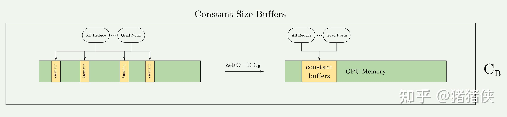

这里就简单重复一次：因为，当模型大小很大时，由于某些操作/高性能库的原因，会等待装填或者分配一个非常大的融合缓冲区去执行操作，这虽然会带来带宽和效率上的优势，但是有时却成为了内存瓶颈。例如对于一个 1.5B 的模型，一个 FP32 的融合缓冲区将消耗 6GB 的内存。这显然是无法接受的，**速度慢是可以接受的，无法训练是难以接受的**。

### 4.2.3 $M_D$ : Memory Defragmentation

前文中也对为什么会产生内存碎片进行了简单的介绍。其中主要是：Activations Checkpoints 和 Gradient 的生命周期太长导致的。

ZeRO-R 通过为 Checkpoints 和 Gradient 预先分配连续的内存块（**如图所示，蓝色色块被聚合在一起代表 Checkpoint 放在连续内存中**），并在生成时将它们复制到预先分配的内存中，即时进行内存碎片整理，并将该优化命名为 $M_D$。$M_D$ 不仅使 ZeRO 能够训练具有更大批量大小的大模型，而且还提高了在有限内存下训练的效率。

### 4.2.4 ZeRO-R Communication Analysis

分区 Activation Checkpointing 的通信量权衡取决于模型大小、Checkpointing 策略和 MP 策略。为了提供具体的分析，我们在使用SOTA MP方法实现的基于transformer的模型的上下文中进行分析，即 Megatron-LM。

1.  在基于Megatron-LM的模型并行（MP）中，每个transformer块需要 $12 \times \text{seq_length} \times \text{hidden_dim}$ 的通信量，这是因为它在前向传播、前向重新计算和反向传播中各有两次 AllReduce 操作，每次操作的通信量是消息大小的两倍，也就是前文中经常见的 $2\Psi$ 。  
2.  当使用 ZeRO-R 的 $P_a$ 技术进行 Activation Checkpoints 分区时，由于在每个 Activation Checkpoints 的反向传播的前向重新计算之前需要一个额外的 AllGather 操作，增加了 $\text{seq_length} \times \text{hidden_dim}$ 的通信量。但是，这仅仅是标准 MP 通信量的不到 10%。  
3.  当 MP 和数据并行（DP）一起使用时， $P_a$ 的引入能够允许更大的 batch size，这反过来可以将数据并行的通信量减少一个数量级，尽管增加了模型并行的通信量的 $10\%$ 。例如 $N_M$ 可以达到 16（例如，一个 DGX-2 节点上的 GPU 数量），这意味着 batch size 可以增加高达 16 倍。**由于数据并行训练的通信量与批量大小成反比**，因此由于 $P_a$ 引起的批量大小的这种大幅度增加可能导致数据并行通信量减少一个数量级。  
4.  另外，通过 $P_{a+cpu}$ ，将分区的 Activation Checkpoints 卸载到 CPU 两倍的数据传输到 CPU 的开销。但这在小批量大小的情况下仍然可能是有益的，因为它可以进一步减少 DP 通信的总体开销。  

**Update 2024/07/24**

有同学在评论区提问：**"activation checkpoint的每个阶段都需要两次all-reduce是为什么啊？"**

这其实只涉及到 NVIDIA 的 Megatron-LM 的 Paper，想深入探究可以参考：[arxiv.org/pdf/1909.0805](https://arxiv.org/pdf/1909.08053.pdf) 。这里的图截取自 Paper 中的 Figure4。

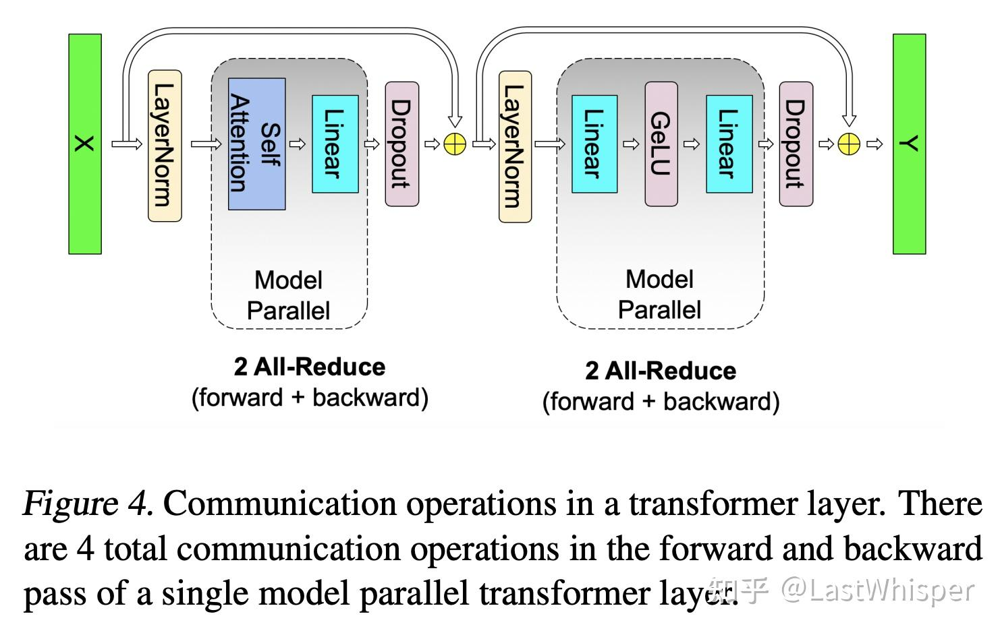

  
  
一个 Transformer Layer 可以分为 Attention 和 MLP 两阶段，这两块如果使用 Model Parallelism （Tensor Parallel）的话是需要进行通信的（这毫无疑问），但是如何进行 Tensor 的拆分是 NVIDIA 设计出来的。**这里我们只需要知道结果**，目前的结果是：我们只需要在每个阶段（Attention 和 MLP）进行一次 AllReduce。这样理解了之后就不难理解每个阶段都需要两次 AllReduce 了。

具体是如何做模型并行才能优化到 Attention/MLP 只需要一次 AllReduce 是可以展开讲很多的。而 ZeRO 的 Partitioned Activation 的意思是：**我们把 Activation 分在不同的 device 上，在进行 backward re-computation 时利用一次 AllGather 做同步就好了。所以只需要增加 10% 的通信量。**

## 5 Summary and My Viewpoints

下面是一些个人观点。

- 硬件的发展掩盖了软件的懒惰？在之前显卡的显存是足够的情况下，人们缺乏了探索显存优化的动力？因为整体看下来 ZeRO 的优化不算过于难。实际上也是，我们总要做 ROI 更高的事情。
- 无限制的优化可能带来更大的瓶颈。参考高性能库和 Buffer 之间的关系，性能的优化反而成为了可能的内存瓶颈，这提醒我们多关注一些所谓是优化的工具/策略，也许能发现其中的问题。
- 性能的优化要善于观察操作中的冗余，哪些信息是重复存在的？能否利用这些信息？这是优化的直觉和基础。
- 数学分析非常重要～整个 ZeRO 看起来不难，但其基于坚实的数学分析（通信量分析），这才证明了 ZeRO 的意义，在个人优化时要多进行数学分析再进行实验，多写 Design Doc。

  

## Appendix A. Collective Operations

首先我们得了解一些基本的[通信函数](https://docs.nvidia.com/deeplearning/nccl/user-guide/docs/usage/collectives.html)，这里只介绍四个基本的便于后续数学分析的推进：

### 1 Reduce

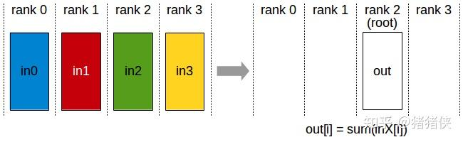

Reduce，归约。属于多对1的通信原语，具有多个数据发送者，一个数据接收者，可以在集群内把多个节点的数据**规约运算**到一个主节点上，常用的规约操作符有：求累加和 SUM、求累乘积 PROD、求最大值 MAX 等。

### 2 Broadcast / Scatter

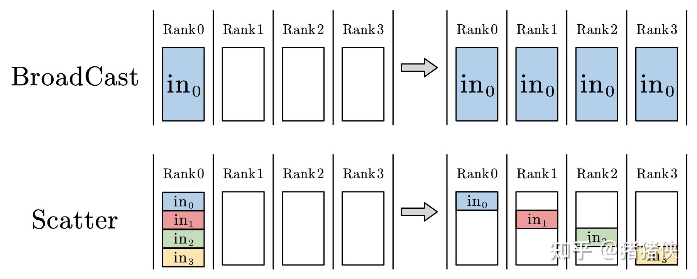

Broadcast，广播。Broadcast 属于1对多的通信原语，一个数据发送者，多个数据接收者，可以在集群内把一个节点自身的数据广播到其他节点上。

Scatter，散开。Scatter 是一个1对多的通信原语，是一个数据发送者，多个数据接收者，可以在集群内把一个节点自身的数据发散到其他节点上。与 Broadcast 不同的是 Broadcast 把主节点 0 的数据发送给所有节点，而Scatter 则是将数据的进行切片再分发给集群内所有的节点。

### 3 ReduceScatter

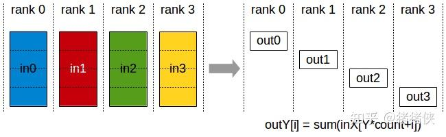

ReduceScatter 属于多对多的通信原语，它操作执行与 Reduce 操作相同的操作，不同之处在于结果分散在等级之间的相等块中，每个等级根据其 rank 索引获得一块数据。（后续操作等于 Scatter）

### 4 AllGather

  

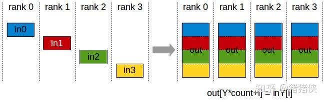

  

AllGather，全收集。它属于多对多的通信原语，具有多个数据发送者，多个数据接收者，可以在集群内把多个节点的数据收集到一个主节点上（Gather），再把这个收集到的数据分发到其他节点上（broadcast），即收集集群内所有的数据到所有的节点上。

## Appendix B. Ring AllReduce Operation

### 1 AllReduce

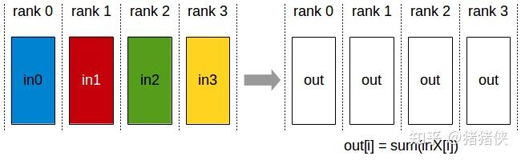

首先，什么是 AllReduce，如上图所示。AllReduce 属于多对多的通信原语，具有多个数据发送者，多个数据接收者，其在集群内的所有节点上都执行相同的 Reduce 操作，可以将集群内所有节点的数据**规约运算**得到的结果发送到所有的节点上。AllReduce操作可通过在主节点上执行 Reduce + BroadCast 或者 ReduceScatter + AllGather 实现。

Reduce + Broadcast 的操作貌似很直观：

- 在 `Reduce` 阶段，所有进程将数据发送到主节点，主节点对所有数据进行聚合。
- 在 `Broadcast` 阶段，主节点将聚合后的数据发送到所有其他进程。

但是缺存在非常多的缺陷：在 `Reduce + Broadcast` 方案中，主节点可能成为瓶颈，因为它负责所有的数据聚合和广播。而在 `ReduceScatter + AllGather` 中，所有进程都参与数据的收集和分发，从而实现了更好的负载均衡。并且还存在诸如：并行性，网络利用率和扩展性等问题。

目前主流的实现方法是基于 ring 状通信可以高效的实现 ReduceScatter 和 AllGather，然后进行一步实现 AllReduce。**理解AllReduce的实现方法才能够更好的理解为什么ZeRO-DP有效**。

### 2 Ring-ReduceScatter / Ring-AllGather

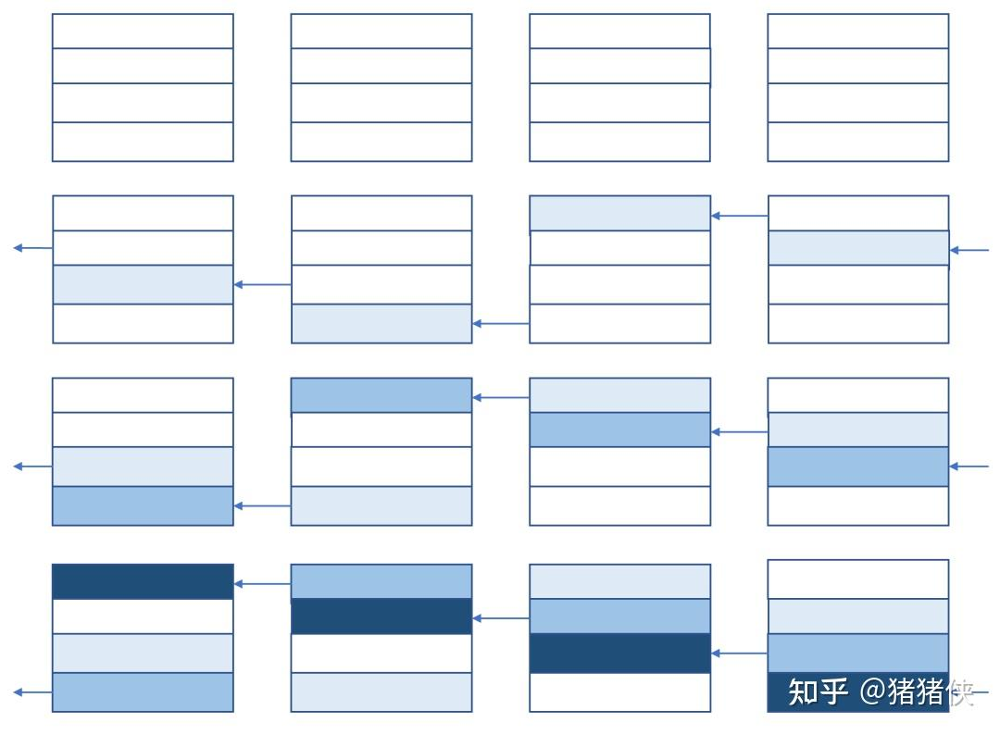

**（这里参考了知乎上某位博主的介绍，参考后问reference）高效实现一个集群通信的关键是如何充分利用设备和设备之间的带宽，基于环状（ring）通信实现的集群通信算法就是这一思想的体现。**

我们可以理解为，Ring-ReduceScatter 每次都发送一部分自己的数据出去（不属于这个设备），由于自己最后只需要其中一份，那么只需要执行总数 - 1 次数据传递和接收（双工）。

下面，我们通过数字和符号来详细的分析环状通信算法是怎么工作的。张量总大小为 $\Psi$ ，一共有 $N_d$ 个设备，每个设备上数据都划分为 $N_d$ 份大小为 $\dfrac{\Psi}{N_d}$ 的数据块。Ring-ReduceScatter 一共需要 $N_d - 1$ 步才能完成。假设设备是双工通信即每个设备出口和入口带宽可以同时达到 $\beta$ 。

经过 $N_d - 1$ 步之后, 每个设备上都有了一片所有设备上对应位置数据 Reduce 之后的数据。整个过程中, 每个设备向外发送了 $\dfrac{(N_d-1) \Psi}{N_d}$ 大小的数据, 也收到了 $\dfrac{(N_d-1) \Psi}{N_d}$ 大小的数据，因为每个设备的出口或入口带宽是 $\beta$ ，所以整个过程需要的时间是 $\dfrac{(N_d-1) \Psi}{N_d \beta}$ ， 如果 $N_d$ 足够大, 完成时间近似为 $\dfrac{\Psi}{\beta}$ ，这个时间和设备数 $N_d$ 无关。

**让我们强调一下: 基于环状通信的集群通信算法执行时间几乎和设备数无关, 但总通信量和设备数成正比。**

Ring-ReduceScatter 执行结束之后，再通过 AllGather 过程就可以实现 AllReduce，其中 AllGather 也可以通过环状通信算法来实现。

  

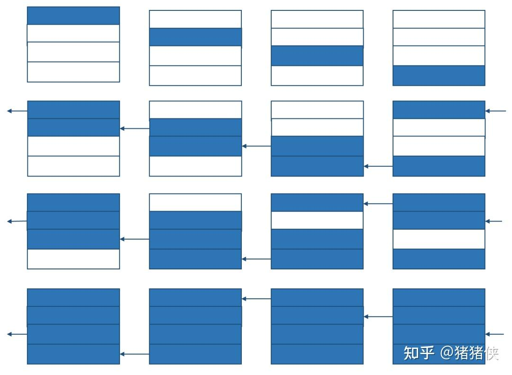

如图所示，整个流程和 Ring-ReduceScatter 一致。

综合 Ring-ReduceScatter 和 Ring-AllGather 便是 Ring-AllReduce。

### Reference

- [知乎. 手把手推导Ring All-reduce的数学性质](https://zhuanlan.zhihu.com/p/504957661)
- [知乎. 【深度学习】【分布式训练】DeepSpeed：AllReduce与ZeRO-DP](https://zhuanlan.zhihu.com/p/610587671)
- [知乎. 分布式训练 – 第3篇 - 分布式训练常用的集合通信及其通信原语](https://zhuanlan.zhihu.com/p/493092647)
- [知乎. 分布式--集合通信](https://zhuanlan.zhihu.com/p/569156416)
- [知乎. 深度学习并行训练算法一锅炖: DDP, TP, PP, ZeRO](https://zhuanlan.zhihu.com/p/581677880)
- [知乎. DeepSpeed之ZeRO系列：将显存优化进行到底](https://zhuanlan.zhihu.com/p/513571706)
- [大模型分布式训练的并行策略](https://finisky.github.io/how-to-train-large-language-model/)
- [Paradigms of Parallelism](https://colossalai.org/docs/concepts/paradigms_of_parallelism/)
- [NVIDIA: Collective Operations Doc](https://docs.nvidia.com/deeplearning/nccl/user-guide/docs/usage/collectives.html)

## 参考

[^1]: Transformer 基础模型的 Activations 内存与 transformer 层数、隐藏维度、序列长度以及批处理大小成正比。对于类似 GPT-2 的架构，总的激活数量为： Activations = 12 x (隐藏维度) x (批处理大小) x (序列长度) x (transformer 层数​)
