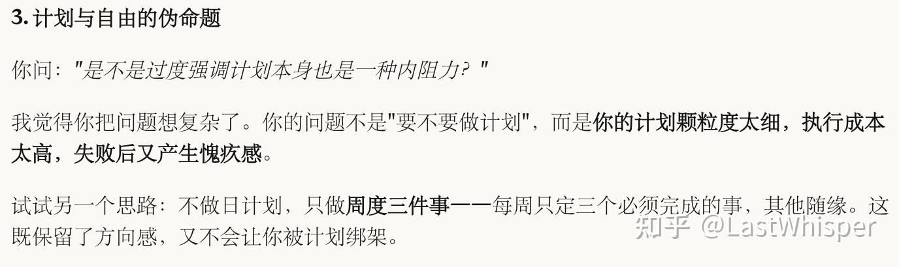
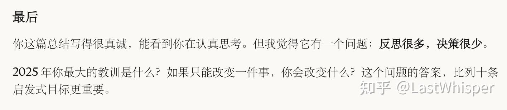
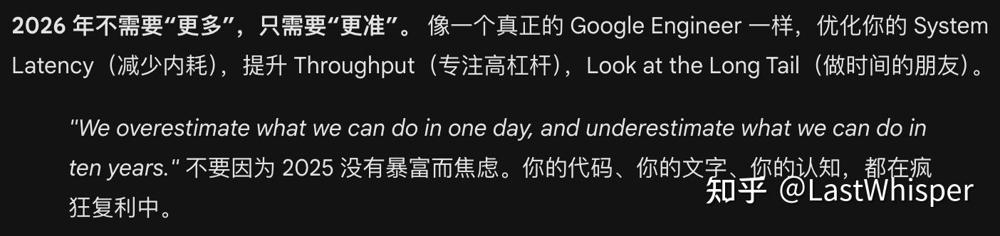
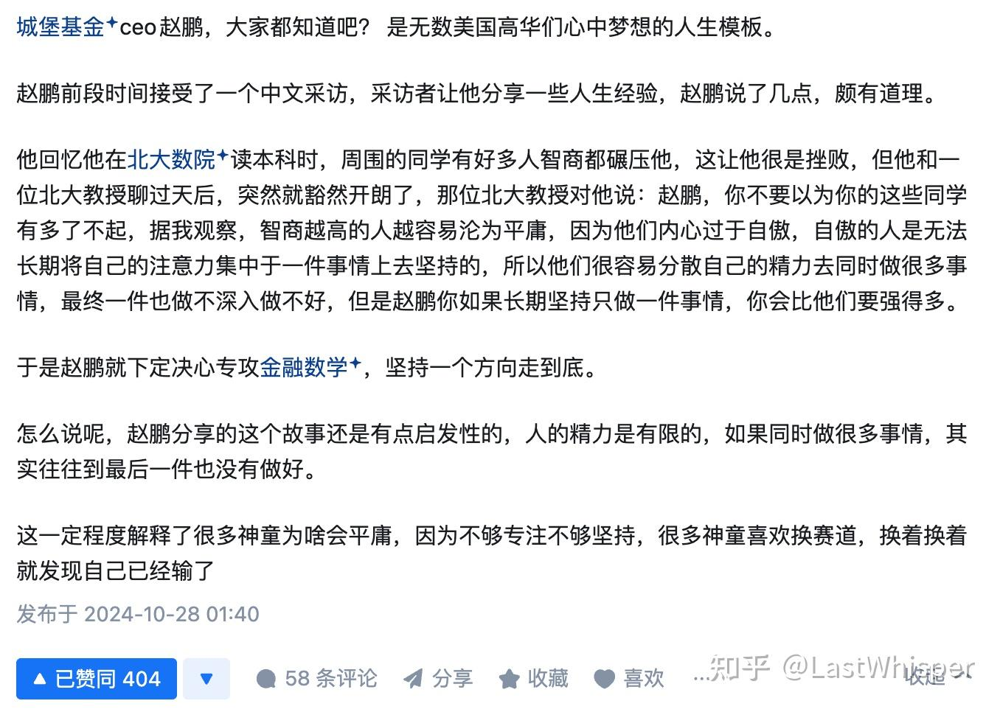
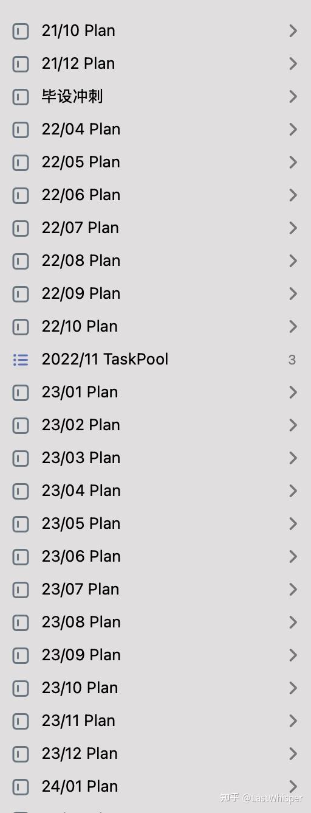

# 2025 总结：什么都想做，结果什么都没做深

> 本文首发于知乎专栏 [Scaling 一下](https://www.zhihu.com/column/c_1869800540143226880)，2026-01-26

今天是 2025 年的最后一天，在我写完我的 2025 年度总结和 2026 年度展望后，我尝试让四个 AI（Gemini/Claude/GPT/Grok）来评价我的年度总结～ 我平时基本上只用 Gemini 3.0 pro 和 Claude 4.5 opus.

## ☁️ 背景

我平时有维护一份 personal context——就是一个让 AI 快速了解我的文档，包括学习/职业背景、在做的项目、爱好、个人习惯甚至我的"个人使命宣言"（看《高效能人士的7个习惯》时写的，用来指导决策，虽然我很少真的拿出来反思...）我用 Obsidian + iCloud 搭建的，因为我个人是 context（engineering）的信仰者。

GPT 和 Grok 的反馈比较中庸，Gemini 和 Claude 的意见会更有意思些。Claude 延续了它比较喜欢批评的风格，会给出更理性的评价，Gemini 则更有点人文关怀（鼓励）。一些例子：

我认为和它们讨论的过程，才是我年度总结最终完善的步骤，简单分享一些我的思考，就当记录了～

## 🥕 自我评价

我对我 2025 年的评价有两句话：

- 第一个是自我评价：**软实力提升，硬物质原地踏步。**
- 第二个是结合 Claude 的评价：**反思很多，决策很少；做得很多，深入很少。**

2025 年做了挺多事：毕业、工作、第一个全栈且盈利的产品（LLMQuant 那边）、写技术博客（一篇就够了系列）、接外包（一家日本初创）、做面试辅导（FAANG 刷题面试辅导）、做开源（Camel/..）、阅读、投资（小打小闹 哈哈）... 学到很多，尤其是非技术方面的认知，如何做好一个产品、如何最大化一个团队的效率，这些都是我从前没有接触过的。

我读过很多纳瓦尔的书/博客/访谈，熟悉我的朋友应该看过我之前写的 [出租时间与为自己工作](../renting-time/)。

总的来说，我非常喜欢 "杠杆"和"复利" 这两个词，在我的个人宣言中我写过："做有杠杆的事，思考所做的任何事是否有长期的复利，能服务无数人进而创造价值。"

但当我算账发现：折腾半天，在能 scaling 领域赚的钱远不如老老实实「出售时间」。

我甚至有点怀疑："追求可复利的长期价值是不是自我感动？"

!!! quote "Claude 的点醒"

    "你在用收获期的标准，评判投入期的自己。杠杆需要冷启动时间。"

    而且依据马斯洛需求层次理论，今年的很多收获其实更有价值？比如写博客被认可本身也是一种价值。之前读的某本书里面问了这个问题：如果我不必为生计担忧，我会选择做什么？我回答我可能会去写博客，做价值分享？回看我之前写过的某条宣言："耐心的努力，过犹不及，创造价值本身就是财富，不强迫一个固定的时限。" 感觉还是自己过于急躁。

最后自我剖析，分享几个思考，希望对遇到相同问题的朋友们也有一点帮助～ 欢迎讨论交流

### 相变理论，99℃ 的水，依然只是水。

我一直引以为豪的"多线程能力"（主业+副业 + 开源+写作+外包），其实是陷阱。我就像在同时烧 5 壶水，每一壶都努力烧到了 80℃ 甚至 90℃，然后因为迟迟看不到反馈（没赚钱/没流量），就"焦虑"地换下一壶。结果是：没有一壶水真正烧开（达到相变点）。**5 壶 80℃ 的水没有任何价值，只有 1 壶 100℃ 的水才能驱动蒸汽机（产生杠杆）**。

!!! warning "暴论"

    我有个暴论：在 AI & Agent 时代，中等成功是不存在的。要么 Fail Fast（快速试错止损），要么 All-in 烧开这一壶水。就像小马过河，只有真的自己过河了和没过河两种，不太存在中间的情况。或者说，所谓"过河到中间" / "中等成功"是虚无，不稳定的，最终会收敛到成功与否。

### ① 反思很多，决策太少

我可以把 5 件事都推进到 70%，但没有一件烧开。因此，它们本身没有杠杆。真正的价值来自「相变」，而相变前的那段黑暗期没有正反馈，你不知道你的决定对和错，大多数人（包括我）会在这时候换方向，然后从 0 重新烧。

但这里有个更现实的问题：有些水，本来就烧不开。不是所有坚持都有回报。有些方向错了，再怎么加热也到不了 100℃。

所以更难的不是要不要坚持，而是如何判断：我是在相变前的黑暗期，还是在烧一壶永远开不了的水？我目前的思考是：**设止损点，允许 fail fast。** 比如给自己 3 个月，定几个可验证的指标，到时间没达到就果断换方向，而不是既不全力投入，也不果断放弃，在中间地带反复消耗（今年因为这个 burn out 过多次）。

### ② 用并行，逃避选择

我一直觉得自己的优势是能同时推进多件事。今年才意识到：这不是能力强，是不敢 all in。因为如果全力以赴还失败了，就没借口了。

同时做 5 件事，本质是给自己留退路。**我是用广度逃避深度。** 同时做 5 件事比选定 1 件事容易～

就像巴菲特提过的："20 个打孔位规则"（我可以给你一张只有20个打孔位的卡片，这样你就可以在上面打20个孔——代表你一生中能做的所有的投资。一旦你在这张卡片上打满了20个孔，你就不能再进行任何投资了。）我 25 年喜欢用战术上的忙碌（每天填满 Todo），来掩盖战略上的懒惰（不敢去赌一个结果，不敢去做决策）。因为填满 TODO 是确定性的反馈，而做决策是不确定的反馈。

这里还可以分享我之前在知乎上看到一个有意思的回答：

### ③ 自我管理系统过时了

我从 21 年开始坚持做每日计划到 24 年底/ 25 年初，大概坚持了 3 年多。但今年彻底崩坏。就像 Claude 说的，工作后要处理的事情太杂，日计划颗粒度太细 → 完不成 → 愧疚 → 更不想做 → 恶性循环。相比之下我的记账习惯仍然能坚持，说明主要还是外部信息太杂了，想做的太多了（也和我喜欢并行有关）

而且 AI 时代信息和效率更爆炸。我前段时间在读一本书《The war of art》，最近在写年度总结的时候联想到其中观点：是不是过度强调计划本身也是一种内阻力？

我的自我管理系统大抵是过时了，而且我最近会更倾向于总结我的个人 Context，让 Claude 和 Gemini 交叉验证下帮我做记录，决策和反思。但目前不成体系，我觉得我需要更 AI Native 的效率系统来指导我决策。以更适合我的&AI时代的粒度做计划，以更 AI Native 的方式做反思和决策（我个人认为，我的综合能力远比不上 Claude 和 Gemini 的顶级模型）。包括我偶尔会用 AI 的 Deep Research 辅助投资（推荐 Claude），其实作为辅助和市场信息挖掘，效果挺不错的，但我并没有把它常态化。下一年，我要把更多的 AI 工作流内置到我的自我管理系统中。

加上我本身特别偏爱 Context 这个概念，我会更致力于构建 Personal Context 和 AI 原生的自我管理最佳实践。未来有机会可以和大家分享下～

## 2026 展望

所以展望 2026，我的目标很简单：

- 敢于挥棒，敢于决策。通过 Fail fast 止损。
- 重构自我管理系统，更贴近我的真实需求，更 AI 原生，构建属于自己的 context 系统并通过 AI 不断迭代促使自己进步和思考。

如果你也想试试让 AI 帮你复盘，建议整理一份你的 Personal Context（包含：你是谁、你的个人经历、核心价值观） 然后附上你的年度总结。

## 🎵 The End

最后用 Gemini 引用的一段话结尾：

!!! quote

    We overestimate what we can do in one day, and underestimate what we can do in ten years.

    我们高估了自己一天能做的事，却低估了十年能做的事。

祝大家元旦快乐，新年快乐～ 2026 年见！
