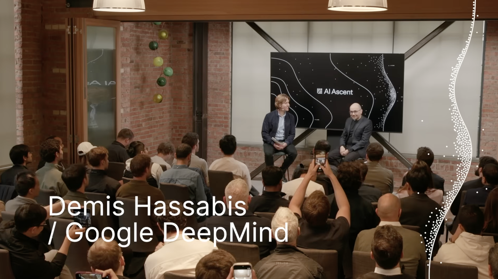
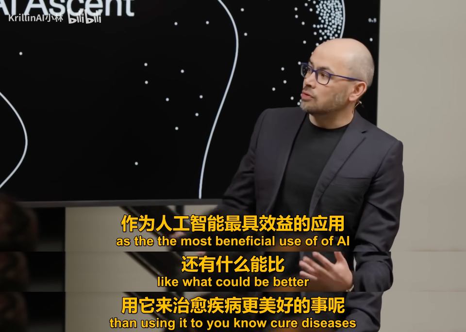
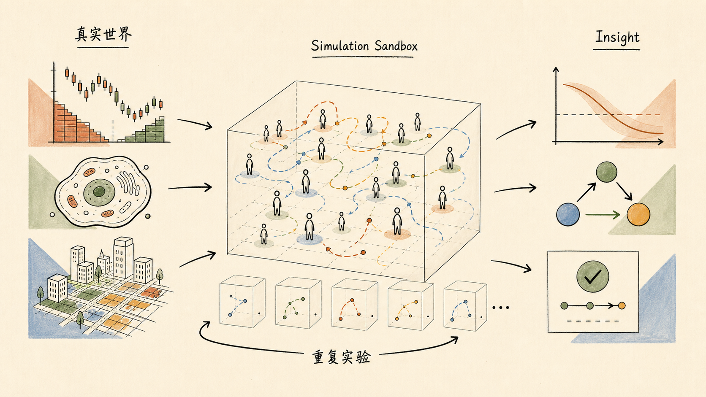
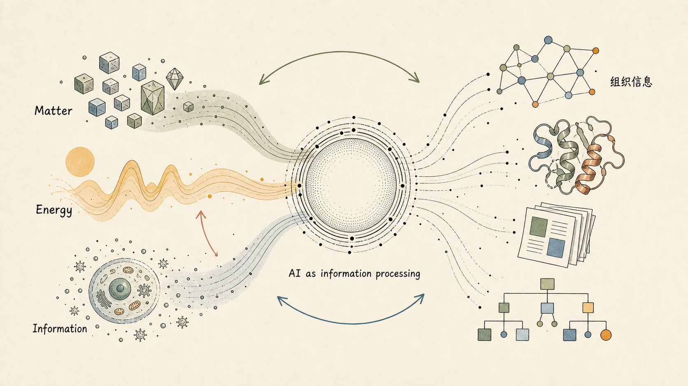
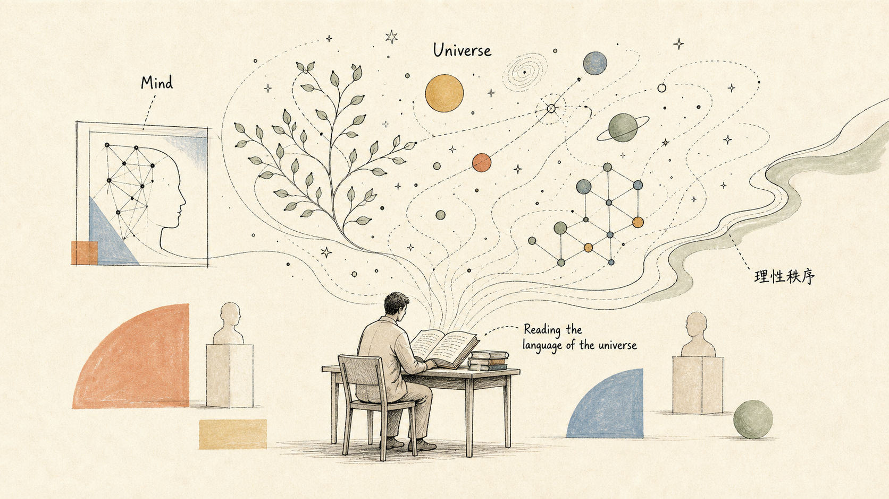

# 当 AI 成为理解世界的方式：Demis Hassabis 访谈随想

> 本文首发于小红书 / 知乎专栏 [Scaling 一下](https://www.zhihu.com/column/c_1869800540143226880)，2026-05-10。一点关于 Demis Hassabis 的随笔，更多是有感而发，若有不严谨之处望原谅。

<i>Demis Hassabis at Sequoia AI Ascent 2026</i>

> *"Doing AI is like reading the language of the universe."*
>
> — Demis Hassabis

我个人一直是访谈类节目的爱好者。红杉的 AI Ascent 从 2025 年开始我基本会看大部分内容，整体质量很高。对我来说，这类访谈最有价值的地方，不只是获取信息，而是可以短暂"进入"一些行业顶级人物的 vision 和 insights（我可以直接接触、吸收这些一手的思考）。

并非拉踩其他嘉宾，戴密斯·哈萨比斯（Demis Hassabis, Google DeepMind CEO）的访谈给我的感觉和很多人都不太一样。它兼具深度和广度，同时带有一些人文主义气息和哲学色彩。相信看过他访谈的人，应该会有类似感受。

当然，也有人吐槽关于 Demis 的访谈，总会花很多时间重复他的个人背景：游戏、创业经历、AlphaGo、AlphaFold。但比起很多更偏产品、工程或组织演进的 AI 访谈，比如 Claude Code 相关人物、Andrej Karpathy 等，Demis 给我的感觉会更"浩瀚"一些。

并非说其他访谈不重要。它们都非常有价值，我关于 Agent Engineering 的 insights 都会从这些访谈中汲取营养：关于 agent 产品和组织形态的未来，关于 agentic coding 的能力边界，以及随着 agent 能力增强，人类什么能力会变得更重要。但 Demis 的表达（或者说他本身的理解）更像是在把 AI 放回一个更大的坐标系里：科学、医学、生命、信息，以及人类如何理解世界（些许哲学）。

这次访谈里，有大概四个点我比较想记录一下：

## 一、他对 AI 的使用愿景

Demis 说，他构建 AI 的个人驱动力，是为了推进科学、医学，以及我们对世界的理解。他的思路有点 **"Meta / 元"**：先构建一个足够强大的智能工具，再用这个工具反过来推动科学发现。AlphaFold 之后，这个愿景就**不只是宏大叙事，而已经有了现实支点**。

<i>"还有什么能比用 AI 治愈疾病更美好的事呢？"</i>

> 我之前一直在等待算法足够强大，思想足够通用。对我来说，攻克围棋就是那个时间点。那时我们觉得：好了，现在我们准备好把这些思想应用到重要的现实问题上了，尤其是重大的科学挑战。
>
> 我们一直认为，这是 AI 最有益的用途。有什么能比用 AI 治愈疾病、让人类更健康长寿、帮助医学发展更好呢？当然，之后还有其他非常重要的领域，比如材料科学、环境、能源等。我认为未来几年 AI 在这些领域也会发挥巨大作用。

## 二、他关于 simulation 的理解

他说自己一直喜欢 simulation，早年做游戏时就在做模拟系统。而未来 AI for simulation 可能会打开一些新的科学。这个点我听到的时候突然有所触动，因为我之前在 MSRA Intern 做的项目叫 **MarS（Large Market Model for Market Simulation）**，希望基于此做回测和风控等等。之前我可能更多是把它理解成一个具体研究项目，但听完 Demis 之后，**我会突然觉得 simulation 这件事本身其实很有意思**。

现实世界里，很多系统是很难做受控实验的。比如经济系统、市场系统、社会系统，甚至生物系统。你不可能把利率调整一千次，然后每次都重新运行一个真实世界；也不可能随意改变一个复杂市场环境，只为了观察某个变量的影响。

但 AI 仿真提供的恰好是另一层能力：它不一定需要我们先写出完整、精确的方程，而是可以从数据中学习一个隐式模拟器（implicit simulator），让一些原本无法严格实验化的复杂系统，也能在模拟世界里被反复采样、对比和试验。某种意义上，它是在为复杂世界搭建一个可以运行的影子沙盒（World Model || World Sandbox）。

<i>从真实世界到模拟沙盒：在 implicit simulator 中反复采样以获得 insight</i>

我自己一直在想的一个场景是：让相当数量的 agents 扮演不同风格的投资者，模拟某些订单或新闻进入市场后的传导路径。也突然想起 Janelia 与 Google DeepMind 合作的 virtual fly / 虚拟果蝇项目。这里附上 Demis 访谈中提到的内容：

> 我们正在研究一种我称为"虚拟细胞"的东西。细胞是一个极其动态、涌现的系统。我认为机器学习是描述生物学的完美语言，就像数学是描述物理学的语言一样。
>
> 在生物学和许多自然系统中，你有大量微弱信号、微弱相关性、海量数据，远远超过人类心智可以分析的规模。但在这些数据中，确实存在联系、相关性和有趣的因果关系。
>
> 所以我一直觉得，机器学习正好是描述这类系统的完美工具。而直到今天，数学还没能做到这一点。原因可能是这些系统对顶尖数学家来说也过于复杂，也可能是数学的表达能力不足以理解这些高度涌现、动态的系统。

## 三、他对信息和 AI 关系的理解

Demis 提到，能量和物质当然重要，但他倾向于认为，**信息可能是理解世界更基础的视角**（Demis 谈过一个理论：宇宙中一切事物的基本构件可能是信息）。尤其是生物系统，本质上可以看作是在对抗熵增的信息处理系统。如果从这个角度看，AI 的意义就不只是自动化工具，而是一个关于信息组织、信息理解、信息建构的系统。也让我想起之前 Ilya 说过的："Compression is intelligence"。Demis 这段表述我直接放译文吧，我觉得很有 insight：

<i>Matter / Energy / Information — AI as information processing</i>

> 爱因斯坦的 E=mc² 以及他关于能量和物质的那些工作都很著名。能量和物质某种意义上是等价的。
>
> 但我认为信息也具有类似的等价性。你可以把物质和结构的组织方式，尤其是生物这种抵抗熵增的东西，理解为本质上的信息处理系统。
>
> 所以我认为这三种量在某种意义上可以相互转化。但我有一种感觉：信息是最基础的。
>
> 这和 20 世纪 20 年代经典物理学家的想法有点相反。传统上大家会认为能量和物质是首要的。但我认为，从信息出发去理解世界和宇宙，是一种更好的方式。
>
> 如果这是真的——我认为有相当多证据支持这一点——那 AI 的意义甚至比我们想象的还要深刻。而它本来就已经非常深刻了。因为 AI 也是关于组织信息、理解信息和构建信息对象的。
>
> 在我看来，AI 本质上就是信息处理。所以如果你从"信息处理是理解世界的首要方式"这个视角来看，就会发现这些不同领域之间有非常深的联系。

!!! note "Karpathy 视角的对照"

    这部分我觉得很深刻，虽然我得说我没完全的理解。这也让我联想到 Karpathy 关于 Software 2.0 / 3.0 的讨论：当"信息"成为机器可以直接处理、生成和组织的对象时，软件本身的形态也会发生变化。不过 Demis 这里谈得更底层，不只是软件形态，而是 **AI 与世界理解方式之间的关系**。

## 四、哲学部分

他提到康德和斯宾诺莎。前者关心心智如何组织和解释我们经验中的现实，后者则接近一种通过理性和科学理解宇宙秩序的精神性。Demis 说，**做 AI 和科学，某种意义上是在"阅读宇宙的语言"**。这句话有点浪漫，但也很贴合他给人的感觉：他不像一个单纯的商业 CEO，也不只是技术领袖，有时候会把他当做是非常有愿景的思想家。

<i>Reading the language of the universe — mind, science, and cosmos</i>

所以我会觉得，看 Demis 的访谈，和看很多其他 AI 访谈的体验确实不一样。其他访谈可能让我更理解一个产品如何演进、一个组织如何适应 agent、一个工程师未来需要什么能力，我确实学到了很多最佳实践；但 Demis 的访谈会让我短暂地从"AI 如何改变工作"跳到"AI 如何改变科学，甚至改变人类理解世界的方式"（依稀记得我第一次翻看 DeepMind 的 OKR 时，即使只是看看也非常心潮澎湃），尽管我无法立刻改善我的效率和方法论。

但 Demis 的访谈总让我心潮澎湃，也许是直观的感受到**有人在尝试拓宽人类的边界**，就已经足够迷人。

---

!!! tip "延伸观看"

    推荐两个近期我看过、觉得值得一看的 Demis 相关视频：

    - [**AI Ascent 2026 Demis Hassabis: We're Three Quarters of the Way to AGI**](https://www.youtube.com/watch?v=AFpeWo1GTeg)（Sequoia Capital · YouTube）
    - [**The Day After AGI**](https://www.youtube.com/watch?v=mmKAnHz36v0)（World Economic Forum Annual Meeting 2026）
