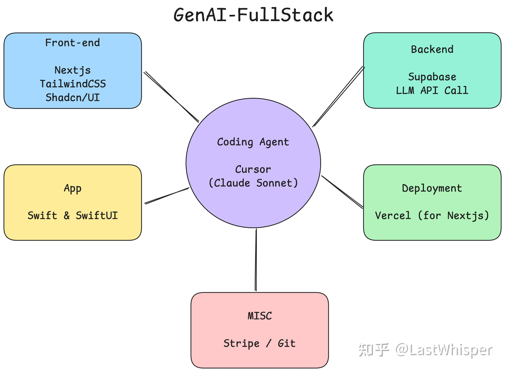

# Scaling 一下：GenAI 时代的全栈开发

> 本文首发于知乎专栏 [Scaling 一下](https://www.zhihu.com/column/c_1869800540143226880)，2025-02-27

最近做了些 fullstack 的东西，包括我在之前的博客中说过：我理解下的 fullstack 会在 GenAI 时代下重构出新的范式。想和大家交流下有哪些新质生产力（工具）可以应用在 workflow 中，以及值得注意的坑和技巧。

抛砖引玉描述下我的 workflow：

**需求：** 这是核心但易被忽视的环节。务必区分是为自娱自乐还是创造经济价值。最好从自己需求出发：如果连自己都不愿使用的产品，又怎能 sell 给其他用户？空想的需求通常不可靠。

**设计文档：** 尽管有时候"写文档"被认为是浪费时间，大家（包括我）会在灵感火热的时候直接投入到开发中。但是，我推荐先冷静下完成设计文档的撰写，比如你需要解决的问题，用户画像，软件的大致架构，技术选型。这样可以避免后知后觉陷入无法解决的问题，同时这些也是你的私人知识库哦。

**前端：** v0 + bolt.new => Next.js + TailwindCSS + Shadcn/UI（AI 写这套很厉害，审美也比较在线）

**后端：** Supabase（目前做的东西就这么简单 笑）这部分我探索的不深，大部分任务都可以基于 API Call 解决。

**Coding Agent：** Cursor (Claude Sonnet)

**App：** Swift（主打原生，大家推荐 Flutter 比较多？）

**部署：** Vercel（搭配 Next.js 我觉得就是 top1）

**MISC：** Stripe / Git

!!! note "学习建议"

    这套技术栈学习门槛较低。简单说，只需掌握基本的 React 语法（推荐官方教程），其余可交给 Cursor 辅助，learn by doing 是全栈开发的最佳途径。

我目前的工作/学习模式是：更强调对于基础知识的学习 + 使用更高效更先进的工具/模型。Why 基础知识？能写出更精准的 prompt，能在 AI 端到端失效时人工接管与 AI 一起解决问题。

Prompt engineering 潜力巨大，对大多数任务而言，现有模型加上优质 prompt 完全足够。我发现影响效率的因素之一是 prompt 管理。虽然本质上只是文本存储，但或许我可以开发一个更高效的 prompt 工具？
