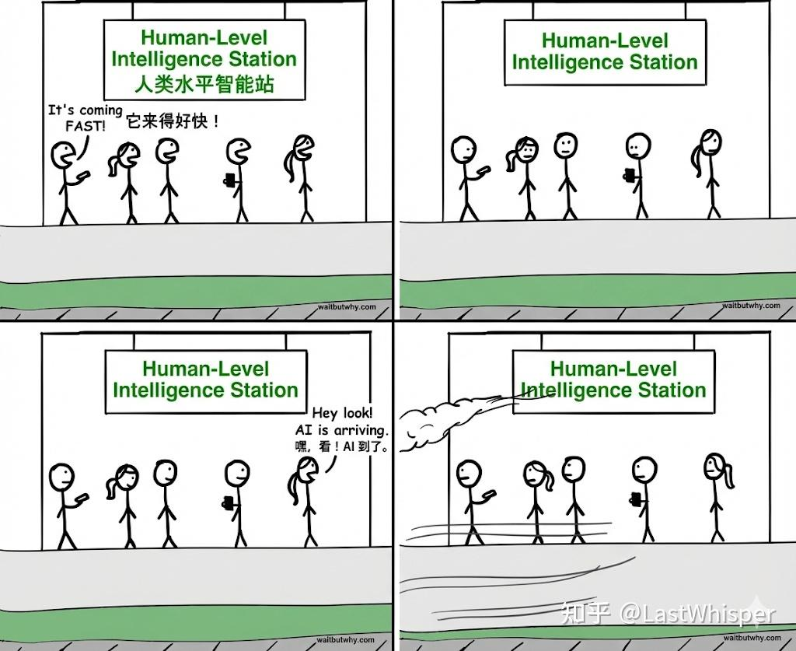
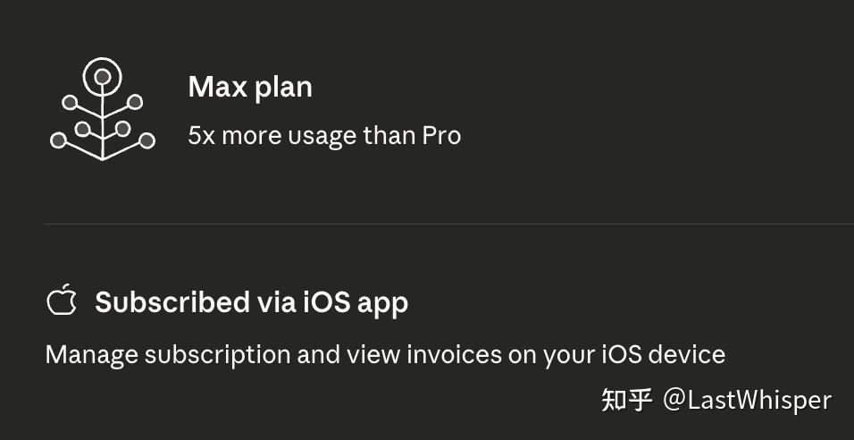
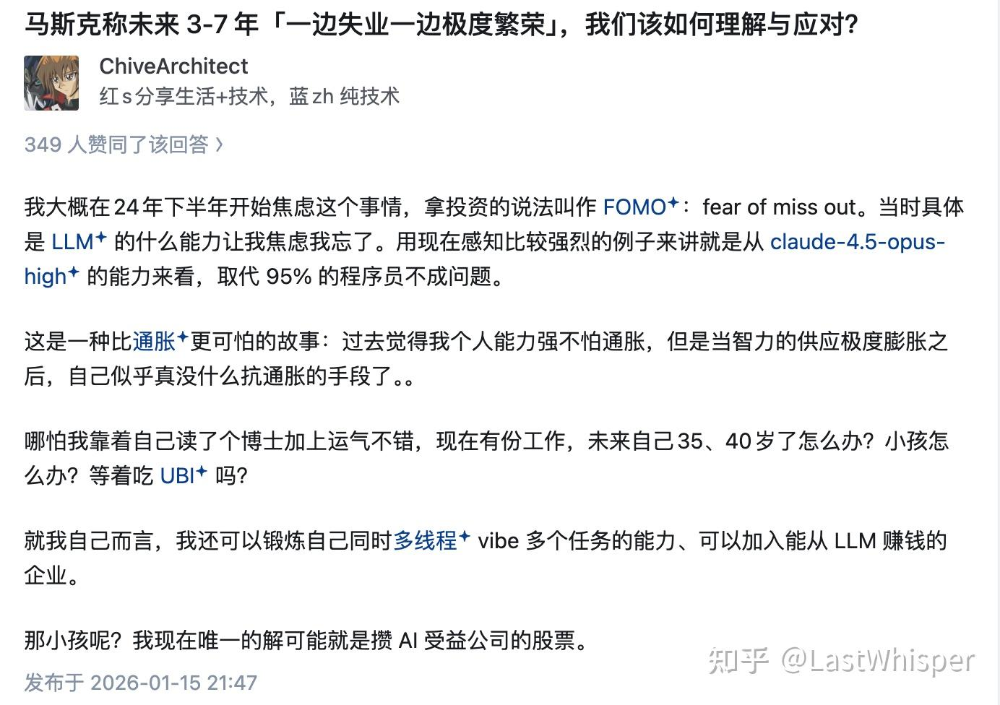
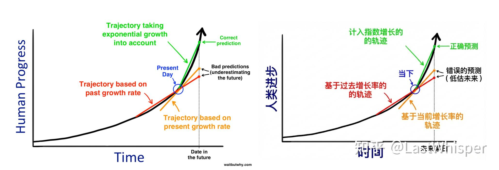
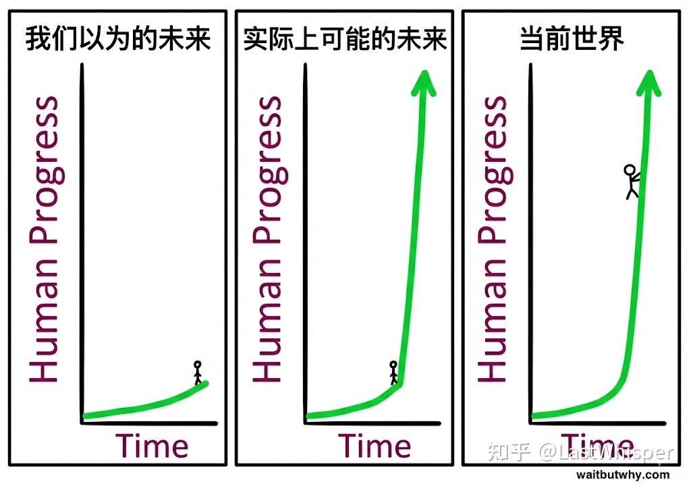

# Scaling 一下：当 Token 成为新的生产资料

> 本文首发于知乎专栏 [Scaling 一下](https://www.zhihu.com/column/c_1869800540143226880)，2026-01-17

<i>"Wait but Why" | The AI Revolution: Our Immortality or Extinction</i>

> 我开始怀疑：限制我生产力的，到底是能力，还是我愿意烧多少 token？
>
> Token 的智力/价格比在指数上升，而且可以并行；人的恒定，而且只能串行。当这个比值越过某个奇点，生产力的瓶颈就从"时间"变成了"token 用量"。

🥕 **写在前面**

文中会多次提到 The AI Revolution 这篇经典博客。为了方便大家阅读，我专门重制了它的双语 PDF 版本（第一节，共两节），非常推荐。

把我最近几个小的想法合并在一起记录下（一部分内容已经零零碎碎发在知乎里了）。有三个小 topic：

1. 我的 AI Coding 情况，why Claude Max？
2. Claude Max 被封后的感想，以及发现奇怪 bug 后又能继续使用 Claude。
3. 看到关于 AI 影响人类的回答，引发了一些思考。

## 1. 对 AI Coding 的投资

首先是我第一次充值了 Ultra/Max 版本的 AI 服务：Claude Max 5x，Apple Store 付费，125 USD 每月。

之前一直是 Codex / Claude Code / Cursor 一起用，但发现主力还是 Claude Code（后统称 CC）。Codex 效果不错要等太久，Cursor 用完 20usd 的额度后要被 routing 而且我觉得它更适合在我精调项目（人工接管）时使用，CC 中的 Opus 4.5 兼具质量和速度，体验非常丝滑。唯一问题是 pro 会员用量太少，在等了两次 5hour limit 后我决定充值一段时间 Max，看看效率能否随着 token 用量的 scaling 进一步 scaling？如果可以，这其实是一个确定性很高的投资（这是一段时间前的观点，那段时间我尝试用 AI 来处理我生活中的所有信息：自我对话，项目管理，健身/饮食/投资 后面发现还是有 API 更方便 hh）并且正好赶上 Claude cowork 发布，正好还能体验下。

目前 AI Coding 主力：Opus 4.5

- 一些复杂问题会尝试 Codex 5.2 xhigh
- 一些 web dev / 美学样式设计会尝试 Gemini 3.0 pro
- 快速咨询会用 Gemini 3 flash（最近用它体验真不错，非常快）偶尔 Sonnet 4.5。

上个月 Claude Code 用量 $82.80，做了两个小项目。这个月争取做一个 context engineering 的 opensource，几个小项目，一篇 Agent Skills 相关的博客。

??? info "关于 Gemini 3 pro"

    该说不说，Gemini 3 pro 真的有点问题，可能是滑动上下文窗口导致特定场景效果甚至不如 2.5 pro。one-shot 最强，随着上下文积累越容易拉大的。要是公司能给我用 Opus 4.5 就好了 TAT（我记得果子和 NV 都可以用 Opus 来着）

充完 Claude Max 时的我大展宏图，并行了三个 CC 窗口写了 2/3 个小时代码。

## 2. Claude 被封与感受

次日早晨，我发现我的号被封了。在充值之前我已经正常使用 1 年了，并且是我用了长达 7/8 年的 Gmail 账号。第一时间是难受和不解，不过这是我第二次被封号了。第一次是因为 Apple Store 里面没钱了，续费失败直接封号。

我立刻去申诉，写了一篇小作文，尽管我知道大概率无法解封。随后去苹果上退款。此时有一种戒断反应，似乎没有 CC 我的生产力直接下降了（其实用 Cursor + Codex 也许会差不多）。这种感觉很奇怪，我像是被降级了一部分思考能力，所以我有些焦虑，急切的希望它能重新回来。这种状态大概持续了 1 个小时，这段时间我疯狂的搜索可能的封号原因是什么，以及其他人是否遇到了相同的情况。

我一直准备了一个备用的 Claude 免费账号。当时，我只是想简单测试我这个号还活着不，于是我在 iOS App 上登录了它，奇怪的 bug 发生了，我的免费账号直接继承了 Claude Max Plan，并且刷新了额度。

!!! note "后续思考"

    后面思考的时候发现，可能 Claude 和 App Store 存在奇妙关联？如果我第一时间在网页版上登录新的账号可能就没这个效果了？

## 3. AI Coding 与未来

前几天突然看到某个答主的回答 @ChiveArchitect

突然有如下思考（碎碎念）

Opus 4.5 + CC 的能力迈过了某个边界，我甚至觉得多人 team 的 coding 效率不如我 + CC。但是再进一步，为什么一定要是我 + CC 呢？目前可以说需要我来"监督"微调最终的结果，再往后呢？也许只有能实现 **人 + AI > AI** 的人才有不可替代性。另一方面，Anthropic 明显接近了它们最开始的目标：从它们博客来看（例如 "Writing effective tools for agents — with agents" 中的 Collaborate with agents like Claude Code to automatically increase the performance of your tools），它们追求的是 Agent 优化 Agent 的自我迭代，CC 我觉得已经一部分实现了这个效果（CC 迭代的越来越快）。

前段时间写一些东西，惊叹 1 年前我可能需要 2/3 个月才能 prototype，现在只需要 1/2 小时。未来人的价值更多可能是 **taste**。所谓 Coding，大部分人都用 AI Coding，我很难认为我比 CC 还强；所谓知识分享，有可能是 NotebookLM 加工，知识的广度我很难认为我比 Gemini 3.0/3.5 pro 强。但相同的内容，相同的 AI 不同的 "品味" 决定了输出的质量和受欢迎程度。另一方面，我一直觉得 Anthropic 的品味非常好（从文档/博客/美学设计 可以略窥一二）。

为数不多能让人重新有"掌控感"的可能是投资，一方面有人则必然有可以交易的 market，不用太担心投资这个技能无用武之地，另一方面 AI 全产业链投一投？会让自己有我在"车上"的"自我安慰感"。剩下的就只能是"感受"了，感受 AI 从我的身边迈过去，然后立马消失在视野里。（想到著名的 The AI Revolution 的两篇博客，写于 2015 年，非常推荐阅读，我制作了双语 PDF）再放一张由 Gemini 翻译的图和书中的一些观点：

1. 谈到历史时，我们的思维是线性的。当我们想象未来 30 年的进步时，我们会回顾过去 30 年的进步，作为可能会发生多少事情的指标。

2. 近期历史的轨迹往往讲述了一个扭曲的故事。首先，当你只看一小部分时，即使是陡峭的指数曲线看起来也是线性的，就像你近距离观察一个巨大圆圈的一小段，它看起来几乎像一条直线。其次，指数增长并不是完全平滑和均匀的。库兹韦尔解释说，进步是以"S 曲线"发生的。

3. 我们自身的经验使我们在面对未来时变成了顽固的老头。我们基于个人经验建立对世界的看法，而这种经验将最近过去的增长速度作为"事物发生的规律"根植于我们的脑海中。

---

很久之前，我和很多人聊天（外企的）我发现相当多的成功路径是：工作 + 投资（量化）。我现在觉得也差不多，可能多一个"健身"（多苟几年），"个人 Branding"（AI 利好超级个体），然后等待什么时候 Coding Agent 取代我。不只是我，我交流过大部分传统的 SWE，包括一些 Staff Engineer 都有类似悲观的态度，编码技能的不可替代被 Coding Agent 解构，无论 Coding Agent 能否端到端的替代高级工程师，价值都会被大量稀释。当然，可能一叶障目，世界上不只有 tech，只是赤裸裸的冲击会让人思考都变得有些麻木。

我用 AI 做自我管理，做理财分析，做健身教练，写代码。如果我有无限的 Claude && Gemini API Tokens，我觉得我可以有更夸张的生产力。有点像我很久之前想的一个问题：**"更多的钱带来了，更多的算力，更多的算力带来了更强的生产效率，Token 成为了新的生产资料"** 这样一个正循环。所以在未来会是：token 用量的 scaling 决定生产力的 scaling 吗？只是我还没想清楚，AI 的发展，智能的通胀，技术平权后所谓生产效率的提升从什么方面获得"钱"。或者未来，广义的算力/电力/token 是不是比"钱"更有价值？它们也成为了"钱"（我目前感觉，如果没有 CC 我的效率远远比不上从前，前段时间被封号我突然思考这个事情，比起充值给 CC 的会员费我更希望有随时可用的 CC）。

## 4. The End

其实有很多可以说，我相信大家也有很多可以说。用的 AI 越多越感觉恍惚：一方面觉得个体局限，如果把 Token 看成智能单位，它们将毫无疑问更便宜，并且还能并行。就像《纳瓦尔宝典》里面提到的资本杠杆一样，它无条件的听从你的指挥，不知疲倦（对比劳动力杠杆）。另一方面，又容易雄心壮志，认为有这么强大的 AI 个人的能力会能放到到过去难以想象的地步，想做的更多。

我记得很久之前看过某个博客，里面提到：过度的"灵感迸发"，过度的想做事情本质上也是一种 burn out（燃尽）。所以，我觉得 AI 时代下的一些自我管理方式可能要改一改。我以前的特点是行动力强，有一个小 idea 很愿意去做出一个 demo / MVP。AI 时代要做一个 MVP 太简单了，我反而应该多思考（借助 AI），而不只是沉溺于实现中（在过去，实现更困难，我的大脑因为实现某事而分泌多巴胺）？

最后用一张图简单收尾，希望之后有机会继续分享关于这些博客，关于 AI Coding，关于 AI 对个体影响的一些思考。

<i>此图 1/2 来自于 2015 年，图 3 是我补上的</i>

## References

- The AI Revolution: The Road to Superintelligence — [https://waitbutwhy.com/2015/01/artificial-intelligence-revolution-1.html](https://waitbutwhy.com/2015/01/artificial-intelligence-revolution-1.html)
- The AI Revolution: Our Immortality or Extinction — [https://waitbutwhy.com/2015/01/artificial-intelligence-revolution-2.html](https://waitbutwhy.com/2015/01/artificial-intelligence-revolution-2.html)
