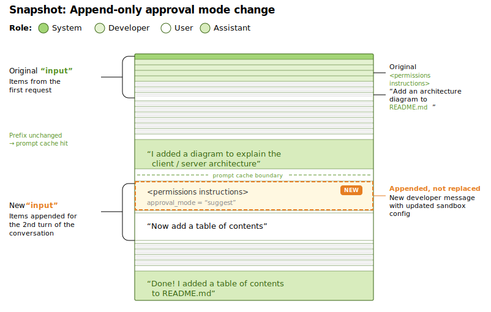

# Thinking in Context: Codex 中的上下文工程

`READ⏰: 18min`

未来的 Context Engineering 一些随笔都会写到 “Thinking in Context” 系列中。

先简单 recall 下之前的一些内容。在第一篇 [《Context Engineering，一篇就够了》](../../one-poem-suffices/context-engineering/) 中，我们定义了上下文工程的四个支柱：**Write、Select、Compress、Isolate**；在第二篇 [《Just-in-Time Context，一篇就够了》](../../one-poem-suffices/just-in-time-context/) 中，我们深入了 JIT Context 的摄入与代谢机制，探讨了 Agent 从被动接收上下文到主动获取上下文的范式转移。

OpenAI 近期发布的工程博客 [《Unrolling the Codex agent loop》](https://openai.com/index/unrolling-the-codex-agent-loop/) 为上下文工程提供了一个难得的分析样本。我个人用了相当长时间的 Codex CLI，虽然推理速度略慢，但在解决一些特别复杂的问题或者需求时能持续的执行很长的时间并最终交付一个良好的结果。因此，这是一个难得的机会从博客中窥见顶级公司是如何进行上下文工程的。

本文将从 Codex 的工程实践出发，探讨两个话题：

1. **The Architecture of State**：Prompt Cache 友好的上下文设计以及 Append-only 的上下文工程实践。
2. **The Latent Space Moat**：应用层与基础设施层在压缩能力上的不对称格局，以及这对应用开发者意味着什么。

## 1. The Architecture of State: 缓存友好的上下文设计

在 Agent 系统中，一个重要问题是：**状态（State / Messages）保存在哪里，以何种方式管理？**

Codex 给出的答案围绕两个紧密耦合的设计展开：严格排序的 Prompt 布局、以及 Append-only 的状态变更策略。两者共同服务于一个核心目标，**最大化 Prompt Caching 的命中率**。

### 1.1 Prompt Layout: 面向 Prompt Caching 优化的结构。

Codex 博客中详细展示了其 Prompt 的构建过程。当 Codex CLI 向 Responses API 发送请求时，JSON payload 中的 `input` 字段按照以下顺序组装：


为什么 Prompt 的组成架构需要专门拎出来描述一下呢？这主要和 Prompt Caching 相关，进一步思考是因为 Coding Agent 会面对相当多复杂的任务，上下文窗口的利用率较高。因此，Prompt Caching 无论在推理速度和成本控制上都举足轻重。

参考我的另一篇博客，Prompt Caching。Prompt Caching 的核心工作机制为：缓存命中要求**严格的前缀匹配**。只有当新请求的 Token 序列与缓存中的序列**从第一个 Token 开始完全一致**时，缓存才会生效。一旦前缀中的任何位置发生变动，哪怕只是调整了两个 Tool Definition 的顺序，后续所有 Token 的缓存都会失效，触发完整的重计算。

因此，Codex 将**变化频率最低的内容置顶**（System Message、Tools、Instructions），将**变化频率最高的内容置底**（对话历史、Tool Traces）。这样，在 Agent Loop 的多轮迭代中，前缀部分始终保持不变，能够持续命中缓存。原文指出，这种策略使得 Codex 的采样成本从理论上的**二次增长降低为近似线性**。

!!! tip "Codex 的工程教训"

    Codex 团队在博客中提到，早期引入 MCP 工具支持时，由于未能保证工具枚举顺序的一致性，导致了 cache miss。MCP Server 还可以通过 `notifications/tools/list_changed` 通知动态更新工具列表，如果在长对话中途响应了这个通知，同样会破坏前缀，导致 Prompt Caching 失活。

    可以发现，在 Prompt Caching 体系下，**确定性是性能的前提**。任何引入非确定性的操作，无论多么微小都可能带来显著的性能回退。Prompt 的稳定性需要被视为一种**工程约束**来严格维护，而非一个可以随意调整的实现细节。这一点我们在接下来的章节马上会提到。

### 1.2 Immutable Context: Append-only 的状态管理

理解了 Prompt Layout 的缓存逻辑后，一个自然的推论是：**Agent 运行过程中，状态发生了变化怎么办？**

比如，在我们使用 Claude Code 或者 Codex CLI 时，我们会通过 shift + tab 切换审批模式，例如从“默认模式”切换到“自动修改”或者“规划模式”，或者我们进行了工作目录的切换（`cd /new/path`）。此时，如何让 agent 知道这些更新呢？朴素的做法是直接修改 Input 中对应的 `<environment_context>` / `<permissions instructions>` 消息内容，将 `cwd` 更新为新路径或者更新权限指令。这看起来最"干净"，上下文中始终反映最新状态，不存在冗余信息。

但这种 **原地修改** 操作（Context Editing）会破坏前缀缓存。因为被修改的消息通常位于 Input 序列的中间位置，前缀从该位置开始就与缓存不再一致，后续所有 Token 的缓存全部失效。（这其实是一种 tradeoff，详情见我之前 JIT Context 博客中的 [Compress](../../one-poem-suffices/just-in-time-context/#3-effective-jit-context-engineering) 章节，**感觉 OpenAI 和 Anthropic 在这部分的处理上是两个不同的流派？**）

Codex 选择了一种不同的策略：**Append-only（只追加，不修改）**。当环境状态发生变更时，Codex 保持所有已有消息不变，在历史记录的尾部追加一条新消息来记录变更：

- 如果工作目录变了，追加一条 `role=user` 消息，内容为新的 `<environment_context>`。
- 如果 sandbox 配置变了，追加一条 `role=developer` 消息，内容为新的 `<permissions instructions>`。

这里做了一张粗糙的图片（By Claude Opus）：



这种方式和我常用的 supabase 中的 db migration（迁移文件） 很相似。我们不会直接在生产环境修改 Schema（相当于原地修改状态），而是编写并执行 Migration 文件（相当于追加一条状态变更记录）。最终的数据库 Schema 是所有 Migration 文件顺序执行后的结果。

**"State is a projection of events."**，当前状态是历史事件序列的投影，这个概念和 Even Sourcing 有点关系，有兴趣的可以看看 [MS - Event Sourcing pattern](https://learn.microsoft.com/en-us/azure/architecture/patterns/event-sourcing#pattern-advantages)。

这种 Append-only 策略带来了收益有：

1. **推理速度和成本控制**：前缀始终不变，只有尾部在增长，最大化了 Prompt Cache 命中。
2. **因果链保留**：如果我们直接把 `cwd` 从 `/project` "瞬移"到 `/project/tests`，模型只知道"现在在 tests 目录"，但不知道"为什么来到这里"。而 Append-only 的事件日志保留了完整的操作序列，使模型**可能**够通过因果链推断出意图。例如，它可能因为要运行测试而切换了目录。

!!! warning "一个值得思考的 Tradeoff"

    Append-only 并非没有代价。事件日志的持续增长本身就会导致上下文膨胀，在之前的博客中我们提到过[上下文退化](../../one-poem-suffices/context-engineering/#31)的问题，上下文中冲突的内容或者噪声会对模型的性能产生影响。这就产生了一个内在的张力：**保留因果链的完整性** 与 **控制上下文的信噪比** 之间需要取舍。

    这里我觉得有两个不同的方向进行思考（一家之言）：

    1. OpenAI 对 Append-only 的 Context Engineering 进行了专门的模型训练，让它更适应这种形式从而不会 decrease 性能。对于上下文过长的问题，则通过优化过的 Context Compress 解决。
    2. Append-only 是更传统，且更容易在工程上实现的模式。相较于 Claude Code 更激进的 Context Editing 功能，OpenAI 在这方面更保守（更弱一些）。

## 2. The Latent Space Moat: 上下文压缩能力的不对称

在前两篇博客中，我们讨论了 Compress（压缩）作为上下文代谢的核心策略之一。在应用层，压缩通常意味着**基于模型的语义压缩（Semantic Compression）**，用 LLM 对历史对话进行摘要，保留关键信息，丢弃冗余细节。

但是 Codex 博客中透露的一些技术细节，暗示了一种普通开发者**无法触及**的压缩能力。这种能力可能正是基础设施层的护城河。

### 2.1 区分两种 `encrypted_content`

Codex 博客中，`encrypted_content` 这个字段出现在两个不同的数据结构中。区分它们对于理解 Codex 的上下文管理至关重要：

**第一种：`type: "reasoning"` 中的 `encrypted_content`**

```json
{
  "type": "reasoning",
  "summary": [{"type": "summary_text", "text": "Adding an architecture diagram..."}],
  "encrypted_content": "gAAAAABpaDWNMxMeLw..."
}
```

这是模型推理过程（Thinking / Chain-of-Thought）的加密载体。其目的是**隐私保护**：模型的内部推理链属于 OpenAI 的私有信息，不应以明文形式暴露给客户端。客户端看到的只有 `summary`（推理摘要），而 `encrypted_content` 作为不透明的加密数据被原样传回服务端，用于在后续 Turn 中恢复模型的推理状态。所以这并非压缩机制。

**第二种：`type: "compaction"` 中的 `encrypted_content`**

当上下文膨胀到一定阈值时，Codex 会调用 `/responses/compact` 端点。该端点返回一个精简后的 Input 列表，其中包含一个特殊的 Item：

```json
{
  "type": "compaction",
  "encrypted_content": "..."  // preserves the model's latent understanding
}
```

> "This list includes a special `type=compaction` item with an opaque `encrypted_content` item that **preserves the model's latent understanding** of the original conversation."

这才是真正的压缩机制。原文使用了 "latent understanding" 这个措辞，暗示 Codex 保留的可能不仅仅是文本层面的摘要。

### 2.2 Semantic Compression vs. Latent Compression

理解了这个区分之后，我们可以深入应用层与基础设施层在压缩能力上的差异。这里我们暂时忽略**基于规则的结构化剪枝**，虽然它也是一种压缩手段但属于不同的“压缩哲学”（我没找到很合适的词来描述，所以用了哲学）。


**应用层——Semantic Compression**

我们作为应用开发者能够实现的压缩，本质上是一种**语义重构**：将完整的对话历史传给 LLM，要求它生成一段摘要。无论这段摘要写得多么精准，它都是对原始信息的**有损投影**，推理过程中的微观逻辑、被排除的假设、模型注意力的分布模式，这些信息在文本摘要中不可避免地被丢弃。而且作为应用开发者，对于真实用户的使用场景采样是有偏差的，远比不了 OpenAI 这种模型提供商，会导致基于模型的语义压缩效果进一步变差。另一方面，被用于压缩的模型多为**通用模型**其在预训练时的优化目标并非进行上下文压缩。

通过博客的阅读，一些团队会尝试在第二个维度发力。比如，我们之前的博客中提到，Cognition AI（Devin）会 Fine-tune 专用的压缩模型来优化这个过程。但无论压缩模型多么精巧，它操作的始终是**文本表征**，Token 序列。


**基础设施层——Latent Compression？**

OpenAI 并未公开 `/responses/compact` 端点的内部实现。看到 "preserves the model's latent understanding" 这个描述时，一个自然的推测是：**模型厂商是否在操作比文本更底层的表征**——直接在模型的隐空间（Latent Space）中对高维向量进行压缩？

这个想法有理论上的吸引力，因为上限非常高。文本（Token 序列）是模型内部状态的一种**低维投影**，而隐空间的向量表征包含了更丰富的信息结构。在高维空间中做有损压缩，可操作的空间更大，保留信息结构的上限也更高。就像在高分辨率原图上做裁剪 vs. 在缩略图上做裁剪。

但是，我觉得这条路有一个很重要的工程问题：**向量表征与模型架构深度耦合**。隐空间的维度、结构、语义取决于具体的模型版本。一旦模型升级（架构调整、重新训练），之前保存的向量表征就可能失效，压缩/恢复机制需要随模型版本共同演进。每次升级都要重新适配，这不符合好的工程实践（但万一呢？）

**更可能的实现：有信息优势的 Semantic Compression**

所以一个更保守也更合理的推测是：`/responses/compact` 本质上仍然是 Semantic Compression，用模型自身来生成压缩后的文本表征，但厂商拥有应用开发者不具备的**信息优势**：

- **压缩过程中可以访问模型内部状态**（注意力分布、哪些 token 被重点关注）来**指导**压缩决策，而不是直接保存这些状态。
- **海量真实用户对话数据**用于优化压缩策略，这是任何单个应用开发者无法匹敌的数据规模。
- 可能像 Cognition AI（Devin）一样 Fine-tune 了**专用的压缩模型**，但训练数据的规模和多样性远超应用层。

换言之，护城河的来源可能不是操作不同层次的表征（向量），而是**"在同一层次上，凭借信息优势和数据优势做得更好"**。加密封装（`encrypted_content`）则保护了这些私有的压缩策略不被逆向工程。

!!! example "类比：语义压缩的不对称"

    仅供直觉参考，不要过度引申：

    - **应用层的压缩**相当于做总结笔记，你读完一本书，用自己的理解重写要点。笔记必然是原书的有损投影。
    - **厂商层的压缩**相当于"作者本人帮你做笔记"。他知道哪些段落是铺垫、哪些是核心论点、哪些伏笔后面会用到，所以他的笔记能保留更多关键结构。但本质上仍然是笔记，不是原书。

    无论具体实现如何，**模型厂商能够利用应用开发者无法触及的内部信息来优化压缩**，这一结构性优势是确实存在的。

### 2.3 回到应用层：我们还能做什么？

一个一直有关注度的问题是：基础模型厂商是否会逐渐吞噬应用层的价值？在本篇博客的语境下，这个问题可以具体化为，如果厂商在 Compress 上有结构性的信息优势（即使只是更好的 Semantic Compression），Agent 应用开发者的 alpha 在哪里？

我觉得答案是：**Compress 只是上下文工程四个支柱之一。** 厂商的优势集中在压缩环节，但 Select（放什么进去）、Write（持久化什么）、Isolate（如何分治）仍然完全由应用层控制（大家用的都是相同的模型）。

即使在 Compress 这一个环节上，完全依赖厂商也不是好的架构选择：

- **模型绑定的风险**：如果你的 Agent 完全依赖 `/responses/compact` 来管理上下文，切换到 Anthropic 或开源模型时就失去了这个能力。应用层的 Semantic Compression（哪怕效果略差）提供了**跨厂商的可移植性**。
- **可控性/可解释性问题**：厂商的压缩是黑盒，你无法控制哪些信息被保留、哪些被丢弃。对于特定业务场景中的关键约束（如"不要修改 core/ 目录"），应用层自己做的压缩可以通过 instruction 明确指定保留策略，厂商的通用压缩未必能识别这些领域特定的信号。
- **递归压缩的信号衰减**：无论谁来做 Semantic Compression，多次递归压缩都会导致信号衰减（详见前作 [《Just-in-Time Context》中的 Compress 章节](../../one-poem-suffices/just-in-time-context/#3-effective-jit-context-engineering)）。这是文本层面有损压缩的根本性局限，厂商的信息优势可以缓解但无法消除。

最后补充我的一个观察：**Codex 目前是一个单 Agent Loop，没有 Isolation 机制**（[codex issue - Subagent Support](https://github.com/openai/codex/issues/2604))。 所有的探索、推理、工具调用都发生在同一个上下文窗口中，Context 的代谢完全依赖 `/responses/compact`。对比 Claude Code 的 Sub-agent 架构（通过 Task 工具派发子任务到独立上下文），这或许是 Codex 架构中一个值得关注的演进方向，当压缩不足以覆盖超长任务的上下文膨胀时，Isolation 可能是下一步。

## 3. Conclusion

这篇随笔从 Codex 的工程博客出发，虽然它的主题是 Agent Loop 的实现。但我更关注的是：**一个世界级 Coding Agent 中有哪些前沿的上下文工程实践？**

两个观察：

1. **确定性是性能的前提。** Codex 围绕 Prompt Caching 构建了一整套缓存友好的设计，从 Prompt Layout 的稳定排序，到 Append-only 的状态管理。这些决策的共同点是：宁可接受冗余，也要保护前缀的不变性。不过，这种 Append-only 的路线与 Anthropic 更激进的 Context Editing 形成了对比（但 Anthropic 肯定是混合策略），两种流派的长期效果我会持续观察。
2. **压缩能力的不对称。** `encrypted_content` 在 Codex 中承载了两种不同的功能（推理链保护 vs. 上下文压缩）。后者的实现可能没有我想象中那么"黑科技"，更可能是厂商凭借信息优势和数据优势做的更好的 Semantic Compression，而非隐空间层面的直接操作。但无论具体实现如何，这种结构性的不对称是真实存在的。

上下文工程是一门艺术，而不只是"写好 Prompt"。从 Codex 的实践中可以看到，它涉及缓存策略、状态管理、压缩机制等**系统工程问题**。这些问题中，有些需要应用层和基础设施层协作（比如 Cache-friendly 的 Prompt Layout，需要应用开发者主动配合基础设施的前缀匹配机制），有些存在能力上的不对称（比如压缩时厂商能参考应用层看不到的内部信息）。理解这种协作与不对称的关系，对于我这种普通的 Agent 工程师很有价值。

## Appendix: context-kit —— From Theory to Practice

之前的一些 Context Engineering 给了我许多启发。为了验证其中一些理念（特别是 Context Editing 和 Context Swap），我构建了一个微型的开源工具：[**context-kit**](https://github.com/keli-wen/context-kit)。

它不是一个生产级框架，而是一个**教学原型**，`context-kit` 旨在通过最简代码，帮助开发者建立对 Context Engineering 的直觉，我也会逐步把我在博客中学习的一些概念，尝试以代码的形式更新到 context-kit 中（比如 Codex 中提到的 tools ordering），目前写了一些：

- **Compress**: 体验 `compress_by_rule`（对齐 Claude Context Editing API 的结构化剪枝）和 `compress_by_model`（基于 LLM 的语义压缩），直观感受 Token 的清理过程。
- **Select**: 手动实现 JIT Context 的渐进式检索（`list_dir` → `grep` → `read_file`）。
- **Memory**: 将上下文卸载到文件系统，实现 Write 策略的持久化。

**Do the simplest thing that works!** 

---

## References

- [[1] OpenAI: Unrolling the Codex agent loop](https://openai.com/index/unrolling-the-codex-agent-loop/)
- [[2] Anthropic: Effective context engineering for AI agents](https://www.anthropic.com/engineering/effective-context-engineering-for-ai-agents)
- [My Blog: Context Engineering，一篇就够了](../../one-poem-suffices/context-engineering/)
- [My Blog: Just-in-Time Context，一篇就够了](../../one-poem-suffices/just-in-time-context/)
- [context-kit: GitHub Repository](https://github.com/keli-wen/context-kit)