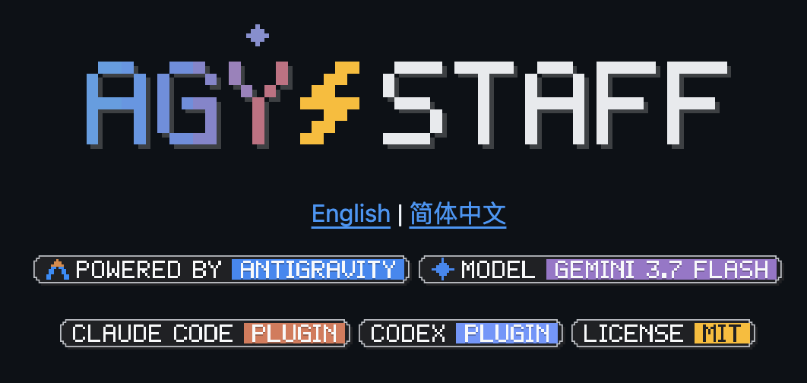
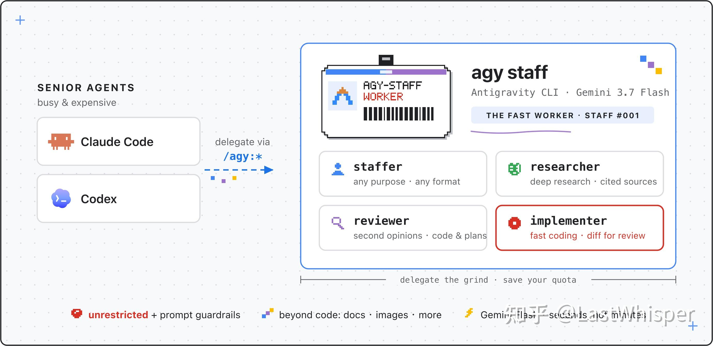
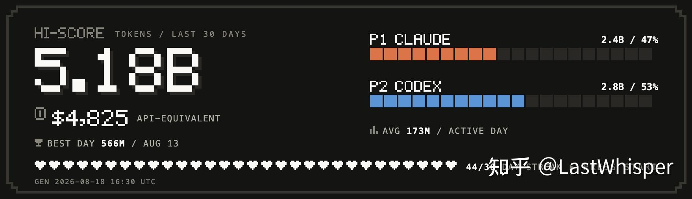
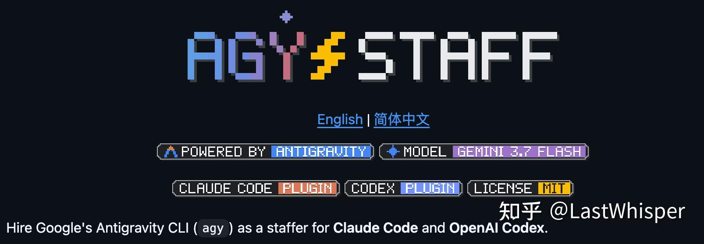
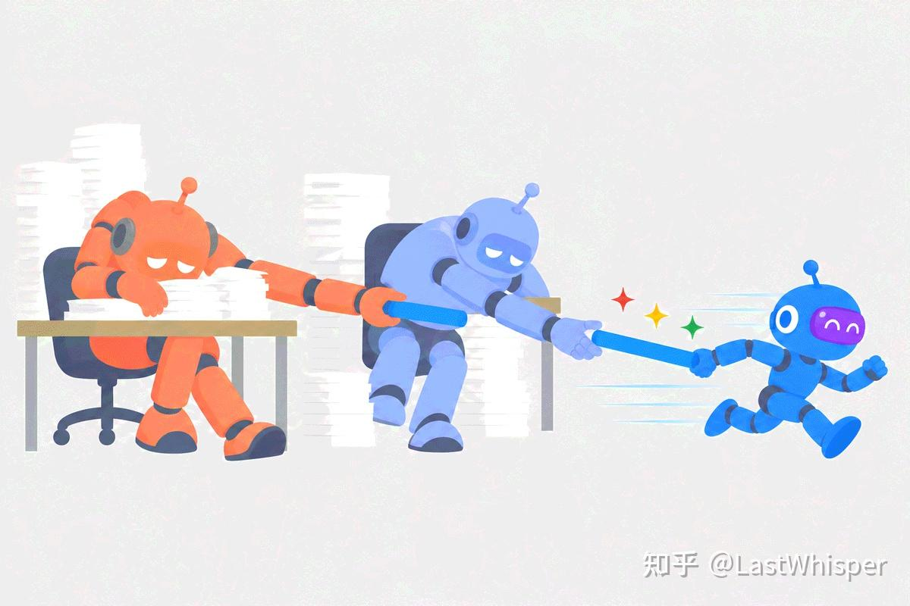
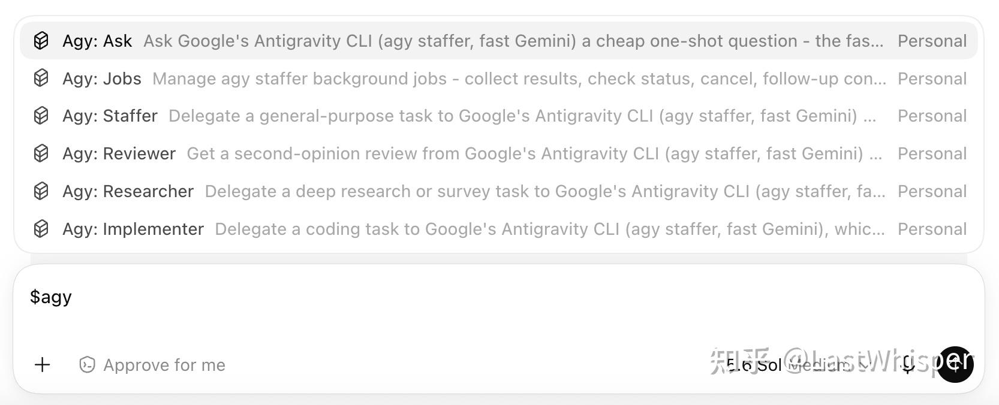

# agy-staff: 让 Gemini 成为 Codex / Claude Code 的员工

其实是把 Antigravity 做成了 Codex / Claude 的 [subagent 插件](https://github.com/keli-wen/agy-staff/tree/master) `agy-staff` 。让 Gemini 为另外的模型打工。

*agy-staff: 架构图*

为什么会想做这个东西呢？主要是我 agentic engineering 中遇到的一些痛点：

1.  **目前**速度快的模型通常效果不佳；而能力更强的模型，推理速度通常较慢（**点名 GPT 5.6 Sol**），而且额度不足。
2.  Gemini 会员的获取成本较低，但如何高效利用它的额度呢？目前它的能力还不适合作为一个 ochestrator。

自 Gemini 3.5 Flash 之后，其实 Gemini Flash 开始有潜在的生态位（高效的执行者）。但彼时它的能力还是太差了，用户（例如我）没办法信任它。但随着迭代到 Gemini 3.7 Flash，它的能力较之于自己有了一次跃升，明显可靠不少。所以让 Codex 或 Claude Code 中的顶级模型通过 grill 和 review 得到解决问题的 spec / insights，让 Gemini 作为接受派遣它们的员工，并完成具体工作。这个流程似乎能有效的解决我上述提到的两个痛点。**而且 Antrigravity CLI 还可以原生调用 Nano Banana 加上 Gemini 系列模型在多模态/前端领域的能力，在不那么注重执行的领域（营销，分析，设计）它也可以成为 Codex / Claude 强大的助手（尤其是 Claude 无法原生生图）**

所以我做了对应的插件。目前这个 plugin 主要围绕我自己的常见需求而设计，例如代码实现、Deep Research 和独立 Review（通用 Review 和 Code Review）。为了让它用起来更像 harness 原生提供的 Subagent，我也在 ochestration 上迭代了几个版本（任务派发与唤醒、后台执行、结果回收和 follow-up 等交互细节）。

其中一些设计借鉴了 Anthropic 博客中的最佳实践。不过目前还处于比较早期的阶段，很多判断更多来自我的个人使用习惯（写博客时学习的一些内容）。

接下来我准备先正常使用一两周，**看看 Gemini 作为员工到底能不能高效高质量的完成任务**。等积累了一些真实体验之后，我会再回来分享其中比较有意思的 insights。

原始回答放在下面，感兴趣的话可以继续往下看～ 这周也会加油更新一篇最近 Agenitc Engineering 的随笔。

[https://www.zhihu.com/question/2071408739723302257/answer/2073214784749703642](https://www.zhihu.com/question/2071408739723302257/answer/2073214784749703642)

------------------------------------------------------------------------

*day to day tokens*

日常各个模型都会体验下，对于 Gemini 3.7 flash 的评价是**可以作为 codex 和 claude 部分场景下的 实现/调研 subagent，高效地推进任务进度。**其实另一个高赞答主也提到了这个方面。

为此我专门做了一个 Github 的小工具（给 codex 和 claude 的 plugin），agy-staff 。寓意为为 Codex 和 Claude 雇佣一个干活很快的 gemini 员工。主要的动机是利用下我的 Gemini AI Pro 会员额度。

agy-staff - [​https://github.com/keli-wen/agy-staff/tree/master](https://github.com/keli-wen/agy-staff/tree/master)

*Gemini 员工*

## 背景

经常用 GPT-5.6 系列模型的朋友们应该会有一个发现：GPT-5.6 尤其是 Sol 非常慢，推理速度和任务完成速度这两个维度上都很慢。我觉得它**甚至不适合当一个执行者**。包括我其实在写一篇 blog，就是关于 GPT-5.6 Sol 它在执行时的 **“BFS 困境”**，他执行的过程中会偏离主线，即使 spec 规定好了它也倾向于分析各个可能的细节（所以它做设计和分析还挺不错的，除了很慢之外）。

相比之下，GPT-5.5 （这里特指 GPT 5.5 xhigh）是非常适合作为 implementation subagent。一个中等难度的任务，以前给 GPT5.5 xhigh 以及对应 project 的 skills 就可以不管了，回来简单验收就好了。而 GPT 5.6 Sol 可以执行 60min 以上～ 所以后来我都是 Sol 更多用于设计，执行端我定义了 GPT 5.5 Worker 和 GPT Luna Worker agents（xhigh 和 max） 。

> 这是因为在最近更新 Codex MultiAgent V2 Mode 之前，你无法通过自然语言去编排 sol 和 terra 之外的模型，必须为 Codex 全局自定义： [​https://learn.chatgpt.com/docs/agent-configuration/subagents?surface=app#app-custom-agents](https://learn.chatgpt.com/docs/agent-configuration/subagents?surface=app#app-custom-agents)

Fable 不用多说，主要问题是额度不够用。所以我工作流都是 Fable 作为 ochestrator，实现用 Opus5, 检查和基本调研用 Sonnet5（最近我自己也在优化我的 [​dev-skills](https://github.com/keli-wen/dev-skills) 核心就是 Long-horizon autonomous tasks 的执行。有兴趣的朋友们可以帮我提点建议，主要是基于 Thinking in Context: 何时需要多智能体 这篇博客的一些思考再往上优化）

[https://zhuanlan.zhihu.com/p/2010163501814010621](https://zhuanlan.zhihu.com/p/2010163501814010621)

从 GPT 5.6 Sol 之后的一段时间内，我觉得我的效率非常低。特别是有一次，我大概折腾了一下午，因为 Sol 的发散且 Claude Code 额度用完了，我认知负荷过载且没有任何进度推进，所以之后我就放弃 Sol 作为执行者了～ 具体的一些思考我会在之后专门的博客里面提到，如果你对 codex 的一些行为比较感兴趣推进阅读（终于舍得给 1M 上下文了～）

[https://zhuanlan.zhihu.com/p/2058727424167241456](https://zhuanlan.zhihu.com/p/2058727424167241456)

## 关于 Gemini

我发现 fast model 还是很有价值的，一些小任务可以快速推进还挺容易进入心流状态。目前 Codex 和 Claude 模型都称不上快。我内部使用和我自己工作中的 benchmark 也反应了 3.7 flash 对比 3.6 flash 有巨大的提升（至少是 agentic 领域），跨过了可用的阈值。那么如图所示，它的价值就体现出来了：接棒 Codex 和 Claude 做一些轻量的任务。

*gemini 接棒！*

因为它从原来的**又快又快**到现在的**又快又“好”**， 至少有自己潜在的生态位了。所以我为他设计了几个常见的工作模式，用于被两个 senior agent 派遣。接下来我会优化这个 plugin 的使用体验～ 看看它是否能成为 codex/claude 下合格的 subagent，之后会重新分享体验到这里。

*重新放一遍*

*codex desktop*

## Reference

- agy-staff - [​https://github.com/keli-wen/agy-staff/](https://github.com/keli-wen/agy-staff/)
- dev-skills - [​https://github.com/keli-wen/dev-skills](https://github.com/keli-wen/dev-skills)
- 如果你对 tracking 自己的 tokens usage 然后可视化感兴趣：[​https://github.com/keli-wen/token-history](https://github.com/keli-wen/token-history)
