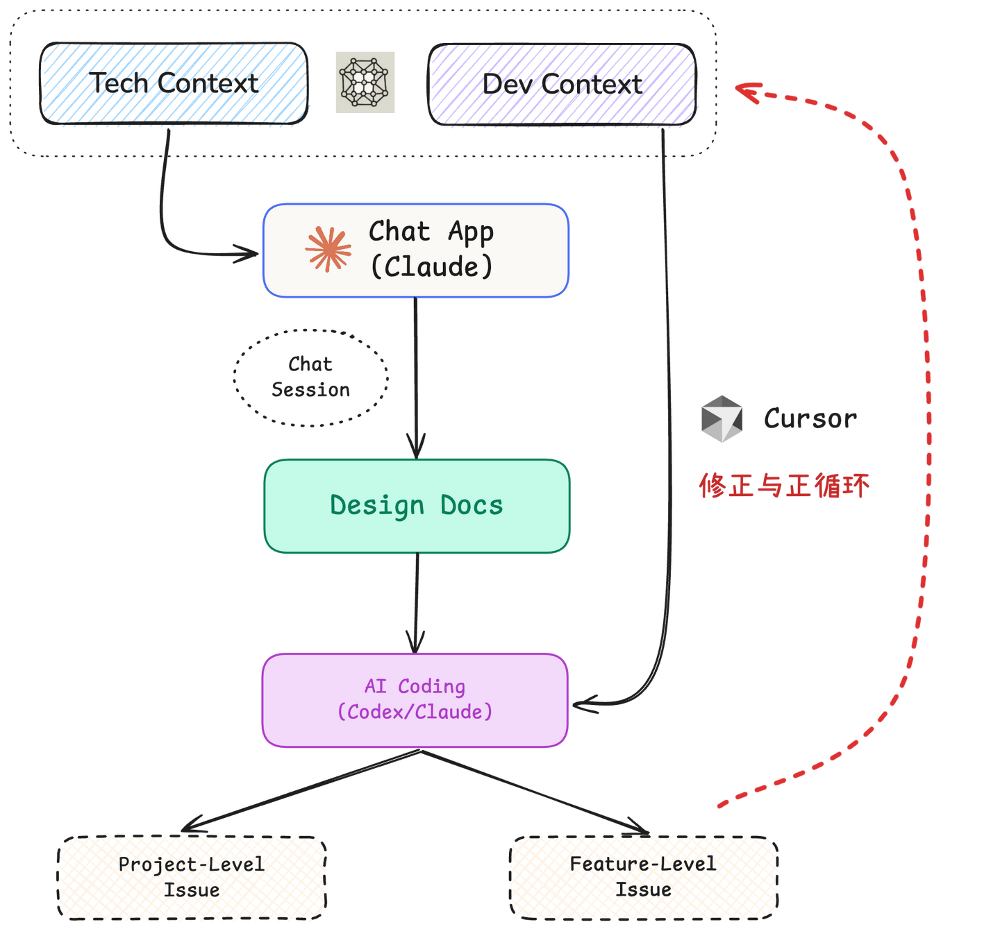
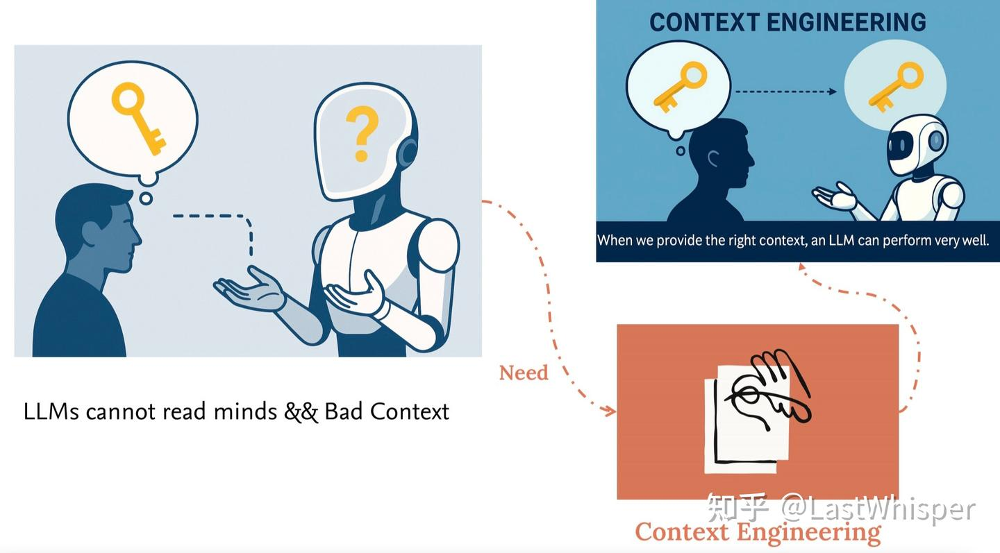
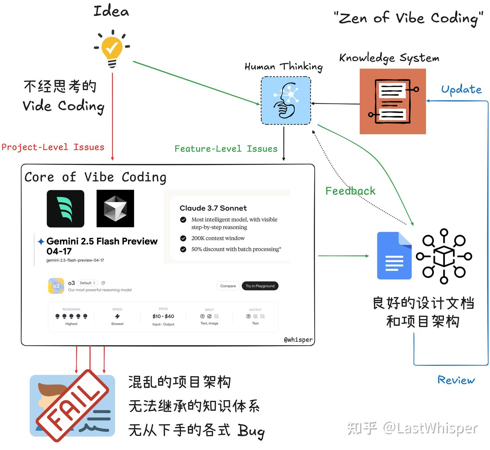

# Zen of Harness Engineering: 最佳实践 I

> 原文发布于 [知乎专栏](https://zhuanlan.zhihu.com/p/78314710899)，2025-10-20

尝试分享下我在 AI Coding 方面的一些实践。关于 AI Coding 的思考我之后想专门写几篇。

这里简单分享一些我常用的 "best practice"，主要涉及到我是如何从零开始 AI Coding 以及如何构建"技术复利"（需要维护哪些 insights）以及简单对比下 Codex 和 Claude Code。



## 1. 维护 Tech Context

AI Coding 发展到现在 bottleneck 不在于模型而是人类的 guidance 是否完善。即大部分情况下问题是：AI Coding 出来的代码并没有和你的"真实"想法对齐。

由于 AI 没有读心术，我们需要提供对应的 context 来解决这些问题。



在反复几次手敲 prompt 后，我会维护一个简单的 Tech Context，存在我的 iCloud 上，方便任何情况下的复制粘贴。一个简单的 Tech Context Example，你可以根据你的需求任意修改，包括添加上你的一些小偏好。

??? example "Tech Context Example"

    ```yaml
    ## Tech Context
    前端:
      框架: React 和 Next.js
      UI 库: Tailwind CSS 和 shadcn/ui
    后端:
      框架: FastAPI
    数据库:
      主数据库: Supabase (PostgreSQL)
      向量数据库:
        演示/开发环境: ChromaDB
        生产环境: 使用 PostgreSQL 并启用 pgvector 扩展
    智能体:
      开发框架: Google Agent Development Kit (ADK)
    大语言模型与嵌入:
      模型调用: 使用 OpenAI Python SDK，通过修改服务地址以支持各类兼容其接口的模型服务
      嵌入模型:
        通用: OpenAI 的 text-embedding-3-small
        国内备选: Qwen 的 text-embedding-v4
    Demo 工具: Streamlit
    部署与托管:
      前端: Vercel
      后端服务: Supabase (通过 Edge Functions 实现服务逻辑)
    ```

基于该 Context 你可以在后续任意步骤中轻松得让 AI 对齐你开发的大方向。换言之，你在手动的维护 personal memory。

除了 Tech Context 外我还喜欢维护 Dev Context，例如代码风格，系统设计偏好（目前更普遍的是放在 `AGENTS.md` 文件下）。但 Dev Context 是和项目主题挂钩的，全栈开发和 AI Agent 的 Dev Context 是不同的。由于我不希望引入一些无关上下文，我目前会选择手动的维护在自己的 Obsidian 上，按需粘贴或者放在代码库的 `AGENTS.md` 中。

## 2. Talk to Design Docs

当模型的能力超过"那个边界"后（我认为 `Claude Sonnet 4` 和 `GPT5-Codex-High` 都满足条件），编程的范式已经在逐步转移至"自然语言编程"。例如最近比较火的 Repo [spec-kit](https://github.com/github/spec-kit) 教你如何编撰完善的文档来进行 AI Coding，由于我没具体用过该项目无法给出详细的见解。

但就我个人而言，这种基于自然语言编码的范式极大的利用了我的零碎时间。因为它相较于传统的编码范式最大优势是极简单/极快速的开始。传统的编码是一个冷启动的过程，你需要一些 warmup。例如打开电脑，打开 IDE，构思并以具体的语言编写代码。但基于自然语言编程的范式可以在任意时间开始编程，你只需要把思考和目标等 prompt 写在备忘录等文本编辑软件中，在有空时让 AI 帮你进行编码。

当然，自然语言编程一定会出现各种 corner case，我们对此需要宽容一些。就像你以前在使用编程语言进行编码时会出现许多 bug，当你用 prompt 进行编码时这同样不可避免。但这同样是一个积累的过程，这就是为什么 Context 如此重要。除了模型本身能力的增长外，你相较于其他人的优势很大一部分来自你总结的 context。

所以，目前对我而言最重要的是如何构建一个准确，符合 AI Coding Best Practice 的设计文档？我目前的实践是和 LLM 进行对话并在进行多轮对话后让 LLM 生成规范的设计文档作为后续 AI Coding 的基石。我的大致流程如下：

1. 打开 Claude APP，粘贴 Tech Context 然后简述我的设计目标和它一步步讨论系统架构，细节，以及让它提出当前设计中可能的问题和存在模糊/歧义的地方。
2. 你可以很简单地在一个 chat session 中深入任何细节或解决任何困惑。在你觉得这个设计足够完善后便可以让 Claude 基于当前 session 的 chat history 生成最终的 design docs。
3. 在与 LLM 交流的过程中，任何收获和反思都可以手动更新到 Tech / Dev Context 中。这就是产生技术复利的关键，维护良好的 Tech / Dev Context 可以在后续的项目开发中节省大量的时间。

!!! quote "关于 Context 的价值"
    可能有相当多的人会认为总结自己的 Context 其实不重要，因为模型能力的发展会让这些 Context 没有任何价值。我也无法预期未来模型的发展，我也认真思考过这个问题，简单讲讲我的理解：

    我们维护个人的 Context 很多时候并不是为了帮模型提升性能。而是为了帮模型对齐你自己。模型的能力就目前和未来而言一定是超过绝大部分个人的。Context 是为了让模型以你能理解的方式给出回答。所以**构建 Context 是必要的**（让模型对齐你的能力），**反思和更新 Context 也是必要的**（让你对齐模型的能力）二者缺一不可。

## 3. Project Level && Feature Level

我很久之前把 Vibe Coding 划分为两类（参考上一次的 [Zen of Harness Engineering: 引子与问题划分](../intro/)，但具体内容可能过时了不少，那时候的 Coding Agent 能力远比不上如今）：

- **Project-Level**，整体项目相关的，涉及多个/复杂/耦合的问题。特点是需求比较模糊，可以继续细分与讨论，比如"设计具有某个功能的插件/应用"。
- **Feature-Level**，具体功能相关的，涉及单个/少数/独立的问题。特点是需求比较清晰，可以参考大部分 GitHub 中的 issue，比如"修复某个因为 XX 导致的 bug"。



我简单介绍下我是如何分别处理这两类问题的：

### 3.1 Feature Level Issue

关于 Feature level 问题的解决，我的思路一直是固定的。这也是我觉得 AI Coding 中很重要的一部分：当需要你解决细节问题时，你最好真的能解决。这是 AI Coding 最后一公里以及 Demo to Production 中最重要的一环。

!!! warning "避免过度依赖 AI"
    因为 Learn by doing，AI Coding 现在会跳过绝大部分的 doing 步骤，如果连 feature level 的问题你都完全的依赖 AI，你很难有任何进步，相反你绝大部分能力都会退步。

最开始有段时间，我会完全利用 AI 做整个项目，但是后果是我在 debug 时也完全依赖 AI，导致在一些其实很简单的问题上浪费非常多的时间（AI 有时会一直无法解决某些问题）同时心态非常差（因为解决问题就像在抽卡，你无法预期能否解决这个问题，以及何时解决这个问题）同时，长远来看我会非常浮躁且没有收获任何长尾价值。

所以对我个人，我会保证我理解这个问题的完整上下文，我会尝试提出解决方案。使用 AI 去按我的思路去解决问题，而非它替我解决这个问题。所以我会用 cursor 的 chat 功能来解决 feature level 的问题以确保我最大程度的掌握这些细节。

同时，这类问题常出现在 AI 完成整个项目代码后，你在实际运行中发现的。这可能说明你最开始的 design 中并没有 cover 这一部分。这恰好是你值得学习的部分，你可以反思并更新 Context。

- 是你的 design 中缺少了什么吗？
- 是你的描述（Prompt）存在歧义吗？
- 是你需要补充启发式的 guidance 吗？如果需要，你是否需要维护属于自己的 `AGENTS.md`？

这是你修正 Tech / Dev Context 与 Design Docs 最重要的环节。

### 3.2 Project Level Issue

Project level 的问题范围有点太广了。目前我的实践如前文提到的主要是：维护 Context → 交流生成 Design Docs → AI Coding 编写 → 反思并更新 Context & Design。

更具体的：

- 如果是 FullStack，我会用 `bolt.new` 进行 MVP 开发，在 chatbot 中调优几轮后 download 在本地用 cursor 解决 feature level 的问题。
- 如果是偏 Research & Open Source，我会选择让 Codex Review Design Docs 生成具体的开发 Plan，让 Claude Code 基于 Plan 开发，最终让 Codex 进行 Review（关于 Codex 和 Claude Code 的对比见文末）。

## 4. Summary

这些内容包含了绝大部分我 AI Coding 的 practices。除此之外也没有更多特别的地方。在调研部分我会同时启动 Gemini / OpenAI / Claude 的 DeepResearch，目前我更喜欢 Claude Research。

??? info "Codex vs Claude Code 对比"

    我这里只能对比 claude sonnet4.5 / gpt5-codex-high.

    - **cc** 在 agent architecture 上做的很好，执行的非常快，但是默认的风格是过度工程化，过度设计，即使你给出很详细的设计文档，但是 cc 还是会在一些你没完全 define 好的细节处进行过度工程化，需要你提前设置许多 rules。
    - **codex** 是纯模型很强，有种大巧不工的感觉，在 implementation 上非常克制和恰当，很难具体描述这种感觉。大致来说就是可用性非常高，不会过度设计。适合做 impl 和 refactor（如果让 cc 的 refactor 大概率是越做越奇怪）。

    所以推荐结合一起使用：

    - 如果是 from scratch，我会先 draft 非常详细的设计文档，这对于 codex & cc 都很重要。让 codex refine & 生成 `Plan.md` -> cc implementation (写的快) --> codex review（如果发现 cc 它写的问题很大，直接清空让 codex 写）
    - 如果只是 feature level 的，我会用 cursor 哈哈哈 保证自己对 feature level 问题的完整掌握，否则会陷入 vibe coding 常见的原地打转情况。

    cc 在 agent architecture & context engineering 上的深度优化在未来肯定是有它对应的生态位。比如 Anthropic 现在在 beta 的 memory tool 和 [context editing](https://www.anthropic.com/news/context-management)。如果这些功能更新到正式版的 cc 中，那么在某些特殊场景下会和 codex 拉很大的差距。
