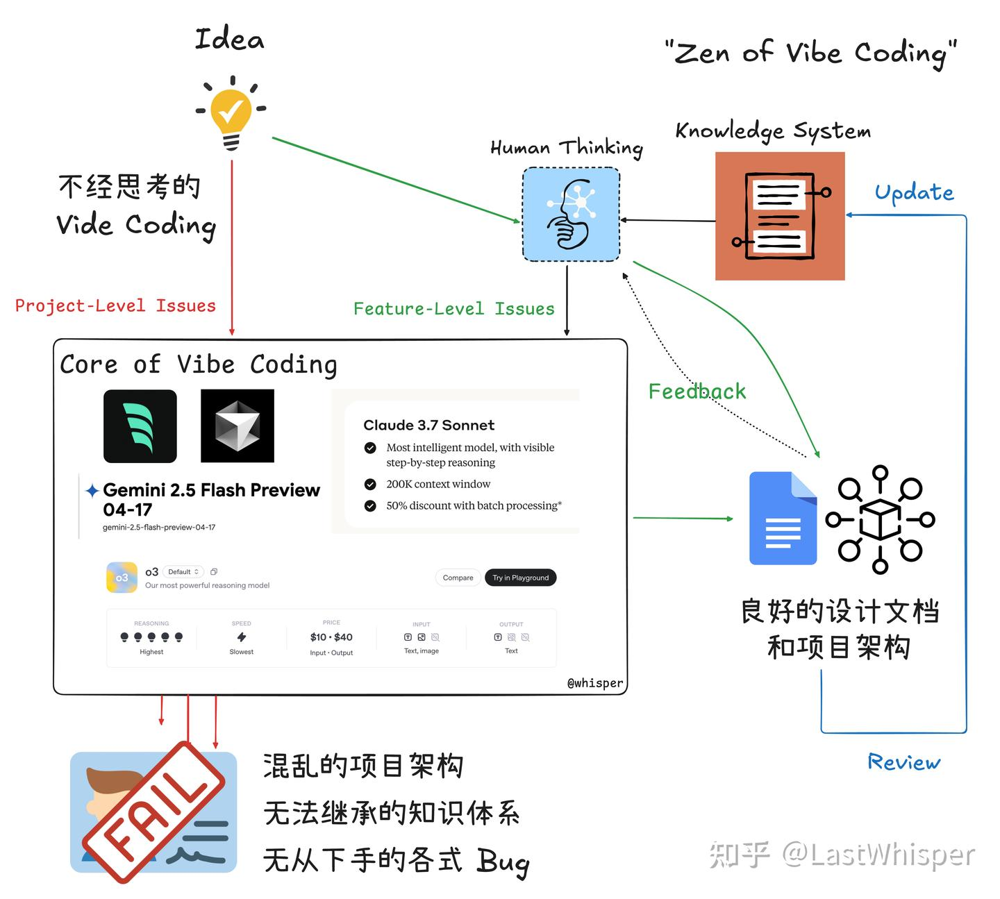
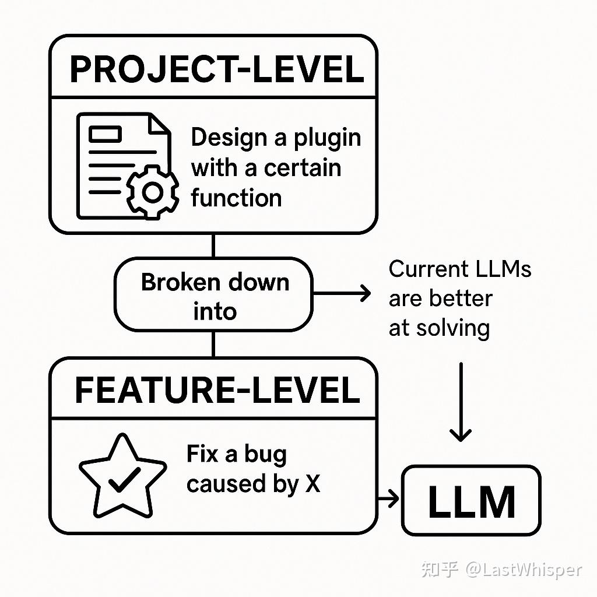

# Zen of Harness Engineering: 引子与问题划分

> 原文发布于 [知乎专栏](https://zhuanlan.zhihu.com/p/1903296419898556976)，2025-05-22

突然想记录下，原本打算把经验总结成 Vibe Coding Best Practice（本质上就是总结方法论和工作流）。但在写的时候总觉得还不够完善，优化后又觉得太僵硬，一直搁置。但在写的过程中发现这些经验适合回答之前困扰我很久的问题："LLM 时代下，工程师的哪些能力才是有价值的？"这个问题可以任意扩展，我会在另一个系列博客中记录。

今天晚上 Vibe Coding 非常失败，明明我预先思考过何为正确的路径，但是莫名花了 2 个多小时产出了一堆 shit。所以就当记录，一方面警醒自己，另一方面供大家参考。

系列开篇，简单介绍背景。我喜欢折腾各种 LLM 工具，在读过纳瓦尔宝典后认为做内容/做产品是这个时代最佳的杠杆。我认为"独立"的价值开发在这个时代是可行的。

## Vibe Coding 的困境

接下来讲讲我做的图。有过 Vibe Coding 的朋友基本会有类似的体验，你在几个小时内实现了 0 到 0.7，但之后可能会遇到：

1. 折腾了几天从 0.7 实现到了 0.8 （进度非线性）
2. 折腾了几天从 0.7 实现到了 0.5 （花费时间但反作用）
3. 有好几个版本的 0.7+- 但是不知道如何选择 （工具灾难）

## 问题划分

对于问题 1/2 我思考后有几个小发现，我们可以把问题分为：

- **Project-Level**，整体项目相关的，涉及多个/复杂/耦合的问题。特点是需求比较模糊，可以继续细分与讨论，比如"设计具有某个功能的插件/应用"。
- **Feature-Level**，具体功能相关的，涉及单个/少数/独立的问题。特点是需求比较清晰，可以参考大部分 GitHub 中的 issue，比如"修复某个因为 XX 导致的 bug"。

Project-Level 可以通过拆解得到多个 Feature-Level 问题 ➡️ Feature-Level 是原属于 Junior 工程师的任务 ➡️ 当前 LLM 更擅长解决 Feature-Level 问题。

## 结论

!!! tip "核心观点"
    Project-Level 的问题需要人主动思考与做细致的规划，拆解为多个 Feature-Level 问题，再由 Vibe Coding 解决，这样高效不少。

本篇仅为引子，下篇做更详细的解读。
