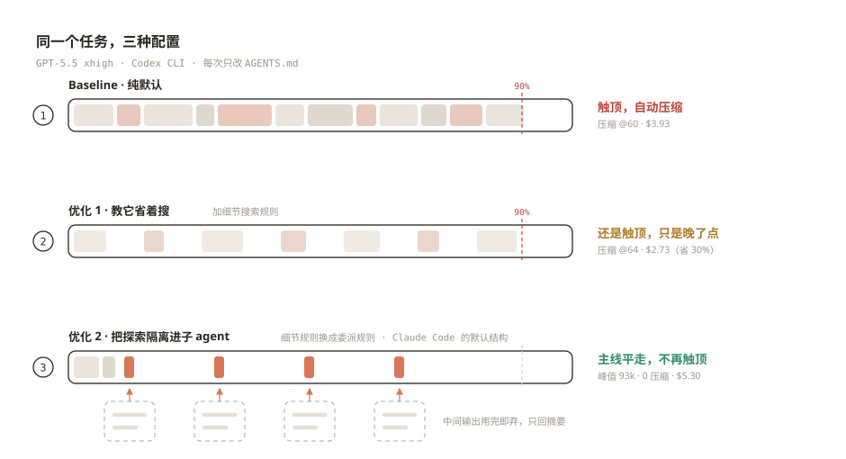
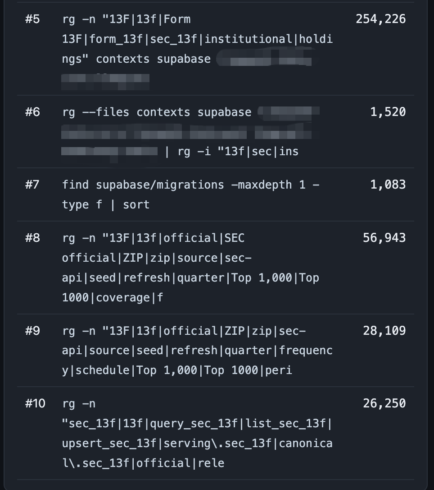
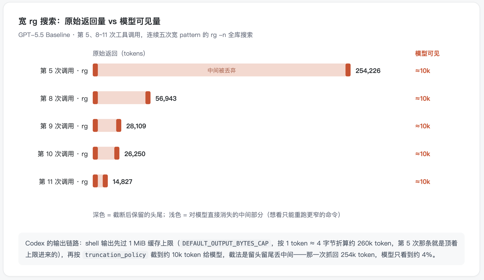
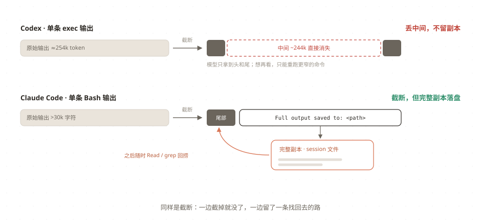
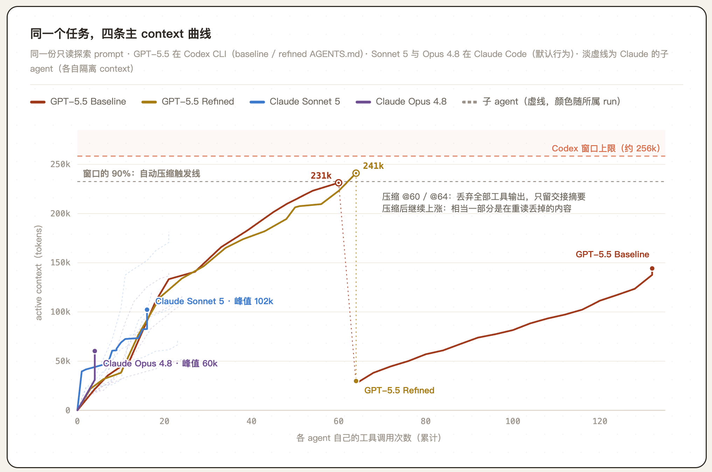
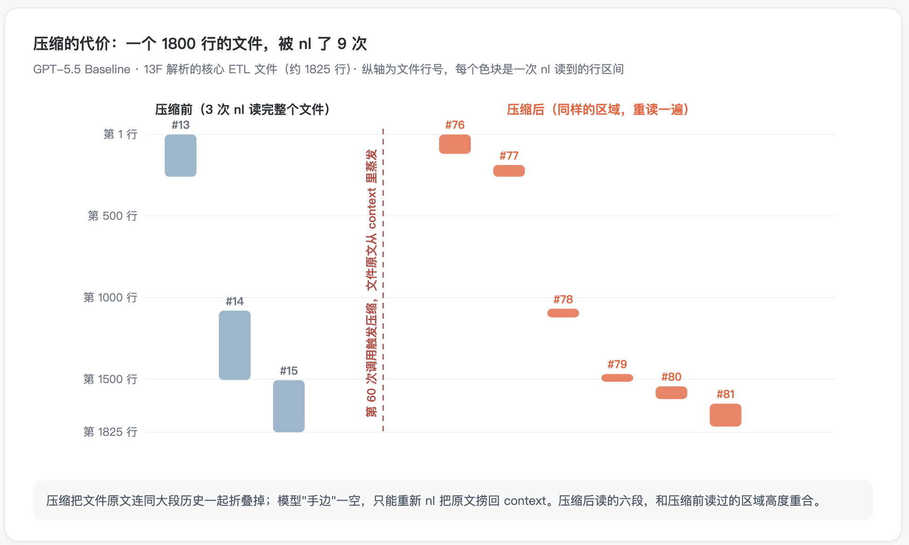
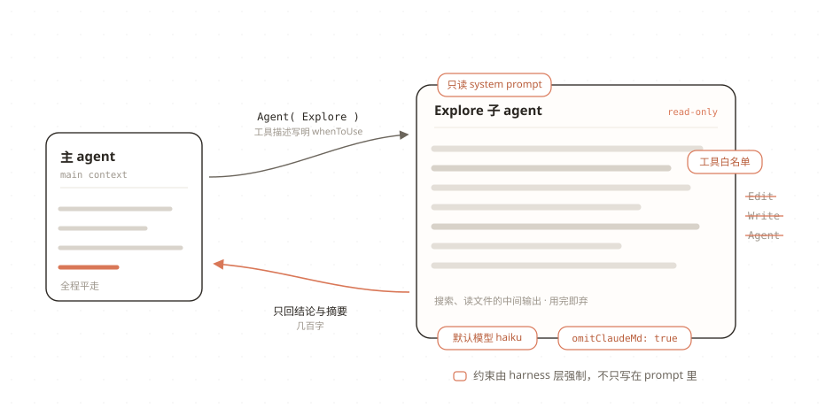
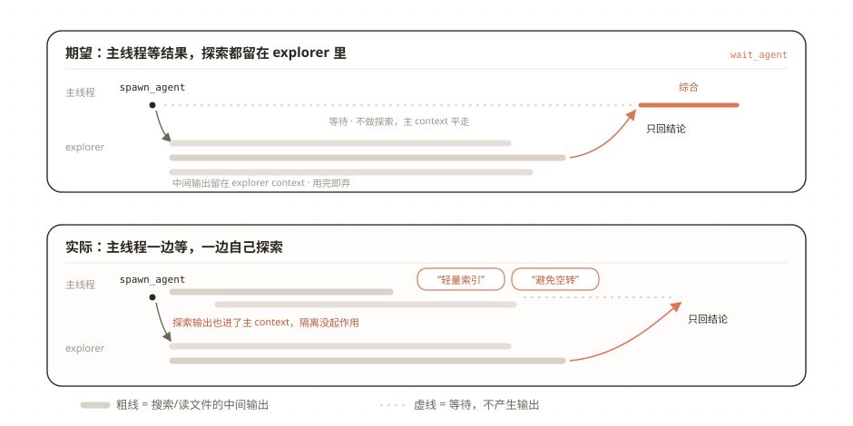
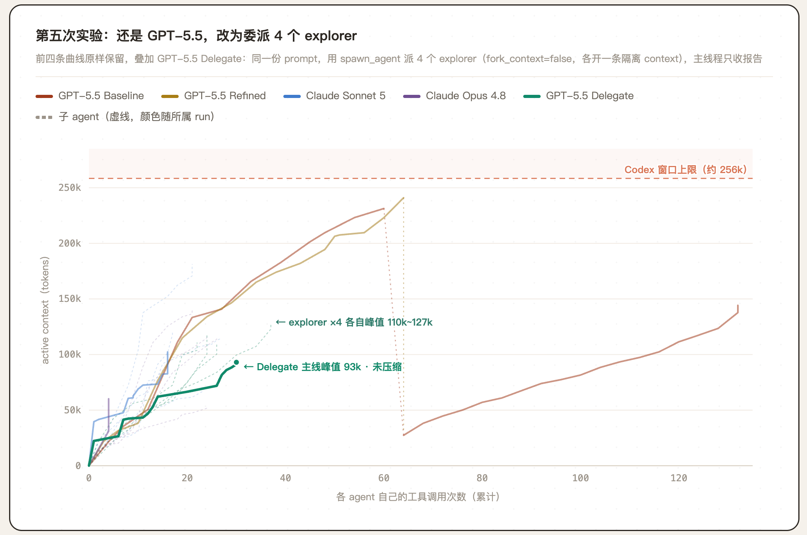
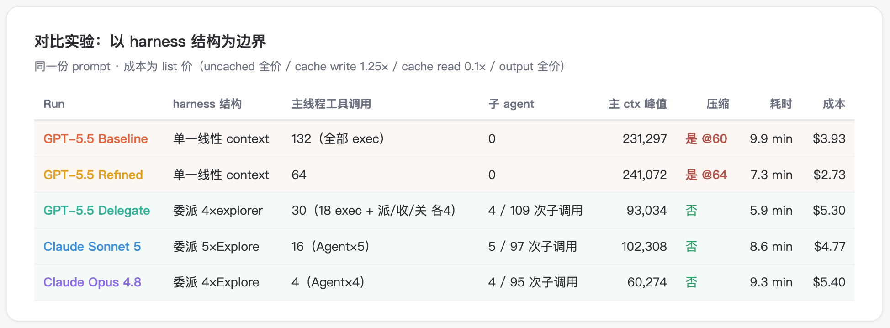

# 为什么 Codex 总在自动压缩？

`READ⏰: 18min`

我有一个做金融数据的 monorepo，代码和上下文大概几十万行的样子（monorepo 是所有的代码/上下文在一个 repo 中）。我问了 Codex 一个问题，大意是：`结合 repo，SEC 13F（机构持仓报告）这个数据 Pipeline，从原始数据源，到预处理到数据库再到 MCP 和 Web，整体链路是什么样`。只是问了这一个问题，订阅版 Codex 给 GPT-5.5 的 256k 上下文窗口就已经接近满，而且中途已经**自动压缩**过一次。这时候再问任何一个 follow-up，它都要先再压缩一次才能继续，且压缩后很多信息需要重读。



同样的问题在 Claude Code 中则没有这个现象。**这是模型的差异，还是 harness 的差异？**一部分原因是 Claude 的上下文窗口本身更大（1M），但后面会看到，用同一个 GPT-5.5 换一种 harness 结构，自动压缩就消失了。**更主要的原因在 harness 怎么安排工具调用和 subagent（上下文工程）**。

为什么会做这个分析？这两个工具我都长期在用，一般是 Codex 做后端相关、Claude 做前端相关；最近感觉 GPT-5.5 xhigh 有点降智，加上 Fable 回归，主力就换成了 Claude。来回切换用得多，上面这种差异的体感就很明显，所以决定认真分析一下，这篇随笔就是分析的记录。我的分析从两个角度做：

1. 先看 trajectory（agent 的完整运行记录，就存在本地：Codex 在 `~/.codex/sessions`，Claude Code 在 `~/.claude/projects`。格式略有差别，不过这不重要，丢给 coding agent 都能轻松读懂），弄清楚上下文都花在了哪里；

2. 再拜读两个工具的源码，来理解 harness 的具体行为（Codex 是开源的 [openai/codex](https://github.com/openai/codex)；Claude Code 没有官方源码仓库，用的是社区镜像 codeaashu/claude-code，npm 包 sourcemap 泄露的过时版本，所以引用的细节凡[官方文档](https://code.claude.com/docs/en/tools-reference)有的都以文档为准）。

结论先行：基于运行记录的分析，我做了两个小实验，都只改 `AGENTS.md`（Codex 每次会话都会读的项目指令文件，相当于 Claude Code 的 CLAUDE.md）。第一个实验优化 Codex 的工具调用偏好，成本从 \$3.93 降到 \$2.73，省了 30%；第二个实验授权 Codex 把探索任务委派给 subagent（派不派由它按任务复杂度自己判断），成本比 baseline 高 35%（\$5.30），但主上下文的窗口占用峰值从 241k 降为 93k，全程无需压缩。

!!! note "什么是 Harness"
    本文说的 harness 指模型外面那层运行时：上下文怎么组装、工具怎么定义、输出怎么截断、子 agent 怎么派遣、什么时候压缩，都是 harness 层的决定。Claude Code 和 Codex CLI 是两个 harness；GPT-5.5 和 Opus 4.8 是跑在里面的模型。同一个模型放进不同的 harness，行为/性能可以相差甚远。

## 1. 256k 都花在哪了

### 1.1 Baseline：过泛的搜索与截断

遇到上述问题后，很自然的第一步是看这个 case 的具体使用轨迹。我把它称为 baseline：GPT-5.5、reasoning effort 开到 xhigh、不加任何额外指令，纯默认设置跑出来的那次调用。

Baseline 的具体工具调用记录里很明显有一串的 `rg -n`。Codex 使用 `rg -n` 时的 pattern 写得很泛，大概长这样：



!!! note "rg 速览：`-n`、`-l` 和 `--files` 的区别"
    `rg`（[ripgrep](https://github.com/BurntSushi/ripgrep)）是一个命令行搜索工具，和传统的 `grep` 干同一件事：按 pattern（正则表达式）在一堆文件里找出匹配的行。它比 grep 快很多，而且默认跳过 `.gitignore` 里的文件，所以成了 coding agent 在代码库里搜索的首选。Codex 的模型 prompt 里就明确写着 *"prefer using `rg` ... because `rg` is much faster than alternatives like `grep`"*（[`base_instructions`](https://github.com/openai/codex/blob/cca16a10878202cb2f6e9666b6b4330329ea7e65/codex-rs/models-manager/models.json#L56)，各代模型的 prompt 里都有这句）。

    本文会反复出现它的三种用法：
    
    - `-n`（`--line-number`）：返回**匹配行的完整内容**，并带上行号；
    - `-l`（`--files-with-matches`）：搜索文件内容，但只返回**哪些文件里有匹配**，不返回匹配行；
    - `--files`：不搜索文件内容，只列出 `rg` 认为应该纳入搜索范围的文件路径。它会递归遍历目录，并默认尊重 `.gitignore`，所以常被 agent 用来先看项目里有哪些候选文件；如果写成 `rg --files | rg 'prompt'`，第二个 `rg` 才是在这些路径字符串里筛选包含 `prompt` 的文件名。
    
    同一个目标，`--files`、`-l`、`-n` 写进 context 的量级完全不同：`--files` 只暴露文件清单，`-l` 只暴露内容命中的文件路径，`-n` 会把每一条命中行的内容都带回来。pattern 写得泛时，`-l` 的输出往往比 `-n` 小一到两个数量级；agent 选哪个，直接决定一次搜索往 context 里写入多少内容。

你能发现 Codex 的搜索中大小写、别名、缩写全部串在一个 pattern 里，想一次搜完。这类搜索的原始返回动辄几万到二十几万 token，而 trajectory 显示，它们全部被截到 1 万 token 上下：最大的一次原始返回 **254k token**，到模型手里只剩 10k。最密集的五次过泛的搜索，原始返回量 vs 模型实际可见量对比如下：



我在分析的时候对 Codex 的截断产生了兴趣，因此调研了下源码，有两层相关的处理：

- **第一层是 shell 输出的缓存上限。** 代码中写着 `DEFAULT_OUTPUT_BYTES_CAP = 1024 * 1024`，一条命令的输出最多留 1 MiB；按 1 token ≈ 4 字节换算，大约是 260k token。也就是说，**单条 shell 命令留下的原始输出，就可以和整个 256k 的窗口一样大。**这层是出于性能的粗剪枝，为上下文窗口做的截断在第二层。（代码见 [`codex-rs/utils/pty/src/lib.rs:12`](https://github.com/openai/codex/blob/main/codex-rs/utils/pty/src/lib.rs#L12)）
- **第二层是给模型看之前的截断。**每个模型的配置里带着一个截断预算，GPT-5.5 配的是 **10,000 tokens**。截断策略是**留头、留尾、丢中间**。（代码见 [`models-manager/models.json`](https://github.com/openai/codex/blob/main/codex-rs/models-manager/models.json#L14-L17)）

Codex 侧的截断逻辑到这里基本清楚了。它对 agent 的影响也很直接：被截掉的信息后面还要用，就得再花一次调用取回来；模型搜回 250k token，能看到的只有头尾 4%，中间丢了什么它并不知道。baseline 里那些换一个 pattern 又搜一次的连环 `rg`，多半就是这么来的：**要找的内容恰好不在头尾，只好换个写法再搜一批**。每一轮截剩的 10k 都留在 context 里，窗口持续上涨。

**Claude Code 的 harness 在社区里口碑很好**。所以我也去看了 Claude Code 的实现，对比它对这类问题的处理：

- **Grep 工具默认只回文件名**（相当于 `rg -l`），要看匹配行得显式要求，结果默认只取前 250 条；
- **Read 工具带 `offset`/`limit` 参数**，读大文件可以只读一段，默认一次最多读 2000 行。整文件超过 token 上限时返回 partial view，并**提示**继续用 `offset`/`limit` 读剩下的部分；
- **Bash 输出超过 30k 字符不丢**：完整内容写进一个 session 文件，给模型回一句 `Full output saved to: <path>`，需要时模型自己去那个文件里 Read/grep。

（250 条、2000 行、30k 字符这几个数值来自镜像源码；Read 的 partial view 行为[官方文档](https://code.claude.com/docs/en/tools-reference)也有说明。）

从**工具设计**的角度看，两边都在控制进入 context 的 token 量，但方向不同。Codex 偏事后止损：输出超了就截断。Claude Code 更靠前，更喜欢**渐进式披露**：默认值先把量压小（Grep 只回文件名），超限时不只拦下来，还告诉模型下一步怎么做。比如 Read 去读超大文件会被 token 上限挡下来，报错原文直接给出替代方案：*"File content (...) exceeds maximum allowed tokens... Use offset and limit parameters to read specific portions of the file, or search for specific content instead of reading the whole file."* 读不了，就告诉你改用 `offset`/`limit` 分段读，或者改用搜索。

Codex 的截断也做了 harness 优化，开头一行 *"Warning: truncated output (original token count: N)"*，被切掉的中段处还有一行 *"…N tokens truncated…"*。模型知道被截了，也知道截掉了多少。

但知道被截断了和能恢复是两件事。Claude Code 在截断时把完整输出存进文件，给模型留一个路径，之后随时能 Read/grep 回来；Codex 截掉的部分没有留副本，想要只能重跑更精确的命令。**截断本身不可避免，两边的差异在截掉的内容还能不能被重新访问**。

其实这个思路，在之前 Claude 做它实验性的 [Context Editing Tools](https://platform.claude.com/docs/en/build-with-claude/context-editing) 时有过体现，我在另一篇[《JIT Context，一篇就够了》](../../one-poem-suffices/just-in-time-context/#31-compress)里解释过，但**回收上下文窗口的代价是提示词缓存失效，这个 tradeoff 比较困难**，因此我较少看见 Context editing 的实际应用。



到这里，Codex 在我这个任务上反复自动压缩的表层原因就找到了：**搜索内容过于宽泛，不对输出做剪枝，且被截断的内容实际上是丢失的**。前两件看起来都能用指令优化。把它们改掉，问题是不是就解决了？

### 1.2 优化搜索工具的调用

于是我在 AGENTS.md 里加了一节 “搜索与输出纪律”，把上面看到的问题总结写成规则（节选，具体的关键词和路径换成了占位符）：

```markdown
## 搜索与输出纪律

- 先确定候选文件：用 `rg -l '<keyword>' <paths>` 搜正文但只输出文件名，高频泛词先限制路径；范围缩小后，再对少数候选文件用 `rg -n` 定位行号
- 大范围搜索结果先写进 /tmp 文件，再用 `wc -l` 看规模、`sed -n 'start,endp'` 选择性读取
- 找到行号后，用 `sed -n '120,180p' file` 只读相关行段，避免一次展开大文件
- 多用管道先剪枝：`rg -n '<keyword>' <paths> | head -80`、`tail -80 log`，先看小样本和规模，再决定是否扩大读取
```

然后用同一份 prompt 跑了四个实验：GPT-5.5 的 baseline 和 refined（只改 AGENTS.md），加上 Claude Code 的 Sonnet 5 和 Opus 4.8（都用默认行为），**实验做得比较粗糙，每个配置只采样了一次**。具体实验如图所示：



简单优化后，Codex 主线程的工具调用从 132 次降到 64 次，连环截断基本消失，成本从 **\$3.93 降到 \$2.73**，省了 30%。

把四次实验的工具调用统计出来（Claude 侧的统计含子 agent 内的调用），可以看到：

| Run | 读文件 | 搜索 | 搜索 pattern 平均 OR 分支数 | 只回文件名（`-l`）占比 |
|---|---|---|---|---|
| Codex Baseline | `nl` 读整文件 ×111 | `rg` ×16 | 9.0 | 0%（0/16） |
| Codex Refined | `nl` ×47 | `rg` ×14 | 13.3 | 21%（3/14） |
| Claude Sonnet 5 | `Read` 工具 ×51 | Bash `grep` ×40 | 2.5 | 8%（3/40） |
| Claude Opus 4.8 | `Read` 工具 ×48 | Bash `grep` ×40 | 6.3 | 3%（1/40） |

先看 pattern 宽度：Codex 一条 pattern 平均带 9~13 个 OR 分支，把能想到的写法都放进同一次搜索；Claude 平均只有 2~6 个。再看 `-l` 的占比，结果是谁都不怎么天然用它：baseline 的 16 条 `rg` 里一条 `-l` 都没有，refined 的 3 条全部来自 `AGENTS.md` 教的第一条规则，Claude 两边也只有零星几条。Claude 省 context 更多靠的是 pattern 写得精确、用 `--include` 限定文件类型（避免搜索结果被截断），同时读文件走 Read 工具而不是 `rg -n`。

Claude 还有一个习惯：用 `| head` 给搜索输出设上限。Sonnet 和 Opus 的 40 条 grep 里，各有 24 条在末尾接了 `| head -N`（N 从 10 到 100 不等）。Codex baseline 的 132 条命令里没有一条 `| head` 或 `| tail`（refined 里有 13 条，但那也是 AGENTS.md 教出来的）。我在 Claude Code 的镜像源码中没有找到强制加 `| head` 的机制，**这个习惯更像是模型从训练中学到的**。

但这没有解决根本问题。refined 还是触发了压缩：搜索规则让上下文窗口涨得慢了，但杯水车薪。

!!! note "Codex 的自动压缩具体做什么"
    活跃上下文达到 context window 的 **90%** 就触发（阈值可以在配置里自己调）。压缩就是让 LLM 给接手的 LLM 写一份交接摘要：压缩后的历史只剩最近至多 20k token 的原始 user 消息，加上这份摘要；assistant 消息和工具输出**全部丢弃**（[`compact.rs`](https://github.com/openai/codex/blob/main/codex-rs/core/src/compact.rs)）。后文说的"压缩后重读"，根源就是"工具输出全部丢弃"这一条。

压缩本身是有代价的。Anthropic 在 [Effective context engineering](https://www.anthropic.com/engineering/effective-context-engineering-for-ai-agents) 里写过：*"overly aggressive compaction can result in the loss of subtle but critical context whose importance only becomes apparent later."* 丢掉的往往是那些当时看不出重要、后来才关键的东西。压缩后具体会发生什么？baseline 的轨迹里有一段可以看到：



这个情况并非我 repo 的特例。`openai/codex` 的 [issue #16839](https://github.com/openai/codex/issues/16839) 里有更极端的例子：*"a single 610 KB file was re-read 53 times in one session because it was needed after every compaction."* 一个 610 KB 的文件在一次 session 里被重读了 53 次，因为每次压缩之后都得再读一遍。类似的反馈还有 [issue #26889](https://github.com/openai/codex/issues/26889)。

根本的限制在任务编排结构上：只要所有中间输出都在同一个上下文窗口中，任务稍复杂一些或 repo 再大一些，窗口还是会被填满。从上面的折线图可以看到，Claude Code 不管是 Sonnet 还是 Opus，主 context 曲线是完全不同的形态。

## 2. 把探索隔离出去

### 2.1 Claude Code 的 Explore Agent

从 Claude 的 trajectory 可以看到：**主 Agent 不做探索**。Opus 实验中的主 Agent 总共 4 次工具调用，全部是 `Agent`，把实际的读文件和搜代码任务交给了 4 个只读的 Explore 子 agent 并行执行。主线程只接收每个子 agent 几百字的摘要，然后综合成最终回答。

这套机制我在[《Multi-Agent System，一篇就够了》](../../one-poem-suffices/multi-agent-system/)里提到过：子 agent 是**智能过滤器**。它们在各自的 context 里并行消化大量原始信息，只把最关键的洞见交回主 agent；主 agent 不必亲自读每一份原始文档，专注做综合和决策。在本次实验中：探索必然产生大量一次性的中间输出（搜错的 pattern、读了没用的文件），隔离在子 agent 的 context 里，维护了主 agent 中的信噪比。同时多智能体系统，通过将一个大任务分解成多个子任务，并分配给拥有独立上下文窗口的多个子智能体来执行，**本质上是一种极其高效地扩展总 Token 使用量的架构**，可以往问题里投入更多的有效算力（token）。

> 如果你常用 Claude Code，那么当你新开一个 session 问出第一个问题时，它会很自然地调用 Explore Agent。

我去看了 Explore Agent 在源码里的实现（镜像源码 [`src/tools/AgentTool/built-in/exploreAgent.ts`](https://github.com/codeaashu/claude-code/blob/main/src/tools/AgentTool/built-in/exploreAgent.ts)），发现 Claude Code 针对 Explore 等信息探索类任务做了一套完整的特化设计。一图胜千言：



具体来说，Claude Code 为 Explore Agent 做了如下设计：

- **专门的只读 system prompt**，给定具体的 Agent 身份和执行边界：

    > *"You are a file search specialist... This is a READ-ONLY exploration task. You are STRICTLY PROHIBITED from: Creating new files... Modifying existing files..."* 你是一个文件搜索专家……这是一个只读的探索任务，严格禁止：创建新文件……修改任何已有文件……
    
- **工具白名单**：Edit / Write / Agent 这些修改类工具直接从工具集中禁用。从 prompt 层和 harness 层强制的只读；

- 主 agent 在 `Agent` 工具的描述里写了一段 `whenToUse`，告诉模型什么时候该调用它。

    > *"Fast agent specialized for exploring codebases. Use this when you need to quickly find files by patterns, search code for keywords, or answer questions about the codebase..."*
    >
    > 专门用来探索代码库的快速 agent。当你需要按 pattern 快速找文件、按关键词搜代码、或者回答关于代码库的问题时，用它……

（如果你用的是 Claude Code：这一节没有要配置的东西，这套行为默认就有；后面两节需要改 AGENTS.md 的部分是给 Codex 用户的）

于是问题变成了另一个：派子 agent 做探索，在 Claude Code 里几乎是开箱即用的默认行为；Codex 也有一整套 subagent 机制（`spawn_agent` / `wait_agent` / `close_agent`，默认开启），但**除了我显式要求外，我从来没见 Codex 主动用过 subagent**。为什么？

### 2.2 为什么 Codex 不爱用 subagent

Codex 也有 `explorer` 这个 role，但它的内置定义文件 [`explorer.toml`](https://github.com/openai/codex/blob/main/codex-rs/core/src/agent/builtins/explorer.toml) 是一个空文件。explorer 和主 agent 的全部差别，只有一段硬编码在 `role.rs` 里的使用说明（*"Use `explorer` for specific codebase questions… Explorers are fast and authoritative…"*）。没有专门的 system prompt，也没有工具约束。

!!! note "Role 文件与自定义 explorer"
    Role 文件是加在子 agent 上的配置层（[`agent/role.rs`](https://github.com/openai/codex/blob/main/codex-rs/core/src/agent/role.rs)），可以给某类子 agent 单独锁定 `model`、`model_reasoning_effort` 等参数。用户可以在 `~/.codex/agents/` 或项目的 `.codex/agents/` 下放一个同名 TOML 覆盖内置 role（[官方文档](https://developers.openai.com/codex/subagents)：*"If a custom agent name matches a built-in agent such as `explorer`, your custom agent takes precedence."*）。

默认配置下，`spawn_agent` 的工具描述里有一条限制（[`multi_agents_spec.rs`](https://github.com/openai/codex/blob/main/codex-rs/core/src/tools/handlers/multi_agents_spec.rs)）：

> *"Do not spawn sub-agents unless the user or applicable AGENTS.md/skill instructions explicitly ask for sub-agents, delegation, or parallel agent work."* 除非用户或适用的 AGENTS.md / skill 指令**明确要求**使用子 agent、委派或并行 agent 工作，否则不要派生子 agent。

下一句进一步限定了范围：用户要求"深入、彻底、调研、详细分析代码库"**也不算授权**（*"Requests for depth, thoroughness, research, investigation, or detailed codebase analysis do not count as permission to spawn."*）。按这个定义，即使用户说"好好查查这个 repo"，模型也不应该派子 agent。

Codex 里也写了一段主动委派的指令，放在另一个文件里（[`multi_agent_mode_instructions.rs`](https://github.com/openai/codex/blob/main/codex-rs/core/src/context/multi_agent_mode_instructions.rs)）：*"Use sub-agents when parallel work would materially improve speed or quality"*，在并行能明显提升速度或质量时主动用子 agent。这一档叫 Proactive，但默认配置下不会生效。

!!! ambition "Proactive 模式的生效条件"

    我基于源码查了一下 Proactive 的生效条件。目前没办法生效，有两个前置条件（[`session/multi_agents.rs`](https://github.com/openai/codex/blob/main/codex-rs/core/src/session/multi_agents.rs)）。第一个是 feature 开关：Proactive 的判定只在 multi-agent v2 下运行，而 `multi_agent_v2` 在 feature 表里标着 `UnderDevelopment`（注释 "not ready for external use"）、默认关闭。第二个是推理档位：Proactive 不是配置项，是从 reasoning effort 派生的，开到 `ultra` 才会切过去。所以主动委派目前对应的是一个还没发布的档位。应该只有内部员工可以享受（可以 ultra + 1M 上下文真爽啊）

    关于 Codex harness 的 subagent 设计，我没想通。Codex 的订阅用户窗口只有 256k，相较于其他的主流 Harness 是**更需要靠子 agent 隔离上下文**，但它默认不派子 agent，主动委派的功能也还在内部开发中。可能是担心 subagent 会让新手的 token 消耗失控，也可能是多 agent 路径还没打磨到能默认打开？（从后文我做实验来看，Codex 的 subagent orchestration 也有一些让我意外的行为）。

所以，当下开启 Codex 主动 subagent 的办法是在 `AGENTS.md` 里显式授权。不过实际操作时遇到了两个问题：

### 2.3 Codex Subagent 实践遇到的问题

**问题一：授权的措辞。**我最初在 AGENTS.md 里写的是**"请你基于探索任务的复杂度，自己选择是否使用 subagent"**。这个写法看上去没任何问题，但 agent 的输出是：

> "按当前工具说明，子代理只有在用户显式要求时才能启动；这里我不启动 explorer，改为主 agent 做小输出、先文件名后片段的剪枝搜索。"

我尝试了几次，试图加强语气，但它都没有启动子 agent。理由引用的是上面 `spawn_agent` 工具描述里的那条限制：它要的是 *明确要求*，"你自己看着办"在字面上构不成显式要求。后来我把 `AGENTS.md` 中的要求改成 **"用户对本 repo 的 subagent / delegation 长期开放授权"**，它才开始派子 agent。

这个问题本身不复杂，因为错误很显著（没有调用子智能体），修改合适的指令就解决了。下一个问题则有更大的隐患。

**问题二：派了子 agent，但主线程不等结果。**我以为它会像 Claude Code / Antigravity CLI 那样，派完子 agent 进入等待，拿到子 agent 的结果后再进行分析/总结。实际上它的输出是：

> "子任务已经在后台跑。我先在主线程做轻量索引和关键疑点确认，避免等结果时空转；只会读少数命中文件的相关行段。"



这个行为和隔离的目的是冲突的。**派子 agent 是为了让主 context 干净，但主 agent 一边等子 agent，一边自己在主窗口里读文件，上下文隔离就白做了**。源码里能看到这个倾向的来源。`wait_agent` 的设计允许主 agent 设一个超时时间，到时间子 agent 没做完也不报错，直接返回当前进度。再加上工具描述里"避免空等"的引导，模型自然倾向于在等待期间继续做探索。在追求速度的场景这也许是对的，但我用子 agent 是为了隔离上下文，不是为了快。我的做法是在指令里写明：**子 agent 运行期间，主线程只做综合，不做探索**。

??? note "最终写进 AGENTS.md 的子 agent 分工规则（节选）"
    ```markdown
    - 用户对本 repo 的 subagent / delegation 长期开放授权：若可用工具要求 "用户显式要求 subagents / delegation / parallel agent work"，本节即满足该要求，无需每次任务再次确认
    - explorer 只读不改 repo；fresh context（fork_context=false）；工具支持时用低于主 agent 的 reasoning effort
    - explorer 只返回结论和证据表（claim | file:line | confidence），不回传原始输出、长 diff 或无关日志
    - 派出 explorer 后，主线程的默认动作就是用长超时 wait_agent 等结果；等待期间不碰 repo 搜索和文件阅读；给它起名"轻量索引""提前确认疑点" "避免空转"也不例外
    ```
​    这里只留和上面两个问题直接对应的四条；完整版见文末 Appendix。

### 2.4 一个模型，两种表现

第五次实验：还是 GPT-5.5、还是 Codex CLI，但 `AGENTS.md` 变了。我把 1.2 里加的那节“搜索与输出纪律”整个删掉，换成了子 agent 分工规则（内容就是文末 Appendix 那份，rollout 里注入的原文可以核对）。

删掉具体搜索规则，是因为 [the bitter lesson](http://www.incompleteideas.net/IncIdeas/BitterLesson.html)。指导模型“先 `rg -l` 再 `sed`”，我认为是**用人写的细节指令去修正模型的习惯**。这些指令依赖我对这一代模型行为的观察；模型换代、工具升级之后，它们很可能就过时了，那 30% 的收益到时候也可能变成干扰。子 agent 分工依赖的是结构：不管模型怎么读文件，只要探索发生在独立的 context 里，主线程就不会超限。所以这次实验我把硬编码的指令全删了，只留启发式指令。

这次 GPT-5.5 派出 4 个 explorer，按模块边界分工探索。



主 context 峰值 **93k，全程没有压缩**。四个 explorer 的峰值都比主线程高，在 110k~127k 之间，加起来约 467k，接近单条窗口的两倍。探索要读的内容并没有变少，只是分散在了四条互相隔离的 context 里，每一条都没有接近上限。



把五次实验按 harness 结构分组：

| harness 结构 | 实验 | 主 ctx 峰值 | 压缩 | 成本 |
|---|---|---|---|---|
| 单一线性 context | GPT-5.5 Baseline / Refined | 231k / 241k | 是 @60 / 是 @64 | \$3.93 / \$2.73 |
| 子 agent 隔离 | **GPT-5.5 Delegate** / Sonnet 5 / Opus 4.8 | 93k / 102k / 60k | 否 / 否 / 否 | \$5.30 / \$4.77 / \$5.40 |

**分组的边界是 harness 结构，GPT-5.5 横跨两组。**开头的问题到这里有了答案。模型之间当然有差异：1.2 的统计表可以看到，Claude 天然写更窄的 pattern、更多用 `| head` 剪枝，这些习惯确实帮它省 context。但"总在压缩"这个现象似乎更多是 harness 设计导致的：同一个 GPT-5.5，换了 harness 设计其表现和 Claude 的两个模型基本一致。

子 agent 分工没有改变 GPT-5.5 的工具使用习惯：分析 explorer 的子轨迹，还是用 `nl` 读整文件、搜索 pattern 还是很宽泛。改变的只是任务的编排与上下文工程。

代价是更高的成本。从 \$2.73 涨到 \$5.30，几乎翻倍，和 Claude 两次实验（\$4.77~\$5.40）在同一水平。原因在之前的博客中提到过，多智能体的 token 消耗接近 chat 的 15 倍。但由于并行的设计，耗时反而更短：delegate 用了 5.9 分钟，refined 是 7.3 分钟。

本次实验十分粗糙，每个 setting 只跑了一次。且还有一个 setting 没做测试：hardcode 的搜索规则和多智能体委派同时存在，它或许能让委派更便宜一些，就留给感兴趣的读者了～ 

一些简单任务并不需要多智能体架构，请参考：[《何时需要多智能体》](../../thinking-in-context/when-multi-agent/)。关于多智能体架构本身，可以看：[《Multi-Agent System，一篇就够了》](../../one-poem-suffices/multi-agent-system/)。

## 总结

所以，为什么 Codex 总在自动压缩？对于我这个任务，答案是：它把所有探索过程和输出都记录在同一个 256k 的 context 窗口上；过于宽泛的搜索导致超长输出，且输出被截断，模型只能反复重新搜索、重新读文件；唯一能把探索隔离出去的机制（subagent），又被默认值关闭。三个问题更多和 harness 设计相关，和模型关系反而不大。

模型当然重要，但任务的形态变了。以前用模型多是几轮对话，什么进 context 是人在选择：贴哪段代码、贴哪条报错。现在一个任务是上百次工具调用，模型大部分时间在和 repo、命令行打交道，人只出现在两头：开头交代方向、把握 taste，结尾 review。选择 context 则基本依赖于 harness；对长程任务来说，harness 的编排质量很大程度上决定了最终表现。现在也有 model 和 harness co-evolve 的趋势。如果是这样，「模型的差异还是 harness 的差异」这个问题，以后可能越来越难以成立，因为它们会更耦合。

还有一个我还在思考的问题。模型层面，越来越难分高下；harness 层面，最佳 harness 实践也会收敛。最后会剩下什么？不同产品之间的差异由什么来决定？

水平有限，以上归因都基于我自己 repo 里的五次实验和对两份源码的粗读；Codex 侧的关键引用核对过 main 分支（2026-07），Claude Code 侧用的是未经官方证实的社区镜像、数值以官方文档为准。样本很小，欢迎指正～

## Appendix：AGENTS.md 委派规则完整版

2.3 里只节选了四条，下面是完整版本。它不只是"实验后留下的最终版"：第五次实验跑的时候，AGENTS.md 里就是这一份，rollout 注入的内容与此一致（个别全角破折号按本文排版习惯换成了冒号/分号，其余原样）：

```markdown
## 搜索、输出与探索委托纪律

原则：主 agent 的 context 是稀缺资源，只装结论和关键证据，不装原始搜索输出： 大输出会被截断，被截断的输出既烧 context 又误导结论。本节只写目标和授权；具体用什么命令、派几个 explorer、怎么分工，由 agent 按任务自行判断。

- 委托与否看信息经济：预期"搜索翻出的原始内容"远大于"最终要的结论"（开放式调研、跨模块、入口不明）就尽早委托，别烧掉半个 context 才想起来；入口明确、直接读更快就自己做。开始时用一两句说明选择和理由
- 用户对本 repo 的 subagent / delegation 长期开放授权：若可用工具要求 "用户显式要求 subagents / delegation / parallel agent work"，本节即满足该要求，无需每次任务再次确认。授权不等于必须用
- 给 explorer 的 prompt 像交接给刚加入的同事：目标、动机、范围内外、已知线索、期望输出；交代问题和边界，不塞死步骤。多个 explorer 按自然边界分工、互不重叠
- explorer 只读不改 repo；fresh context（fork_context=false）；工具支持时用低于主 agent 的 reasoning effort；自己是 explorer 时直接完成任务，不再次委托
- explorer 只返回结论和证据表（claim | file:line | confidence），不回传原始输出、长 diff 或无关日志
- 派出 explorer 后，主线程的默认动作就是用长超时 wait_agent 等结果：等待不花任何资源，子 agent 在并行干活，墙钟不受影响；主线程"顺手探索"花掉的恰是委托想保护的 context，还和 explorer 干重活。 等待期间不碰 repo 搜索和文件阅读；给它起名"轻量索引""提前确认疑点" "避免空转"也不例外。唯一例外：用户在等待期明确新布置的任务
- spawn/explorer 的工具描述可能鼓励"delegate 后立刻继续本地工作" "可以自己看代码补 context"；在本 repo，用户明确要求以本节为准：探索已经委托出去，就等结果，不自己动手
- explorer 结果回来后再综合：不重复它们已覆盖的搜索，只对关键疑点做少量 spot-check
- 主 agent 自己搜索时同理先剪枝：先摸候选范围和内容规模，再决定展开多少；避免把大文件、长 diff、minified 内容整段拉进 context
- 环境没有 explorer/subagent 工具时说明一句，退化为主 agent 自己的窄查询剪枝搜索
```

## References

**前篇**

- [Context Engineering，一篇就够了](../../one-poem-suffices/context-engineering/) · 四支柱框架，本文是 Isolate 的实地验证
- [Thinking in Context: Codex 中的上下文工程](../../thinking-in-context/context-engineering-from-codex/) · Append-only 与压缩流派
- [Thinking in Context: 何时需要多智能体](../../thinking-in-context/when-multi-agent/) · 上下文耦合度决策框架
- [把 Claude Code 源码蒸馏成 Agent Skill](../claudecode-distillation-practice/) · harness engineering 实践前篇

**外部资料**

- [Anthropic: How we built our multi-agent research system](https://www.anthropic.com/engineering/multi-agent-research-system)
- [Anthropic: Effective context engineering for AI agents](https://www.anthropic.com/engineering/effective-context-engineering-for-ai-agents)
- [OpenAI: Harness engineering](https://openai.com/index/harness-engineering/)
- [OpenAI: Codex Subagents 文档](https://developers.openai.com/codex/subagents)
- [openai/codex issue #16839: Compaction-aware context retention](https://github.com/openai/codex/issues/16839)
- [Addy Osmani: Agent harness engineering](https://addyosmani.com/blog/agent-harness-engineering/)
- [Rich Sutton: The Bitter Lesson](http://www.incompleteideas.net/IncIdeas/BitterLesson.html)
- 源码：`openai/codex` @ `f6e251c`（2026-07-07 的 main；早期分析基于 `129ea2a`）；`codeaashu/claude-code` @ `6a25909`（非官方镜像，自称来自 sourcemap 泄露）
