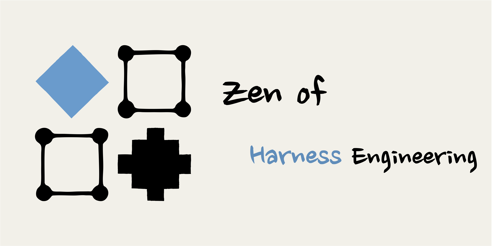
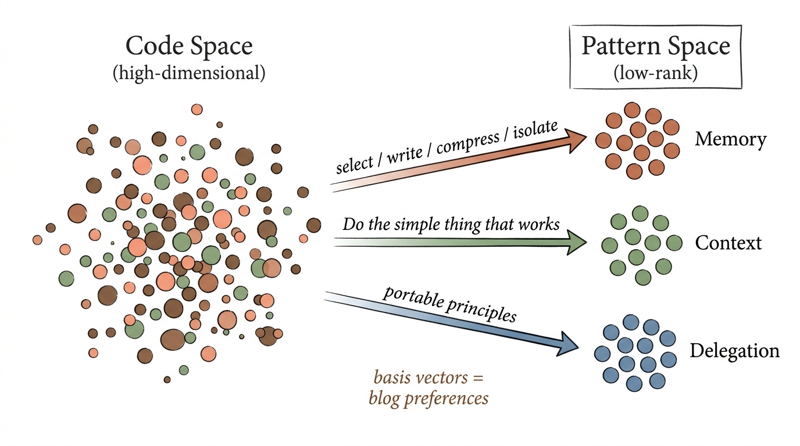

# 如何看待 grill-me（拷问我）这个 Skill？

前几天在知乎回答了关于 `grill-me` 这个 Skill 的使用体验。

[`/grill-me`](https://github.com/mattpocock/skills/blob/main/skills/productivity/grill-me/SKILL.md) 是 Matt Pocock 开源的一个 AI Skill。它的核心逻辑很简单：在 Agent 开始实现之前，先针对需求做一轮深入追问。Agent 会逐个询问你到底想要什么、有哪些边界条件、哪些地方还没有想清楚。每个问题通常会附带一个推荐答案，你确认或修正后，它再继续问下一个。

我经常用这个工具，也推荐给了很多人。

在有这个 Skill 之前，我通常会在一段 instruction 的结尾加一句：

!!! quote "我以前常加在 Instruction 结尾的一句话"

    **如果我的需求或设计有任何不清晰的地方，或者你有想反驳的地方，请直接问我。**

但每次重复输入相同的指令很麻烦，所以我后来也写过一个简单的 prompt。相比之下，`grill-me` 的指令非常轻量，使用起来也更方便，效果却挺好。

从表面上看，**它解决的是人在 Agentic Coding 场景下容易浮躁的问题。**现在实现一个 Demo 太快了，以至于很多人会跳过必要的系统设计，先让 Agent 写起来再说。`grill-me` 会让这个过程稍微慢一点，迫使你在实现之前做一些必要的设计。

但我更倾向于把它理解为一类统一的 **Harness 需求**。无论任务是否涉及编码，只要执行路径足够长、结果存在多种可能，人都需要在 Agent 大规模行动之前，把自己的偏好和关键判断注入进去。

## 它和普通 Brainstorm 有什么区别？

相比于 Superpowers 的 Brainstorm，`grill-me` 问得更细，也更适合 DFS 式地深入某个分支。如果一个问题值得单独展开，我有时会使用 `/branch` 进入新的 session，把讨论结论写回文件系统，再切回之前的 session 继续主线。

!!! warning "有些问题可以直接 Skip"

    它有时也会问出不太合理的问题。例如某些结果其实不由你控制，或者当前阶段根本无法确定。这时可以直接 Skip。反过来说，这些无法回答的问题也在提示你：期望的完成度与实际可控制的完成度之间存在差距。

一个好的追问 Skill 也不应该把所有问题都丢给人。如果答案已经存在于代码或文档中，Agent 应该自己去读。[`/grill-with-docs`](https://github.com/mattpocock/skills/blob/main/skills/engineering/grill-with-docs/SKILL.md) 在追问之外还会维护项目的领域模型、词汇表和 ADR。对于维护时间较长的项目，这种方式更合适。

我自己维护了一个 Shared Context Folder，所以 `grill-me` **向我提出的问题**，通常已经不是技术选型这种大问题，而是一些细小但**关键的决策点**。

!!! tip "维护一个 Shared Context Folder"

    我很推荐大家在维护 Repo 时保留一个 Context Folder，并要求 Agent 在实现之前，先把 Design 和 Implementation Plan 记录下来。

联系到 Harness Engineering，我对这类 Skill 还有三层理解。

## 1. PCA 的角度：Inject Taste

回到我在[《Claude Code 源码蒸馏：Harness Engineering 实践记录》](../claudecode-distillation-practice/)中提到的观点：**Agentic Coding 中最重要的其实是你个人的 Taste。**

为什么？因为在缺少规范时，Agent 的 Action Space 比人脑直觉中的范围**宽**得多。人在 Agentic Coding 中的一个关键作用，就是把自己的 Taste 注入决策过程，对 Action Space 做**剪枝**。

我把 `grill-me` 这类 Skill 理解成 **PCA（主成分分析）中的基向量提取过程**（这个类比只用于帮助理解，不必过度引申）。

复用下另一篇博客的图片，表达下大致意思～

当你想做一件事时，脑中的想法更像一个高维的 **Latent Vector**：模糊、没有完全展开，并且包含许多隐含假设。**以前实现速度远慢于现在**，你可以在 implementation 的过程中逐步解码这个隐向量。但现在实现得太快了。如果没有在一开始做好控制，结果会迅速偏离设想，revert 成本也很高。由于代码并不是你亲手写的，你甚至可能缺乏足够的信息去判断偏离从哪里开始，最后只能整体推倒重来。

`grill-me` 通过不断追问，帮你识别其中最关键的几个**基向量**，也就是核心设计决策。确定这些基向量后，再进行**压缩投影**，让一个复杂且充满不确定性的问题空间，逐渐**收束为结构化、可执行的方案**。

换句话说，人脑中的想法是 latent 的，追问把其中关键的部分**显式化（explicit）**。很多想法放在脑中时，感觉「好像就是那么回事」。但一旦把问题具体展开，你会发现其实存在几种截然不同的解法。而**这恰好是需要你做设计决策**的地方。

## 2. 控制论的角度：减少不确定性

从控制论的角度看，`grill-me` 的价值在于**减少执行过程中的不确定性**。

人在做 Design 时，很多时候只有一种模糊的直觉，觉得「它应该是对的」，或者「机器应该理解我的意思」。但事实往往并非如此。追问把关键问题显式地展开，让你主动选择和修正，以保证后续执行路径尽量对齐。

**这件事对于 Long-horizon Task 尤其重要。执行路径越长，早期一个很小的方向偏差，越可能在后面被不断放大。必要的人类 Taste Injection 与节点控制，对最终结果很有价值。否则，Agent 只是在一条并不正确的路径上更快地消耗 Token。**

所以你可以在 Harness Engineering 上投入不少时间。这些投入看起来降低了开始执行的速度，但会明显提高后续生产过程的效率。

## 3. 我的个人实践：三层控制体系

我目前主要通过三层机制，优化 Agentic Coding 的 Hand-off 过程。

### 3.1 Shared Context Folder

在每一个长期维护的 GitHub 项目中，我都会保留一个 Shared Context Folder，主要包含：

- **Design Docs**：核心架构与设计决策
- **Preferences**：编码风格与技术选型偏好
- **Progress**：重点实现和更新记录
- **Workflows as Skills**：标准化的工作流本身也是 Context，例如如何放置 Context 文件、如何创建 Issue

这里的目标不是给 Agent 一本一千页的说明书，而是让它知道项目中的长期事实应该去哪里找。实现之前，Agent 先更新 Design 与 Implementation Plan；实现结束后，再把关键进展和新决策写回去。文件系统由此成为跨 session 共享的项目记忆。

这部分可以参考[《Agent Skills，一篇就够了》](../../one-poem-suffices/agent-skills/)中关于 Skill 与 Context 的讨论。

### 3.2 用 GitHub Issue 与 PR 承载 Tracking 和 Hand-off

当我提出一个新需求时，会让 Agent 基于已有 Skills 创建一个 Issue。这个 Issue 就是最原始的 **Hand-off Prompt**，其中包含需求上下文、设计决策、执行边界、**验证流程，以及完成后需要写回哪些内容**。

Issue 和 PR 同时也是渐进式披露的入口。后续不需要在每个 session 里复制一大段 Context，只需要引用 `#xxx`，Agent 就能沿着索引读取与当前任务有关的信息。

### 3.3 用 grill-me 式交互 Finalize

在 Agent 真正开始执行前，我会用 `grill-me` 式的交互把设计 Finalize：

- 一部分结论直接写回 Issue Body，成为后续 Tracking 的依据
- 另一部分整理为结构化的 **Hand-off Prompt**，用于 clean session 或 sub-agent 的任务委派

这套流程主要优化的是任务的 Hand-off 与并行效率。当一个新 Agent 接手时，它不需要知道此前完整的聊天过程，只需要知道自己的 Role、Task，以及相关 Context 在文件系统中的位置。关于何时适合拆给多个 Agent，我在[《Thinking in Context：何时需要多智能体》](../../thinking-in-context/when-multi-agent/)中有更完整的讨论。

## 写在最后

行文至此，`grill-me` 对我而言已经不只是一个「让 Agent 多问几个问题」的 Prompt。它更像 Harness 中的一个控制节点：在执行开始之前，把人脑中 latent 的 Taste 转换为可记录、可验证、可交接的设计决策。

Shared Context Folder 负责保存长期记忆，Issue 与 PR 负责 Tracking 和 Hand-off，`grill-me` 式交互负责在行动前消除关键歧义。三层机制最终解决的是同一个问题：**在 Agent 行动得越来越快时，人应该如何继续对方向负责。**

这里只是一些个人实践，希望之后能写一篇更完整的《Harness Engineering，一篇就够了》。

## 相关阅读

- [Claude Code 源码蒸馏：Harness Engineering 实践记录](../claudecode-distillation-practice/)
- [Thinking in Context：何时需要多智能体](../../thinking-in-context/when-multi-agent/)
- [Context Engineering，一篇就够了](../../one-poem-suffices/context-engineering/)
- [Agent Skills，一篇就够了](../../one-poem-suffices/agent-skills/)
